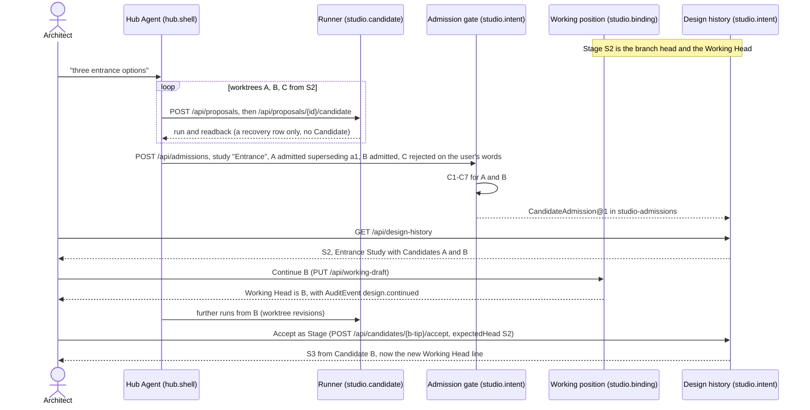

# Candidate admission: audit and minimum migration plan (2026-09-25)

**Issue:** [#294](https://github.com/cogco1/MonkeyHub/issues/294), lane `GH-294/admission-audit`, card [GH-294](mapping/planning/GH-294-candidate-admission.md).
**Base:** `origin/main` `cc9397fa`. Documentation only. No code, record or API changes.
**Method:** the author read the backend paths directly. A read-only sub-agent located the frontend call sites, and the author re-read every frontend line cited here. The root task checked the TESTMODEL replay (§3) read-only, and the author spot-checked it.

**Rule under audit (#294):** a Candidate is an admitted design result, not an execution artifact. A tool call that succeeds is not a Candidate, and neither is a run that succeeds. A Candidate is a closed-loop result plus admission.

**Product chain this plan must supply from retained facts:** Stage → Study → admitted Candidates → Continue → next Stage.

**Path abbreviations**

| Short | Path |
| --- | --- |
| `API` | `apps/archflow-studio/api/archflow_studio_api` |
| `HUBAPI` | `apps/monkeyhub/api/monkeyhub_api` |
| `WS` | `apps/monkeyhub/web/workspaces/src` |
| `HUB` | `apps/monkeyhub/web/src` |
| `P036` | `archflow/project` |

## 0. Summary

**Recommended seam**
- Register one new record kind, `candidate-admission` (`CandidateAdmission@1`). Each record is one closed loop: a task, one worktree of a task, or one human act. It lists each result run with its outcome (`admitted` or `rejected`), the attempt runs the result superseded, the Study (id, label, exact base), the actor and origin, and, when an Agent writes it for the user, the chat message the Hub bound it to.
- The records live in one fixed run, `studio-admissions`, in its review area. This follows the `studio-decisions` pattern, so the Candidate Pool is read without scanning every run.
- Only one gate in `studio.intent` writes the record. It reuses the preflight that Stage acceptance already runs.
- Lineage is not recorded again; it is still derived from `StudioCandidateDelta@1`.
- Continue and Accept-as-Stage keep their existing routes. Continue gains attribution and becomes reachable by the Agent.

**Top findings**
1. Every run is recorded as a candidate at one choke point. `run_operator` calls `record_candidate_draft` after every successful execution (`API/application/candidate.py:380-391`), and every producer goes through it. A seam at execution time cannot separate attempts from results; only a retained fact written after execution can.
2. No retained fact separates attempt, result, rejection or Study today:
   - Working-position rows are uniform `automatic: true` (`API/application/working_draft.py:133-161`).
   - Proposal-level rejections live in process memory until the next run flushes them (`API/application/episodes.py:629-653`).
   - Task identity exists only in the Hub-local journal and chats (`HUBAPI/runtime.py:440`, `HUBAPI/chat.py:706`).
3. The UI treats every run as a Candidate:
   - Versions lists every model artifact that has a `sourceStageRef` and is not yet accepted (`WS/app/App.tsx:653-661`, `WS/features/stage/VersionsStrip.tsx:144-163`).
   - The chat auto-opens every read-back run of a running turn (`HUB/ChatShell.tsx:838-851`).
4. The Stage acceptance preflight is already the closed-loop gate, minus the branch compare-and-swap. It checks replay, the complete receipt, review readiness and exactly one complete model (`API/application/design_history.py:728-797`).
5. The Hub already knows how to retain a judgment a user expresses in chat: `_feedback_body` binds the user's exact words and message identity (`HUBAPI/chat.py:2451-2498`). Rejection, admission and Continue from chat can reuse it.
6. The real project replay (§3) shows the whole defect: 17 runs, which are 10 results, 1 rejected result and 6 superseded attempts. None of the user's judgments is retained. The Working Head is the result the user rejected.

## 1. Where candidate-like runs are created, retained and surfaced

### 1.1 Creation

Every producer ends in `run_operator` (`API/application/candidate.py:365-394`). That function:
1. protects the run as active (`:385`);
2. executes the run (`:387`);
3. reads its delta (`:390`);
4. lists the result for recovery through `record_candidate_draft` (`:391`).

The module still describes itself as "a proposal executed as a detached candidate" (`:1-20`).

| Producer | Entry | Reaches `run_operator` through |
| --- | --- | --- |
| Sentence or semantic edit proposal | `POST /api/proposals` (`API/routes/proposals.py:124-155`) then `POST /api/proposals/{id}/candidate` (`API/routes/candidates.py:68-134`) | `execute_candidate` (`API/application/candidate.py:92-158`) |
| Direct transform, push-pull, elevation, delete | `API/routes/proposals.py:295-382` | same candidate route |
| Sketch, batch sketch, document tracing | `API/routes/proposals.py:181-244` | same candidate route |
| Parameter locks | `API/routes/proposals.py:158-178` | same candidate route |
| Registered capability | `POST /api/capabilities/{id}/run` (`API/routes/capabilities.py:102-139`) | proposal, then `start_candidate` |
| Massing option select | `POST /api/options/{id}/select` (`API/routes/options.py:131-199`) | `execute_option_candidate` (`API/application/candidate.py:191-232`) |
| Program sheet | `POST /api/program` (`API/routes/program.py:74-151`) | `run_operator` directly (`:130`) |
| Combine | `POST /api/candidates/combine` (`API/routes/candidates.py:137-153`) | `run_operator` with `combined_candidate_ids` |
| Hub Agent | `studio_request` allowlist (`HUBAPI/chat.py:2019`); prompt "develop the user's design through reversible candidates" (`HUBAPI/chat.py:1652`, `:2835-2836`) | any of the above |
| Architect's own Sync | `syncModelDraft` → `startCandidate` (`WS/features/stage/syncModelDraft.ts:144`) | proposal candidate route |

The Hub assigns `hub-cand-<operation>` ids before dispatch (`HUBAPI/runtime.py:39-43`, `:200`). The Studio accepts them through a function named `admitted_candidate_id` (`API/routes/candidates.py:342-359`). "Admission" there means request admission, not design admission (see §5.7).

### 1.2 Retention

| Fact | Where | Written by | Survives restart |
| --- | --- | --- | --- |
| Run directory, runner receipt, seat checks, inspections, exports | `runs/<id>/` through P036 `put_json` | `runtime.project_runner`, arranged by `_run_successor` (`API/application/candidate.py:266-362`) | yes |
| `StudioCandidateDelta@1`: exact source run, Stage, record, operator and result digest | run record (`API/application/candidate.py:437-450`; kind `P036/record_kinds.py:186-191`) | `_run_operator` before execution | yes; this is the lineage |
| Working-position row `runs[id] = {automatic: true, label: null, …}` | `design/working.json` (`P036/layout.py:138-141`), whole-file compare-and-swap (`P036/repository.py:1942-1952`) | `record_candidate_draft` (`API/application/working_draft.py:133-161`) | yes; every run, indefinitely (Q3) |
| `active` protection while executing | `design/working.json` (`P036/repository.py:1954-1972`) | `run_operator` | yes; interrupted runs stay listed |
| Job and lifecycle events `candidate.queued/running/succeeded/failed` | in process (`API/application/jobs.py:51`, `:329-367`, `:387-403`) | job registry | no |
| Proposal-level judgment `DeliberationEpisode@1` | run record when it meets a run; otherwise memory (`API/application/episodes.py:20-26`, `:594-653`) | `POST /api/proposals/{id}/decision` (`API/routes/proposals.py:396-507`) | only once flushed into a run |
| Exploration `StudioWorkingCopy@1`: options and selection | common-base run record (`API/application/episodes.py:214-225`) | `POST /api/working-copies` (no product caller; §5.6) | yes |
| Stage `DesignStage@1` and `AuditEvent@1` | accepted run's review area (`API/application/design_history.py:319-346`, `:401-437`) | `accept_design_candidate` (`:697-864`) | yes |
| Hub operation journal | Hub runtime root, not the project (`HUBAPI/runtime.py:154-177`, `:440`) | `OperationManager.admit` (`:179-225`) | Hub-local; "never proves" a result (`:142-146`) |
| Chat message `candidateId` | Hub `chats/` (`HUBAPI/chat.py:706`, `HUBAPI/models.py:206-208`) | `_tool_message` (`HUBAPI/chat.py:1857-1876`) | Hub-local |
| Workspace pin `tools[].candidate` | browser localStorage `monkeyhub.chat-view.v1` (`HUB/ChatShell.tsx:28-36`) | `openTool` | per browser |

### 1.3 Surfacing

- **Readback.** `GET /api/candidates/{id}` returns `CandidateRun` (`API/application/candidate.py:621-763`) and object readback (`API/routes/candidates.py:244-257`). After a restart it still proves itself from the harness receipt (`:184-205`, `API/application/candidate.py:887-931`).
- **Runtime inspection.** `RuntimeCandidate` classifies runs as `completed`, `failed` or `needs_recovery` (`API/application/runtime.py:32-45`, `:131-182`). A run counts as a Studio candidate if it has a delta or a harness workflow (`:138-142`). The Hub reconciles its journal against this classification (`HUBAPI/runtime.py:273-337`).
- **Worktree Graph V0.** `GET /api/worktrees` (`API/routes/runtime.py:30-42`, `API/application/runtime.py:417-449`) shows:
  - the head;
  - accepted branches;
  - running lines, from `active` plus jobs (`:302-334`);
  - up to 50 `result` lines, one for every recovery or saved row off the head's line (`:197`, `:337-379`).

  Its only consumer is the Hub project card (`HUB/ChatShell.tsx:1044-1070`). The client wrapper has no caller (`WS/api/client.ts:198-201`).
- **Working Head.** `GET /api/working-source` resolves the head from `working.json.current`, then the main line's head Stage, then the reference run (`API/application/working_draft.py:328-346`, `:412-458`). The head's lineage is derived from deltas (`:245-277`).
- **Modeling auto-show.** `autoShowRef` (`WS/app/App.tsx:372-375`) takes the latest requested run. The effect loads it view-only and posts "the candidate's model is on screen · not accepted" (`:2952-3017`). A `candidate.succeeded` event refreshes artifacts, working copies and the working draft (`:495-501`, `:1078-1087`).
- **Hub delivery.**
  - During a running turn, the chat opens the last completed tool message with a `candidateId` in Modeling (`HUB/ChatShell.tsx:838-851`).
  - Headless delivery opens the newest unseen completed operation (`:769-836`).
  - Every tool row gets "Open candidate" (`:909-910`), and so does every Worktree result line (`:1066-1067`).
  - A message is tagged with `candidateId` when its tool result succeeded and read back (`HUBAPI/chat.py:365-394`).
- **Versions.** The strip shows these lists:
  - current, saved and "自动恢复点 · N" from `GET /api/working-draft` (`WS/features/stage/VersionsStrip.tsx:113-119`). `recovery` lists every unlabelled automatic run, newest first, however old (`API/application/working_draft.py:76-98`).
  - Stages from `GET /api/design-history` (`VersionsStrip.tsx:127-133`). The server-side design history has no candidates list; `DesignHistoryDto` carries only branches and stages (`API/transport/design_history.py:58-63`).
  - Explorations "探索 · label" from `GET /api/working-copies` (`VersionsStrip.tsx:141-143`).
  - "候选方案": `retainedCandidates`, meaning every model artifact that has a `sourceStageRef` and is not an accepted Stage (`WS/app/App.tsx:653-661`). The list offers Combine, "预览并继续修改" and "接受为下一 Stage" (`VersionsStrip.tsx:144-163`).
- **Continue and Accept.**
  - Continue is `PUT /api/working-draft` (`API/application/working_draft.py:101-117`), reached through `changeEditingBase` (`WS/app/App.tsx:1971-2043`).
  - Accept is `POST /api/candidates/{id}/accept` (`API/routes/episodes.py:77-104`), reached through `onAccept` (`WS/app/App.tsx:3546-3552`).
  - The Agent can do neither: `PUT /api/working-draft` and `…/accept` are outside the chat allowlists (`HUBAPI/chat.py:2019-2020`).
- **Proposal decisions.** `POST /api/proposals/{id}/decision`:
  - `accepted` needs the in-process job link (`API/routes/proposals.py:510-541`);
  - `rejected` is held in memory (`API/application/episodes.py:659-680`);
  - no client calls it (the generated SDK has no wrapper).

## 2. Concept map

"Should become" uses the #294 vocabulary: Run, Worktree (a line of runs for one direction), Completed Result, Candidate, Study, Stage.

| Current concept | Actual responsibility | Should become | Persistence owner | UI visibility, today → target |
| --- | --- | --- | --- | --- |
| "Detached candidate" run (`studio-cand-*`, `studio-opt-*`, `hub-cand-*`, combined), `run_operator` | One exact-base execution with receipt, readback, validation | **Run**; a Worktree revision when it continues a line | P036 run directory; `studio.candidate` | Auto-shown and called "candidate" → progress preview and advanced history |
| `StudioCandidateDelta@1` | Exact parent and operator; replayable | **Run lineage edge** (Worktree structure) | run record; `studio.candidate` | none → derived "from …" labels |
| `record_candidate_draft` row, `automatic: true` | Recovery listing; memory of which line a Continue is on | **Worktree revision index** (execution history) | `design/working.json`; registered to `studio.candidate` / `studio.binding` | "自动恢复点 · N" and Worktree result lines → collapsed execution history. Rows covered by an admission record leave `recovery`. |
| `working.json.current` | The Working Head (#271, #277) | **Working Head position**; never a Candidate by itself | `design/working.json`; `studio.binding` | "Current" → unchanged, plus a warning when it is rejected (§4.2) |
| `working.json` saved row (`label`) | A named bookmark | **Worktree revision** (saved), not a Candidate | same | Saved list → unchanged |
| `working.json.active` | Protects executing or interrupted runs | **Run in progress** | same | running/interrupted lines → running node under a Stage or Study |
| Job and `candidate.*` events | Process-local execution status | **Run status** | in memory (`jobs.py:51`) | Drives auto-show → progress only |
| `CandidateRun` readback, compare | Evidence read from retained records | **Completion evidence** for the gate | derived from run records | Candidate card → result card |
| Validation and review readiness | Five named clauses (`API/application/validation.py:125-129`, `:301-344`) | **Completion contract clause** (§4.3) | derived, memoized in process | Validation badge → gate result |
| `RuntimeCandidate` (`GET /api/runtime`) | Execution classification | **Run / Completed Result status**; keep the name in V0 | derived | Hub delivery and recovery → recovery only |
| Worktree Graph `result` line | Every retained working result off the head's line | **Worktree** (ready, admitted or rejected) | derived | Hub card → advanced; the tree shows admitted results only |
| Worktree Graph `running` line | Active or interrupted work | **Worktree in progress** | derived | Background count → running node |
| Hub `OperationRecord` | Request identity and recovery | **Run request identity** | Hub runtime root (not project) | Delivery ordering → unchanged |
| Chat `candidateId` and "Open candidate" | Which run a tool call produced | **Run pointer** in the conversation | Hub `chats/` | Candidate button → "open result"; Candidate wording only when admitted |
| Tab pin, `autoShowRef` | View state | **View state** | localStorage, memory | unchanged; never implies admission |
| `retainedCandidates` (Versions "候选方案") | Every unaccepted Stage-based model | **Candidate Pool** view, read from admission facts | derived today from artifacts | All runs → admitted Candidates only |
| `DesignStage@1` and `AuditEvent@1` | Accepted immutable checkpoint and its attribution | **Stage**; its `candidate_id` is durable proof of admission | accepted run's review area; `studio.intent` | Stage spine → unchanged |
| `DeliberationEpisode@1` | Judgment on a proposal (before execution) | Proposal judgment; `accepted` counts as legacy admission evidence | run record, or memory | none → none (coordinate with #290) |
| `StudioWorkingCopy@1` ("Exploration") | Local-scope work item options and selection | **Legacy Study**; its non-base options are legacy Candidates | common-base run record; `studio.intent` | "探索 · label" → Study node |
| `StudioScopedDecision@1` | Constraints for later turns | unchanged (not admission) | `studio-decisions` run | context pack → unchanged |
| Precedent Study (`/api/studies`, `EvidenceLedger@1`) | Evidence study of a document page (`API/application/study.py:1-17`) | unrelated; **name collision** with #284's Study | `study-*` runs | Study page → unchanged |
| **New:** `CandidateAdmission@1` | Admission gate verdict per closed loop | **Candidate** (admitted), or a retained rejection | `studio-admissions` run review area; `studio.intent` | none → Design Tree, Versions Candidate list |

## 3. Real project replay: TESTMODEL

Source: the installed Hub's TESTMODEL project and its chat, both read-only. The project has 17 `hub-cand-*` runs. Every one is `automatic: true` in `design/working.json`, with `label`, `branchId` and `sourceStageRef` all null. There is no `design/branches.json` (no Stage), and HEAD is version 0.

Lineage is retained. Each run's delta names its parent (`source_run_ref`). The operator's `base_record_digest` equals the parent receipt's `state_record_digest` (the `base_state_digest` never matches). `lineage_of` already walks these edges (`API/application/working_draft.py:245-277`).

| Scheme | Runs (parent → child) | Meaning, reconstructed from chat | Retained today |
| --- | --- | --- | --- |
| First scheme | eea43a12 (blank base) | Completed; the user rejected it in chat | one recovery row; it is `working.json.current` |
| Furniture band A | ef07afe8 (blank base) | Result | recovery row |
| Furniture band B | ef07afe8 → db174950 | Result built on A, presented as an alternative; the user approved continuing from it | recovery row; the Continue exists only as the next run's base |
| C2 | db174950 → 21f7652c → 9f7328ed | 1 result (9f7328ed); 21f7652c was an attempt fixed within the task | 2 identical rows |
| C3 | 9f7328ed → 021eefac → 7a856a96 | 1 result (7a856a96); 021eefac superseded | 2 identical rows |
| Five Furniture House continuations | 7a856a96 → 7948f1c1, 7e74cb46, cf4acd68, eb6ee53e, 0a75f84b; redos cf4acd68 → 4bdd7ae9, eb6ee53e → cac5d65d, 0a75f84b → 54693329 | 5 results: A 7948f1c1, B 7e74cb46, C 4bdd7ae9, D cac5d65d (房架之家), E 54693329. The 3 redone attempts are superseded. | 8 identical rows |
| 九格环庭 | cac5d65d → f7c29c12 → 3639cf8b | 1 result (3639cf8b), revised within the task; the user approved it and continuing | base binding only |
| **Total** | 17 runs | 1 rejected + 10 results + 6 superseded attempts | 17 identical rows; no Stage |

The retained DAG supplies lineage for free. It is missing exactly four things, and the seam has to add them:
1. **Result versus attempt.** The in-task fix edge cf4acd68 → 4bdd7ae9 is structurally identical to the design Continue cac5d65d → f7c29c12.
2. **Study membership.** Furniture band A and B are a chain. The finals C, D and E are grandchildren of C3. Grouping by "same exact base" therefore fails in both directions. Study identity must come from the task or a declared group.
3. **Admission and rejection.** The rejection of the first scheme and both approvals exist only in chat.
4. **The Working Head.** `resolve_working_source` reads `current` (`API/application/working_draft.py:429-433`), so the project follows eea43a12, the result the user rejected. An Agent's Continue only picks the next proposal's base (`sourceRunId`); it never moves the head, and the Agent cannot call Continue (`HUBAPI/chat.py:2019-2020`).

What the seam requires, from this replay:
- **(a) Continue must be a retained, attributed fact whoever performs it, including the Agent acting on the user's instruction.** The Working Head follows it (§4.2, slice S4).
- **(b) Rejection and supersession must be retainable when the user expresses them in chat,** bound to the user's message the way `_feedback_body` binds feedback (§4.2, slice S3).
- **(c) Supersession is part of the completion contract.** An admitted result names the attempts it replaced (§4.3, C7).
- **(d) Backfill.** Under the legacy rule (§4.4) this project shows **zero** admitted Candidates until someone admits them, because it has no Stage, Exploration or accepted episode. This is deliberate: an empty tree is honest, and 17 Candidates would be false. A one-time retroactive review would write six records and three Continue events, attributed to the user who confirms them:
  - one rejection;
  - Furniture band {A, B};
  - C2;
  - C3;
  - Furniture House {A–E, superseding 3};
  - 九格环庭 (superseding f7c29c12);
  - Continue events: B, D, then 3639cf8b.

## 4. Minimum migration plan

### 4.1 The seam: one retained admission fact

| Option | Verdict | Reason |
| --- | --- | --- |
| Working-draft row (`automatic`, `label`) | Rejected | The issue forbids inferring admission from `working.json` or the recovery and saved lists. The row is mutable position metadata with a strict key set (`P036/repository.py:1915`), no actor and no history. It stays the recovery and position store. |
| `DeliberationEpisode@1` | Rejected; its `accepted` episodes count as legacy evidence | Its subject is a proposal, meaning an option before execution with a process-local id. `accepted` needs the in-process job link (`API/routes/proposals.py:510-541`). A rejection exists only in memory until a later run from the same state flushes it (`API/application/episodes.py:629-653`), so it is not restart-safe. It has no caller. |
| Design-history candidate record | Does not exist | `design_history.py` retains only `DesignStage@1` and `AuditEvent@1`. Reusing the Stage would advance the branch and collapse Candidate into Stage (acceptance 7). A Stage's `candidate_id` is still durable proof of admission (§4.4). |
| `StudioWorkingCopy@1` (Exploration), which #289 suggests reusing | Rejected as the admission fact; kept as a legacy Study reader | It is "one local work item's explicit model options" (`P036/record_kinds.py:192-197`). Options must include the unchanged base (`API/application/episodes.py:233-234`). They must stay inside a scope of entities that already exist, with relations and shared model assets unchanged (`:134-211`). A result that adds an element, as most Agent results do, is refused. It has no attribution, rejection or supersession. Writes are serialized only by a process lock (`:90`), and reads scan every run (`:93-105`). |
| `StudioScopedDecision@1` | Rejected; its mechanics are borrowed | It already has a fixed run, bounded reads and an attributable revision chain (`API/application/decisions.py:91-160`). Its subject is different: constraints on design targets that are compiled into the next turn's context. Admissions would leak into turn context, and it requires the architect's raw wording, which a policy admission does not have. |
| `StudioCandidateDelta@1` | Rejected | It is written before execution, immutable, and explicitly "generation does not accept the result" (`P036/record_kinds.py:186-191`). |
| **New `CandidateAdmission@1`, one record per closed loop** | **Recommended** | It is the only option that holds admission, rejection, supersession and Study membership in one restart-safe, attributable fact. It has no scope invariant and is read without scanning every run. AGENTS.md allows a receipt-like record at an explicit acceptance decision, and admission is one. |

**Per result or per task.** The coordinator's replay suggested one fact per completed task. That shape is adopted, generalized to one closed loop.
- A per-result record would need a Study key and a supersession list anyway. Per-task records carry both atomically and need one write per loop.
- A multi-variant task whose worktrees finish at different times may write one record per worktree with the same `study.id`. The reader groups by `study.id`, so both forms give the same tree.
- A human's single admission is a record with one result.

**Destination.** Kind `candidate-admission`, registered in `P036/record_kinds.py`, area `run_review`, in one fixed run `studio-admissions` created on first write. This mirrors `studio-decisions` (`API/application/decisions.py:46`, `:91-110`: never `run_ids()`).
- Why not inside each result run: Candidates are few and runs are many. Reading the pool must cost the number of admissions, not the number of runs, which is the inflation #294 removes.
- A multi-result record also belongs to no single run.
- This is a new project destination, so the repository owner must approve it (§5, Q1).

**Payload (V0).** Facts only; no authority block, no self-digest.

```text
CandidateAdmission@1
  admissionId            adm-<12 hex>
  projectId
  previousRevisionRef    null in V0; #289/#290 append revisions
  occurredAt
  actor                  actorId, authenticated, origin (studio | hub-agent)
  messageSource          sessionId, messageId (Hub-bound; null for a UI act)
  rawLanguage            the user's exact words (Hub-extracted), or null
  task                   kind (hub-chat | ui | retroactive), opaque ids
  study                  id, label, baseRunId, baseStageRef | null
  results[]              runId
                         outcome: admitted | rejected
                         modelSource (runId, stateDigest, assetSha256), for admitted results
                         receiptRef, recordDigest
                         supersedes[] (run ids)
                         label, summary, reason
```

**Rules**
- A run may appear in at most one live record, either as a result or as superseded.
- A retry that repeats an identical request returns the existing record.
- A different outcome for a run that already has one is refused with `409 ADMISSION_CONFLICT`. Changing a disposition later belongs to #289.
- The reader reports competing claims as warnings and leaves those runs out, the way the Worktree Graph reports unreadable lines.

### 4.2 Writers and readers

**Writers.** The gate is `POST /api/admissions` in `API/routes/episodes.py`, beside accept; the application code goes in `API/application/design_history.py`. The whole record is refused if any admitted result fails the gate (§4.3), and the response names each failing clause.

| Writer | When | Binding |
| --- | --- | --- |
| Architect, UI | "Keep as Candidate", or "Reject" on a shown result, from Modeling, Versions or a Hub result | `request_attribution` (`API/application/authentication.py:141`), origin `studio` or `hub` |
| Hub Agent, task policy (bounded auto-admission) | At the task's stopping condition: one record per closed loop, naming the result or results and their superseded attempts. No human click is needed. | Hub fills `messageSource`, and `rawLanguage` where the user's words carry the decision, through the `_feedback_body` pattern (`HUBAPI/chat.py:2451-2498`) |
| Hub Agent, on the user's words | "Not this one": `rejected` with the user's words bound | same binding. The Agent may reject only on the user's bound words and may never reject on its own judgment. |
| Retroactive review | One-time, human-confirmed | origin `retroactive`, with the actual actor |

Rejected results never enter the pool. They stay readable as "already tried": `GET /api/admissions?include=rejected`, advanced views and Agent context.

**Study grouping (derived, in order)**
1. The declared `study.id` on the record. This is primary and retained.
2. The same record without a study: its results form one implicit group, keyed by the admission.
3. A legacy `StudioWorkingCopy@1` group: its non-base options form a legacy Study.
4. Anything else is ungrouped under its base Stage. It is never merged on "same exact base" alone; TESTMODEL shows that rule fails both ways.

A Candidate's base Stage is its delta's `source_stage_ref`, which propagates along continuation chains (`API/application/candidate.py:546-553`). Candidates with no Stage (TESTMODEL) sit under an "Unstaged" root.

**#284 reads (API delta)**
- `GET /api/design-history` (owner `studio.intent`, `API/transport/design_history.py:58-63`) gains two arrays:
  - `candidates[]`. Each entry has:
    - `candidateId`, `label` and `summary`;
    - `baseStageRef` and `studyId`;
    - `modelSource`, which anchors #292 previews;
    - `admittedBy` (actor and origin), `admittedAt` and `admissionRef`;
    - `legacy`: `stage`, `working-copy`, `episode` or null;
    - `acceptedStageRef` and `continuedFrom`, both derived from lineage and Stages;
    - `inWorkingHeadLineage`.
  - `studies[]`: id, label, base and candidate ids.

  Only admitted results are listed. `include=rejected` adds rejections for advanced views.
- `GET /api/worktrees` `result` lines gain `admission` (`admitted`, `rejected`, `superseded` or `none`) and `studyId`. Running lines stay live, under their base Stage.
- `GET /api/runtime` does not change. `RuntimeCandidate` is documented as an execution result.

**Continue (existing path, extended)**
- The route is still `PUT /api/working-draft` → `select_working_draft` (`API/application/working_draft.py:101-117`). The Working Head follows it at once (`:412-437`).
- S4 adds two things:
  - An `AuditEvent@1` with `action: design.continued`, written beside the target run. It names ids only: actor, origin, previous head run, target run and message ids. The acceptance reader ignores it, because it filters on `resultStageRef` (`API/application/design_history.py:502-506`).
  - Hub Agent access to `PUT /api/working-draft`, only with a bound user message. This answers (a) in §3. Q2 still holds: generation never moves the head, and only an explicit Continue by the architect, or on the architect's words, does.
- Continue never admits. The tree marks a Candidate "continued" when it is in the Working Head's lineage, or in a later Stage's lineage.

**Accept-as-Stage (existing path)**
- The route is still `POST /api/candidates/{id}/accept` (`API/routes/episodes.py:77-104`). V0 makes two small changes:
  - acceptance refuses a run with a live `rejected` outcome;
  - the reader treats a Stage's `candidate_id` as admitted (`legacy: stage` when it has no record).
- Acceptance does not require a prior admission record. The user's own Working Head may be accepted directly, and the Stage record is itself the durable fact.
- The tree shows the new Stage "from Candidate X", where X is the nearest admitted ancestor of the accepted run (`lineage_of`, `API/application/working_draft.py:263-277`).

**Working Head sanity**
- When `current` has a live rejection, `resolve_working_source` adds a warning. It does not move the head; moving it is Continue's job, per Q2.

### 4.3 Closed-loop completion contract (V0)

Every clause is read from facts the harness already retains. The server checks C1–C7; C8 is the actor's retained claim.

| # | Required evidence | Existing source | Gate |
| --- | --- | --- | --- |
| C1 | Exact base and lineage | One `StudioCandidateDelta@1`; `replay_candidate` reproduces the result (`API/application/candidate.py:521-580`) | server |
| C2 | Requested scope executed; no fatal error | Harness runner receipt (`API/application/candidate.py:887-931`), `seat_execution_complete`, component coverage (`:459-483`); not in `working.json.active` | server |
| C3 | Hard constraints and relations | `validate_design_candidate` on the Stage base (`API/application/validation.py:427-443`), or `validate_candidate` on HEAD for unstaged results (`:400-424`): `review_ready` over five clauses (`:125-129`). Keep refs were enforced before execution (`API/routes/candidates.py:81-89`). | server |
| C4 | Required readback | Retained object inspection for every exporting seat, meaning no `objectReadbackError` (`API/routes/candidates.py:244-257`) | server |
| C5 | Representation | Exactly one complete model, chosen by accept's rule (`API/application/design_history.py:764-779`); pinned as `modelSource` | server |
| C6 | Preserve rules the user stated in words | Not machine-checkable today | claim (the Agent's inspection; C8) |
| C7 | Supersession | Each `supersedes` run is in the result's lineage, or shares the Study base; none is admitted | server |
| C8 | Task stopping condition, and the task's own evaluator or visual inspection | No retained evaluator fact exists. The Hub prompt asks the Agent to check spatial intent (`HUBAPI/chat.py:1652-1655`). | retained claim: actor and `messageSource` |

- C1, C2, C3 and C5 are exactly the preflight of `accept_design_candidate` (`API/application/design_history.py:728-797`). S1 extracts that preflight so accept and admit share it, which avoids a second gate. A rejection needs only C2: the result must be completed.
- Failed or interrupted runs never reach the gate. They remain diagnostics.

### 4.4 Legacy runs and the backfill rule

- By default, every existing candidate-like run is a Run or Worktree revision, not a Candidate. It stays readable in recovery, the Worktree Graph and advanced views.
- A run is a legacy admitted Candidate only when an existing durable fact proves it. The reader derives these; nothing is written for them:
  1. It is the `candidate_id` of a committed `DesignStage@1`: accepted, so admitted.
  2. It is a non-base option of a retained `StudioWorkingCopy@1`: explicitly placed in an Exploration, so it becomes a legacy Study.
  3. It is the `producedRun` of a retained `DeliberationEpisode@1` with decision `accepted`.
- Saved versions, recovery rows, chat `candidateId` values, pins, journal entries and newest timestamps prove nothing.
- Anything else becomes a Candidate only through an explicit, attributed admission, whether a UI click, an Agent act bound to the user's words, or a retroactive review. Admission is never automatic from legacy data. TESTMODEL shows the trade-off (§3 (d)).

### 4.5 Implementation slices

Owners were checked with `python tools/devctl.py module studio.intent` (and `studio.candidate`, `studio.binding`, `project.record_kinds`, `hub.shell`).

| Slice | Owner | Files | Tests / acceptance |
| --- | --- | --- | --- |
| **S1: fact and gate** | `studio.intent`, `project.record_kinds` | `P036/record_kinds.py` (kind, note, reason); `API/application/design_history.py` (extract the accept preflight; `admit`; `studio-admissions` reader and writer on the `decisions.py` pattern); `API/routes/episodes.py` (`POST`/`GET /api/admissions`); `API/transport/design_history.py`; `docs/PROTOCOL.md`; `governance/module_registry.json` | New `apps/archflow-studio/api/tests/test_candidate_admission.py`: a1→a2 admitted superseding a1 gives exactly 1 Candidate; a rejected result is retained and not listed; a new binding after restart gives the same pool; each clause C1–C7 refuses; an identical retry is idempotent and a conflicting one gets 409; accept refuses a rejected run; `tests/test_record_kinds.py`. Covers issue acceptance 1, 2, 3, 5, 7, 8 at the API level. |
| **S2: readers and the #284 API** | `studio.intent`, `studio.candidate`, `studio.binding` | `design_history.py` (`candidates`/`studies`, legacy derivation); `API/application/runtime.py` (`_result_lines` annotation); `API/application/working_draft.py` (warning on a rejected head); transports; the generated TS client, `WS/api/client.ts` | Tree fixture: S2 → worktree A (2 runs, admitted), B (admitted), C (rejected) gives exactly A and B in one Study under S2, and the same after restart. Accepting a B descendant gives S3 "from B". A legacy Stage without a record derives as admitted. A TESTMODEL-shaped fixture gives 0 Candidates. |
| **S3: Hub Agent contract and delivery** | `hub.shell` | `HUBAPI/chat.py` (allow `/api/admissions`; message binding like `_feedback_body`; prompt: close each loop with one admission, name superseded attempts, declare the Study, reject only on bound words); `HUB/ChatShell.tsx` (auto-open only admitted results or a turn's final result; "open result" wording) | `apps/monkeyhub/api/tests/test_chat.py` allowlist and binding; web delivery tests. A TESTMODEL-shaped chat replay gives 1 rejection and admitted results with superseded attempts (issue acceptance 1, 4). |
| **S4: attributed Continue** | `studio.binding`, `hub.shell` | `API/application/working_draft.py` and `API/routes/working_draft.py` (`AuditEvent@1 design.continued`, attribution); `HUBAPI/chat.py` (Agent `PUT /api/working-draft` with a bound message) | A Continue on the user's words moves the Working Head and survives restart, and its event is readable. Continue never admits. Generation still never moves the head. |
| S5: Design Tree UI | #284 | consumes S2 | #284 acceptance |
| S6: reject/archive, endorse | #289, #290 | revisions on `CandidateAdmission@1` (`previousRevisionRef`) | their acceptance |

### 4.6 The product chain on the seam



The tree after restart, rebuilt only from `DesignStage@1`, `CandidateAdmission@1`, deltas and `working.json.current`:

```text
S2
└─ Entrance Study
   ├─ A
   └─ B · continued → S3
S3 ● Current
(hidden by default: a1 superseded, C rejected, B's worktree revisions)
```

### 4.7 Acceptance mapping

| #294 acceptance | How |
| --- | --- |
| 1. Many runs, not many Candidates | Only admission records create Candidates (S1), and the Agent writes one per closed loop (S3). |
| 2. A Candidate only after the gate | Clauses C1–C8 (§4.3) |
| 3. Rejection before admission stays out of the pool | `outcome: rejected`; excluded by default |
| 4. Attempts kept for diagnostics | Runs and recovery rows unchanged; `supersedes` hides them from the tree |
| 5. Survives restart without chat | Record in `studio-admissions`; message ids are provenance, not a dependency |
| 6. #284 builds from admitted Candidates | The `GET /api/design-history` delta (S2) |
| 7. Stage acceptance stays separate | Unchanged accept route; admission never advances a branch |
| 8. Exact base, receipts, recovery, rollback | No change to execution, deltas, `working.json` or Stage records |

## 5. Risks and open questions

1. **Q1, new destination.** The fixed run `studio-admissions` and the kind `candidate-admission` need the repository owner's approval, as AGENTS.md requires for new artifacts.
2. **Unbounded recovery list (Q3).** Every run adds a `working.json` row forever. Each completion rewrites the whole file under compare-and-swap with up to 8 retries (`API/application/working_draft.py:149-161`). The Worktree Graph compares up to 50 result lines (`API/application/runtime.py:197`, `:337-379`).
   - With admission, rows for runs that are admitted, superseded or rejected can leave `recovery` without deleting anything, so only abandoned loops accumulate.
   - Paging `recovery` (limit and offset) is a separate change.
   - The file still grows. Whether intermediate runs need a row at all is a later decision.
3. **#289 (reject or archive) and #290 (endorse).** Both are per-Candidate human dispositions. If they land first with their own records, the project gets three parallel judgment stores. Recommendation: land S1 first, then implement both as revisions on `CandidateAdmission@1`.
   - A rejection after admission is a revision. A rejection before admission never enters the pool. The two stay distinct.
   - An endorsed Stage is a revision on its own run's record. #290 still decides whether endorsement gates acceptance.
   - The proposal-level `accepted` episode route (`API/routes/proposals.py:396-507`) becomes redundant; #290 decides whether to retire it.
4. **Human admission versus review readiness.** V0 requires `review_ready` for every admission, so an admitted Candidate is always acceptable. Q2: may a human admit a result that has a recorded relation violation, as a comparison option?
5. **Agent authority.** The Agent could admit at its stopping condition, and reject or Continue on bound user words. That is automatic admission without a click (§4.2). Q3: confirm this bounded policy, and whether a multi-variant task may admit all of its variants.
6. **Exploration retirement.** `POST /api/working-copies` creation has no product caller (`WS/api/client.ts` wraps only read and select). Under "one canonical in, one parallel out", `study` on admissions replaces it; keep its readers for retained data. Q4: retire creation in S2?
7. **Naming collisions.**
   - "Admission" already means Hub request admission: `admitted_candidate_id` (`API/routes/candidates.py:342-359`), `CANDIDATE_ADMISSION_MISMATCH`, `admissionSequence` (`HUB/ChatShell.tsx:797-815`). Rename the internal helper when S3 touches it; the wire code needs a joint Hub change.
   - "Study" already names the precedent Study (`/api/studies`, `API/application/study.py`). Do not reuse that route or `study-*` runs; the UI label can still say Study.
8. **Shared sync.** A configured Runtime delegates acceptance to the shared service (`API/application/synchronization.py:143-157`). Admission must be forwarded the same way: push the result runs, write the admission remotely, then pull. Otherwise facts diverge between the local and shared projects.
9. **Evaluator gap.** No retained task evaluator or visual-inspection fact exists (C6, C8). V0 retains only the actor's claim. Adding evaluator evidence is a later extension of `results[].evidenceRefs`, not a gate.
10. **Delivery wording.** The chat and Modeling call every run a "candidate" (`WS/app/App.tsx:3008-3016`, `HUB/ChatShell.tsx:909-910`). Until S3 lands, the UI keeps contradicting #294 even with S1 and S2 done.
11. **Worktree identity.** V0 has no first-class worktree id. A worktree is derived: the chain from `study.baseRunId` to an admitted result. Running lines map to a Study only while their job is live.
