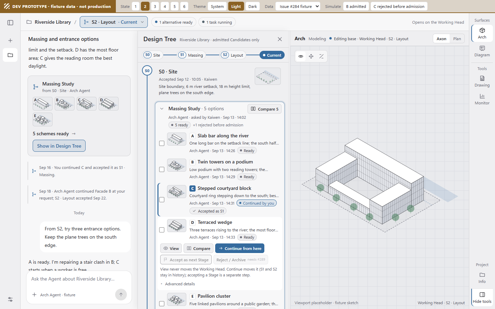
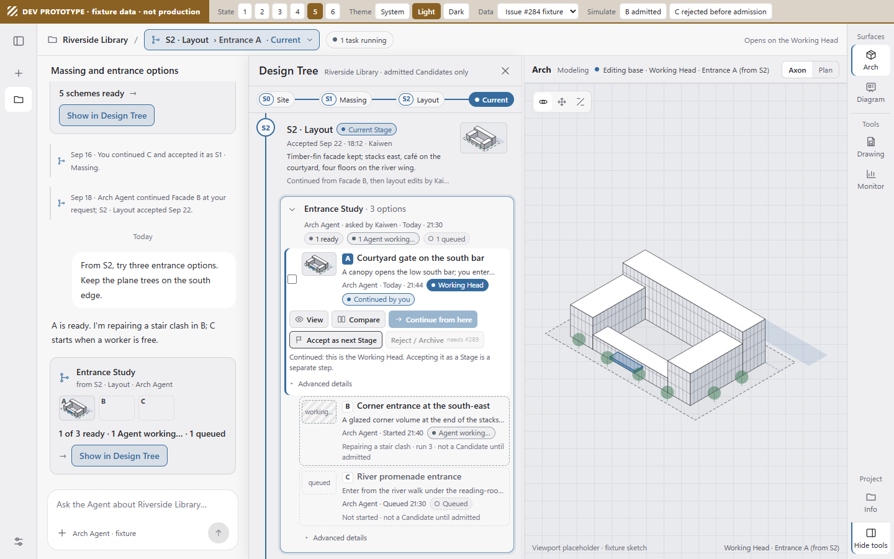

# Candidate Graph interaction: where are my five schemes?

**Issue:** [#284](https://github.com/cogco1/MonkeyHub/issues/284), sections A–D and F · **Date:** 2026-09-25 · **Base:** `cc9397fa`
**Designed against:** #294 (only admitted Candidates are nodes), #277 (Working Head resolver), #295 (Arch and Diagram are primary surfaces; Drawing and Monitor are Tools), #289 (reject/archive), #290 (endorsement), #271 (Worktree Graph).
**Nature:** research note and recommendation. No production UI or backend change. The prototype in `docs/prototypes/candidate-graph/` is dev-only and runs on fixture data.

Terms used below:

| Term | Meaning here |
|---|---|
| **Stage** | Accepted, immutable checkpoint on the spine (`S0`, `S1`, …). |
| **Study** | One request for alternatives, such as "Entrance Study · 5 options". It starts from one point, but its results need not share one exact base (§11, slice 1). The registered term is **Exploration**, backed by WorkingCopy ([naming table](WORK_ENVIRONMENT_AND_EXTENSION_GUIDE.md#产品名称与版本用语), [plan §1](STAGE_BRANCH_CANDIDATE_PLAN.md)). See Q1. |
| **Candidate** | A completed result that has been admitted (#294). Runs, repair attempts, failed jobs and results rejected before admission are never nodes. |
| **Current** | The user-facing name for the Working Head (#277): the point the next edit starts from (修改起点). |
| **Line** | A lineage. A new line starts only when someone continues from an older point. The naming table calls this a Branch. |

## 1. Problem

> "I asked the Agent for five schemes from the same Stage. Where are the five schemes?"

The answer has to be obvious within one interaction from the normal project workspace, and it can't require Candidate IDs, branches or runs. The graph shows one chain:

```text
Stage → Study → admitted Candidates → Continue → next Stage
```

Three actions stay separate everywhere:

- **View** changes nothing.
- **Continue from here** moves Current.
- **Accept as next Stage** creates an immutable checkpoint.

The tree is rebuilt from retained project facts. It never comes from chat history or browser storage.

## 2. Current UI audit

Paths: `ChatShell` = `apps/monkeyhub/web/src/ChatShell.tsx`; `Stage`, `VersionsStrip` = `apps/monkeyhub/web/workspaces/src/features/stage/`; `App` = `…/workspaces/src/app/App.tsx`; `runtime.py` = `apps/archflow-studio/api/archflow_studio_api/application/runtime.py`.

| Place | What the user learns there today | Gap for #284 |
|---|---|---|
| Hub header, `ChatShell:881` | The project name and the chat title. | No Stage and no Current. Below 900 px the tool panel covers it (`ChatShell.css:93`). |
| Rail, `ChatShell:42-50, 1018-1111` | "Workspaces": Modeling, Render, Drawings, Publish, Board, Fab. "System": Monitor. At the bottom, "This project". | It is visible at every width (`ChatShell.css:93-94`), but every entry is a surface or tool (#295). The `drawing` entry borrows the `diagram` label key, which reads "Drawings" (`ChatShell:45`, `messages.en.ts:936`), so "Diagram" has no entry of its own yet. |
| Project card (#277), `ChatShell:1037-1101` | Stage (`:1043`), Current and whether it is accepted (`:1045`), background tasks (`:1053`), and "Work in progress" rows, each with "Open this candidate" (`:1056-1069`). | It is a popover off the rail's last button (`ChatShell.css:72`). The graph is read only while the card is open (`ChatShell:287-289`), so the rest of the UI has no indicator. The rows are flat, sorted by kind (`worktreeGraph.ts:77-88`), and built from every retained working run (`runtime.py:337-379`, capped at 50 at `:197`), which is the legacy mistake #294 removes. They have no Stage or Study grouping and no preview. |
| Agent result, `ChatShell:909-910` | One "Open this candidate on the right" button (`messages.en.ts:940`) per tool message that carries a candidate. | Five schemes plus the internal runs give scattered buttons with no letter, summary or thumbnail. During the turn the viewport jumps to each newest result, view-only, and ends on the last one (`ChatShell:838-851`). Headless results promote the newest one (`:769-836`). |
| Modeling footer, `Stage:2040-2067` | "Versions N", where N is the number of Stages (`Stage:1158`), plus "Viewing …", "new" (`:2044-2048`) and the editing-base row with Continue (`:1176-1201`). | Arch-only. Drawing, Render and Board never show it. |
| Versions panel, `VersionsStrip:86-168` | Drafts, a branch `<select>` showing raw IDs (`:121-123`), Stage rows (`:127-134`), a Git-style branch-name form (`:135-140`), Explorations (`:141-143`), and Candidates folded inside `<details>` (`:144-163`). | It overlays the model at up to 720 × 480 px (`styles.css:1281-1297`). The Candidates are every unaccepted source (`App:653-661`). Clicking a Stage changes the editing base (`App:2191-2193`), which breaks "an old Stage opens read-only". |
| Drawing, `DrawingCanvas.tsx:284-304` | "Source of page …" with Live or Frozen, and a Stage picker labelled `label · branchId` (`:287`). | This is where "which lineage does this sheet follow?" naturally arises, but it doesn't link to the tree. |

**Answers to the issue's six questions:**

1. **Where does the user look right after asking for five schemes?** First at the chat turn they just sent, then at the viewport that opened by itself. Both show at most one scheme. The other four are unlabelled chat buttons or rows inside a closed popover.
2. **Where can a project-level control live without becoming another app?** In project chrome above the surface: one project bar shared by Arch, Diagram and Tools. The rail won't work, because its entries are surfaces and tools (#295). The Modeling footer won't either, because it is Arch-only. The [2026-09-24 proposal §5](2026-09-24-monkeyhub-interaction-proposal.md) already planned this bar as its "unified top bar". The Stage chip would sit in the bar's context slot.
3. **What stays visible while Modeling, Drawing or Render changes?** The project, the Stage, the position (Current, "Viewing X · read-only", or "Comparing N"), the attention counts (new and running), and the Design Tree drawer if it is open.
4. **What survives narrow screens?** The rail, and whichever header is on top. The chip therefore renders in the header of the visible project area and shrinks to `S2 ▾ ●3`.
5. **What should a result card make discoverable?** The Study: its name, its base Stage, "N of M ready" with thumbnails and running placeholders, plus "Compare N" and "Show in Design Tree". It shouldn't be one card per run.
6. **What must work with no chat panel open?** All of it. The chip counts, the tree and Compare come from project facts, not from chat.

## 3. References

All links were fetched on 2026-09-25. Autodesk Fusion was dropped because its version and promote pages returned 404/403, so nothing about it could be confirmed.

**Figma: branching and version history**
([branching](https://help.figma.com/hc/en-us/articles/360063144053-Guide-to-branching), [manage branches](https://help.figma.com/hc/en-us/articles/5668839659415), [review](https://help.figma.com/hc/en-us/articles/5693123873687), [merge](https://help.figma.com/hc/en-us/articles/5691189138839), [version history](https://help.figma.com/hc/en-us/articles/360038006754-View-a-file-s-version-history))
- *Pattern:* every entry sits in the file-name menu (create branch, see all branches, review and merge, show version history). Branches are listed in a modal with Active, Archived and Yours tabs. Review is a separate modal with side-by-side or overlay compare. Version history is a separate right-hand timeline of named versions and grouped autosaves.
- *Makes easy:* safe side exploration. Restore is non-destructive (it adds checkpoints), and merging archives the branch.
- *Confusing:* lineage (the modal) and time (the sidebar) are two unrelated views, and there is no single graph. Merged and manually archived branches share one tab but follow different restore rules. Review is all-or-nothing.
- *Borrow:* an Active/Archived filter, restore that adds a checkpoint, and a name and description on each acceptance.
- *Don't borrow:* splitting lineage and history into two surfaces, merge and conflict UI (architects choose a scheme; they don't merge schemes), and auto-archiving siblings on merge. Unchosen Candidates stay as retained alternatives ([plan §3](STAGE_BRANCH_CANDIDATE_PLAN.md)).

**Onshape: versions, branches, merge, compare**
([versions and history](https://cad.onshape.com/help/Content/Document/versions_and_history.htm), [versions primer](https://cad.onshape.com/help/Content/Primer/versions.htm), [merge](https://cad.onshape.com/help/Content/merge.htm), [restore](https://cad.onshape.com/help/Content/restore.htm), [compare](https://cad.onshape.com/help/Content/Document/compare.htm))
- *Pattern:* an icon in the Document panel opens a tree graph. Versions are immutable solid dots. Each branch ends in an open-dot workspace, and the active workspace gets a blue box. `Branch to create workspace` (with a name and description) forks from any version and leaves Main untouched. Compare shows two points side by side with an emphasis slider. The panel has `Show/Hide merges` and `Show/Hide automatic versions`.
- *Makes easy:* an immutable point and a live tip can't be confused. You can fork from any old point and compare any two points in one graph.
- *Confusing:* the vocabulary (workspace, version, branch, Main). A branch holds many versions but at most one workspace. Restore acts on whichever workspace is open. Merges and auto-versions clutter the graph enough that toggles exist.
- *Borrow:* the dot grammar (solid for a Stage, open for Current), one "you are here" marker, "Continue from here" that leaves the old future intact, noise toggles, and slider compare.
- *Don't borrow:* the per-tab Keep/Merge/Replace dialog, restore that depends on context, and the word "workspace", which already means something else in MonkeyHub.

**Git, GitHub and GitKraken commit graphs**
([Git branching](https://git-scm.com/book/en/v2/Git-Branching-Branches-in-a-Nutshell), [git log](https://git-scm.com/docs/git-log), [GitHub network graph](https://docs.github.com/en/repositories/viewing-activity-and-data-for-your-repository/understanding-connections-between-repositories), [GitHub compare](https://docs.github.com/en/pull-requests/committing-changes-to-your-project/viewing-and-comparing-commits/comparing-commits), [GitKraken interface](https://help.gitkraken.com/gitkraken-desktop/interface/), [agents](https://help.gitkraken.com/gitkraken-desktop/agents/), [detached HEAD](https://help.gitkraken.com/gitkraken-desktop/detached-head-state/), [hide and solo](https://help.gitkraken.com/gitkraken-desktop/hiding-and-soloing/))
- *Pattern:* HEAD is a movable pointer, and each branch gets a lane. `--graph` implies topological order. GitHub's network graph caps at 100 branches. GitKraken puts the newest commit at the top with a WIP node per worktree, fades unrelated commits on hover, and has Hide/Solo view filters. Its Agents view shows one card per worktree plus agent session, with status, ahead/behind and a "Waiting for input" bell.
- *Makes easy:* exact topology, comparing any two points, and watching parallel agent work.
- *Confusing:* detached HEAD (commit on an old checkout and the work is lost), lanes ordered by topology rather than meaning, and hashes and ref jargon.
- *Borrow:* a live node at the tip of each line, hover to trace a lineage, filters that change only the view, and cards for Agent work with a needs-attention state.
- *Don't borrow:* a row per commit as the main view. With current data every Run would become a row, which is exactly the #294 mistake. Also avoid detached-HEAD semantics, hashes and branch names.

**Unreal Engine Multi-User editing**
([overview](https://dev.epicgames.com/documentation/unreal-engine/multi-user-editing-overview-for-unreal-engine), [getting started](https://dev.epicgames.com/documentation/en-us/unreal-engine/getting-started-with-multi-user-editing-in-unreal-engine), [reference](https://dev.epicgames.com/documentation/unreal-engine/multi-user-editing-reference-for-unreal-engine))
- *Pattern:* a toolbar button whose label follows the state (Join, Browse, Leave). The Multi-User Browser lists sessions, clients and a transaction history. Edits live in a sandbox until `Persist Session Changes` writes chosen files, optionally submitting them with a description.
- *Makes easy:* a clean split between live activity and durable history, and choosing what to persist.
- *Confusing:* there are two histories, and nothing is durable until persisted. It is Beta and LAN/VPN only, and you can undo only your own actions.
- *Borrow:* two tiers. Runs, repairs and Agent chatter are session history (chat and advanced views). Candidates and Stages are durable history, the only kind the tree shows. Also borrow an accept sheet with a description, and a control labelled by its state (the chip).
- *Don't borrow:* developer menus and console commands, and any state where unpersisted Agent work can vanish quietly.

**OpenUSD VariantSets**
([glossary: VariantSet](https://openusd.org/release/glossary.html#usdglossary-variantset), [authoring variants](https://openusd.org/release/tut_authoring_variants.html))
- *Pattern:* a VariantSet packages named alternatives on one prim. Each set has zero or one selection, stored apart from the content. usdview switches the selection with a dropdown and writes it into the session layer, not the asset.
- *Makes easy:* alternatives are named siblings you can switch in place without destroying anything.
- *Confusing:* strength ordering (local opinions win), an empty selection shows nothing, nested sets, and no lineage or time.
- *Borrow:* a Study is a named sibling set on one Stage. "Viewing" is a lightweight selection kept apart from Candidates and from Current, switched in the same viewport. A Study can gain options later.
- *Don't borrow:* treating selection as adoption (Continue and Accept stay explicit events), or LIVRPS vocabulary.

**Frame.io V4: version stacks and Comparison Viewer** (optional)
([versioning](https://help.frame.io/en/articles/9101068-versioning-in-frame-io), [comparison viewer](https://help.frame.io/en/articles/9952618-comparison-viewer))
- *Pattern:* a stack is one thumbnail with a count. Compare shows two items side by side with linked zoom and pan, an overlay wipe, "show differences", and comments on one side.
- *Makes easy:* many iterations in one card, and review for non-technical people.
- *Confusing:* stacks are linear, and the newest version is what opens.
- *Borrow:* a Study card with a count, linked cameras, and a wipe.
- *Don't borrow:* a linear stack for alternatives, or "newest is current".

**Flow Production Tracking (ShotGrid) review** (optional)
([collaborative review](https://help.autodesk.com/cloudhelp/ENU/SG-Tutorials/files/SG_Tutorials_tu_collaborative_review_html.html), [playlists](https://help.autodesk.com/cloudhelp/ENU/SG-Supervisor-Artist/files/sa-review-approval/SG_Supervisor_Artist_sa_review_approval_sa_media_app_playlists_html.html))
- *Pattern:* a review panel with Versions and Notes tabs, `Compare with Current` in a grid or wipe, playlists for sessions, and viewed/unviewed markers.
- *Borrow:* one-click "Compare with Current", an unviewed marker (our "new" dot), and later a shortlist sent to Board.
- *Don't borrow:* a separate player, or pipeline vocabulary.

## 4. Patterns learned

1. **Keep "where am I" separate from "the map".** A small control labelled by its state is always visible (Onshape's blue box, Unreal's button label, GitKraken's HEAD/WIP). The graph opens on demand.
2. **Immutable points and the live tip need different shapes, not just colors.** Stages are solid and Current is open (Onshape).
3. **Alternatives are siblings, not a sequence.** USD VariantSets get this right, and Frame.io's linear stacks show what goes wrong otherwise. Lineage decides structure, and time is only a label.
4. **Viewing is a selection. Adopting and committing are separate explicit events.** Compare USD's session selection with Unreal's persist and Figma's merge.
5. **Forking never destroys the old future.** Onshape branches and Figma restore get this right; detached HEAD is the anti-pattern.
6. **Hide noise with filters, not deletion.** Examples are Onshape's toggles, GitKraken's Hide/Solo and Figma's Archived tab.
7. **Agent work is a status on the node it will produce.** GitKraken's cards prove that status matters, but in MonkeyHub it belongs in place, not in a separate list.
8. **Compare needs the same frame.** Use linked cameras, a wipe or slider, and one-click "Compare with Current".

What we don't take: a commit graph as the main view, merge UI, branch naming, hashes, and the word "workspace".

## 5. Entry-point alternatives

- **P1, project-bar Stage chip:** `Project / S2 · Envelope / Current ▾` in a bar above the surface.
- **P2, drawer or rail entry:** a "Design Tree" rail button that opens a drawer beside the workspace.
- **P3, contextual entry:** from the Agent result card, a "5 schemes ready" notice, Drawing's "Source of page" label, or a Compare button.
- **P4, Study tray (fourth pattern):** a filmstrip of the current Study's Candidates that appears at the bottom of the workspace when results arrive.

✓ = solved in one interaction · ~ = partly solved · ✗ = fails

| Workflow or constraint | P1 chip | P2 rail/drawer | P3 contextual | P4 tray |
|---|---|---|---|---|
| W1 · Five schemes just finished | ~ the count changes, but the user is looking at chat | ~ only a badge | ✓ the card is where they look | ✓ it appears by itself |
| W2 · "I need last week's rejected option" | ✓ chip → tree → Archived | ✓ | ✗ the card is buried in an old or archived chat | ✗ current Study only |
| W3 · In Drawing: which lineage does this sheet follow? | ✓ the chip over Tools says `S2 · Current` | ~ open the tree and search | ✓ if the source label links to the tree | ✗ |
| W4 · Back to S1 to start a new direction | ✓ chip → tree → S1 → Continue | ✓ | ✗ | ✗ |
| W5 · Three Agent worktrees still running | ✓ `2 running` shows in the chip | ~ badge | ~ only while chat is open | ~ current Study only |
| Narrow screens | ✓ shrinks to `S2 ▾ ●3` | ✓ the rail survives | ~ the card survives, but notices get missed | ✗ takes viewport height |
| Doesn't read as another app | ✓ it is project chrome | ✗ a rail peer of surfaces and tools (#295) | ✓ | ✓ |
| Works with chat closed | ✓ | ✓ | ✗ | ✓ |

No single pattern passes every row. P1 and P3 together do. P2's rail button fails the "another app" test. P4 is best reused inside the tree, as the narrow-screen peek and the compare picker, rather than as an entry of its own.

## 6. Recommended entry point

**Where is the Design Tree entry in daily use?** It is the **Stage chip** at the left of the **project bar**, above whatever surface is open (Arch, Diagram or a Tool). That chip is the only persistent entry. Contextual doorways (the Study result card, the "ready" notice, Drawing's source label) open the same drawer at the relevant node. There is no rail button, and nothing inside Drawing or the Modeling footer.

This agrees with the prototype lane's hybrid. The refinements it implies are listed in §9.

The chip is the right place for four reasons:

- It answers "where am I?" on every surface. That is the job Onshape's blue box and Unreal's state-labelled button do, and Drawing needs it (W3).
- Its counts come from project facts, so it covers W1 and W5 even with chat closed.
- It is project chrome, so it doesn't become a seventh app (#295), and it isn't Arch-only like the footer.
- The contextual doorways handle the moment of arrival (W1) without being the only way back (W2, W4).

**Closed state.** The chip reads `[Stage] — [position] · [attention]`. "New" counts admitted Candidates this viewer hasn't opened. "Running" counts queued and running Study work. Stale or conflicted items show only as a warning dot on the chip; the details are in the tree.

| Situation | Wide | ≤ 500 px |
|---|---|---|
| Following Current | `S2 · Envelope — Current · 3 new · 2 running` | `S2 ▾ ●3` |
| Viewing another point (warning style) | `Viewing S0 · Candidate B — read-only` [Back to Current] [Continue from here] | `S0·B ▾ !` |
| Comparing | `Comparing 5 · Entrance Study (S2)` [Exit] | `Compare 5 ▾` |
| Just started a new line | `S1 · Massing — Current (new line)` | `S1 ▾` |

The chip replaces the footer's "Versions · Viewing" label (`Stage:2044-2048`) and the editing-base row (`Stage:1176-1201`), so every surface has one "where am I". It renders in the header of the visible project area: the project bar when the tool panel is open, otherwise the chat header next to the project name (`ChatShell:881`). Exactly one chip is on screen at a time. When a Study finishes, a short notice drops from the chip ("Entrance Study · 5 schemes ready · Show") and then settles into the "new" count.

**Open state.** The Design Tree is a drawer of about 320–360 px. It docks on the workspace's chat-side edge and is drawn over the conversation column, which is always at least 360 px wide above 900 px (`ChatShell:38`). The viewport keeps its size for previews, and the chat comes back when the drawer closes. Below 900 px the drawer becomes a sheet over the workspace. Picking a Candidate collapses it to a filmstrip peek of the Study (A–E thumbnails) over the model. The drawer stays open across Arch, Diagram and Tool switches, and clicking a node never moves Current.

## 7. Candidate Graph anatomy

```text
┌ Design Tree ───────── This line | All lines ·  ☐ Archived ·  ✕ ┐
│ ■ S0 · Site          accepted 9/18 · you              (folded) │
│ │                                                              │
│ ■ S1 · Massing       accepted 9/21 · you                       │
│ │ └ Courtyard Study · 5 of 5 · Agent · 9/20     [Compare 5]    │
│ │     [A] [B] [C ▌continued] [D] [E]                           │
│ │            └──────────────┐                                  │
│ ■ S2 · Layout        accepted 9/24 · you   ◄── from C          │
│ │ └ Entrance Study · 1 of 3 ready · 2 running   [Compare]      │
│ │     [A ● new] [B ⟳ Agent working…] [C · queued]              │
│ │                                                              │
│ ○ Current · 3 edits after S2 · you · 10 min ago                │
│   [Accept as S3]                                               │
└────────────────────────────────────────────────────────────────┘
```

1. **Spine.** Stages are solid squares on one vertical line, oldest at the top. Current is an open node at the tip. The drawer opens scrolled to the tip, and Stages more than two back fold to one row. The top-to-bottom order follows the issue's mental model. Newest-first lists (Figma history, GitKraken) put the fresh Study at the top instead; opening at the tip gives the same first view.
2. **Stage row.** Label, a one-line summary, when and by whom it was accepted, and a representative preview (#292). A solid spine means it is on the current line; off-line rows are muted.
3. **Study group.** Hangs off the Stage it started from. If its base is a later, unaccepted revision, the header says so ("from S2 + 3 edits"). The header shows the name, "N of M ready", the author (Agent or you), the time, and [Compare N]. M is what was asked for. Results that weren't admitted appear as a count with a reason ("1 not admitted: checks failed"), never as tiles (#294). This answers "I asked for five and see four."
4. **Candidate tiles.** A thumbnail grid (a contact sheet, so "five" can be counted at a glance). Letters stay stable within a Study, and each tile has a one-line summary and a state marker. The tile menu has View, Compare with Current, Continue from here, Archive (only once #289 ships) and Details. Details shows the base revision, task, worktree and receipt, in developer mode only.
5. **Continue edge.** Runs from the continued tile to the Stage or Current that descends from it.
6. **Other lines.** A second lane to the right, muted and dashed, folded to "Earlier line · S2′ → Current′ · last worked 9/22" until expanded. The current line is always the solid, leftmost lane. Hovering a node highlights its lineage and fades the rest.
7. **Filters.** "This line" or "All lines", plus "Archived" (off by default). Filters change only what is shown.

## 8. Key states and actions

**Node states** (never distinguished by color alone):

| State | Meaning | Visual | Main actions |
|---|---|---|---|
| Ready | An admitted Candidate. | A thumbnail, with a "new" dot until first opened. | View, Compare, Continue from here |
| Viewing | Shown in the workspace right now. | An outline ring and an eye; the chip turns to its warning style. | Back to Current, Continue from here |
| Continued / current line | Current descends from it. | A filled bar, "Continued", and an edge to the next node. | View |
| Accepted Stage | An immutable checkpoint. | A solid square with its S-number, date and who accepted it. | View (read-only), Continue from here |
| Current | The Working Head. | An open node at the tip labelled "Current". | Accept as next Stage |
| Running | Study work that is executing or queued. | A placeholder tile with a progress stripe, "Agent working…" or "Queued". | Open task (the chat turn) |
| Stale | Made from a base older than the point it is compared with. | An amber "Older base" tag that says how many edits behind it is. | View; Continue starts a new line |
| Conflict | Continuing would collide with changes on Current (#277 reconcile). | A warning triangle naming the elements, e.g. "Door D2". | View; Continue as a new line |
| Archived (#289) | Disposed of by a person. | Hidden unless the Archived filter is on; then grey with "Archived 9/20 · you". | Restore |
| Endorsed (#290) | The preferred direction. | A badge, shown only once #290 ships. | — |

**Actions:**

| Action | Where | Current | Stage spine |
|---|---|---|---|
| View | Click a tile or Stage | Unchanged | Unchanged |
| Compare | A Study header, or 2–5 checked tiles from one Study | Unchanged | Unchanged |
| Continue from here | Tile menu, a compare pane, or the chip while viewing | Moves; the old Current stays in the tree | Unchanged |
| … from an older point | Same places | Starts a new line; the old future stays, muted | Unchanged |
| Accept as next Stage | Only on Current (tree footer and chip menu) | Unchanged | A new immutable Stage; sibling Candidates remain retained alternatives |
| Archive / Restore | Tile menu (#289) | Unchanged | Unchanged |

Continue never accepts, and Accept is offered only on Current. Accepting a Candidate therefore always takes two visible steps (Continue, then Accept), which is the #284 V0 demo path.

**Compare.**

- *Start:* [Compare N] on a Study header, or check 2–5 tiles from one Study. While tiles are checked, tiles from other Studies are disabled.
- *Layout:* the workspace becomes an N-up view (2 side by side, 3 in a row, 2×2, or 3+2) with linked orbit and zoom. It uses the Study's shared camera or section when a ReviewContext exists. Otherwise it shows a visible "views not linked" note instead of a silent mismatch.
- *Panes:* each shows its letter, summary and state, with [Continue from this]. Compare has no Accept.
- *The drawer:* stays open with its checks, so going back to the tree keeps the selection. Exit returns to the previous view.
- *After Continue:* a toast says "Current is now Entrance Study · B · Undo", the chip updates, and nothing is accepted.

**Return and fork.**

1. Click S1 on the spine. The workspace shows S1 read-only, and the chip reads `Viewing S1 · Massing — read-only [Back to Current] [Continue from here]`. Nothing else changes.
2. "Continue from here" shows an inline confirm: "Start a new line from S1. The current line (S2 → Current) stays in the tree." If Current has unsynced edits, the confirm first offers to keep them as a saved point.
3. A new lane starts at S1 and Current moves to it. The previous future (S2, its Studies and the old Current) becomes the muted "Earlier line", which can still be expanded and viewed.
4. Lines get automatic names ("Line from S1 · 9/25") that can be renamed later. The Git-style name form goes away.

## 9. Prototype

The prototype is at [`prototypes/candidate-graph/`](prototypes/candidate-graph/README.md). It is static and dev-only: fixture data, admitted Candidates only, no API calls. Open `index.html` directly; each state also opens by URL hash (`#state=1` … `#state=6`). It uses the hybrid entry: a project-bar Stage/Current chip opens a Design Tree drawer beside the workspace, and the Agent's Study card leads to the same drawer. `capture.mjs` re-renders every screenshot and checks each state. It also walks the chain through the UI (result card → Compare → Continue → Accept as next Stage) and reports console errors or network requests.

| # | State | Screenshot |
|---|---|---|
| 1 | Normal project, tree closed | [01-closed.png](prototypes/candidate-graph/screenshots/01-closed.png) |
| 2 | Tree open with the Stage spine and 5 Candidates | [02-tree-open.png](prototypes/candidate-graph/screenshots/02-tree-open.png) |
| 3 | Compare mode | [03-compare.png](prototypes/candidate-graph/screenshots/03-compare.png) |
| 4 | Old Stage selected, read-only | [04-old-stage-readonly.png](prototypes/candidate-graph/screenshots/04-old-stage-readonly.png) |
| 5 | One Candidate continued into the current line | [05-continued.png](prototypes/candidate-graph/screenshots/05-continued.png) |
| 6 | Running Agent worktree under a Study | [06-running.png](prototypes/candidate-graph/screenshots/06-running.png) |
| — | 390 px sheet; dark theme | [07-narrow.png](prototypes/candidate-graph/screenshots/07-narrow.png), [08-dark-tree-open.png](prototypes/candidate-graph/screenshots/08-dark-tree-open.png) |





The prototype differs from this note in two small ways:

- At 1440 px the drawer sits between the chat and the workspace, narrowing the chat to 340 px, instead of being drawn over the conversation (Q4).
- The chip's attention counts follow the fixture: "1 alternative ready · 1 task running".

This research supports the hybrid. When reviewing the screenshots, check that:

- the closed chip shows both position and attention (`3 new · 2 running`), and turns into the read-only warning with [Back to Current] [Continue from here] in state 4;
- there is no Design Tree rail button, and the tree isn't hosted inside Drawing or the Modeling footer;
- Candidates appear as a tile grid under a Study header with "N of M ready" and [Compare N], and running and queued tiles sit in the same grid (state 6);
- Compare happens in the workspace with the drawer still open and checked, each pane offers "Continue from this", and there is no Accept (state 3);
- in state 5, a continue edge runs from the tile to Current, and Accept appears only on Current;
- after a fork, the earlier future is a muted second lane, not removed;
- the chat shows one Study card (thumbnails, Compare, Show in Design Tree), not five "Open this candidate" buttons;
- no raw IDs, hashes, branch names or run labels appear in the main copy.

## 10. Questions and risks

**Questions for Kaiwen**

- **Q1.** Study or Exploration? The naming table registers Exploration (backed by WorkingCopy). #284 says Study, and architects say "massing study". Pick one display name and update the table, so we don't end up with two terms.
- **Q2.** What should the position word be: Current / 当前, or 修改起点 (the 09-24 proposal's term)? Other proposed copy: 设计树, 从这里继续, 接受为 S3, 比较 5 个方案, 正在查看 S0 · 只读, 回到当前.
- **Q3.** Admission policy (#294). An explicit "give me five options" request should admit closed-loop results automatically. If admission needs a click, nothing new shows up and W1 fails, unless the Study gets a "5 finished · review to admit" state. #294 needs to decide.
- **Q4.** Should the drawer cover the conversation (recommended) or push the viewport?
- **Q5.** Auto-open: open only the Study's first ready Candidate, view-only, and let later completions update counts without switching the view ([plan §2 point 5](STAGE_BRANCH_CANDIDATE_PLAN.md)).

**Risks**

- **Legacy data.** Until #294 lands, the runtime lists every retained run as a result (`runtime.py:337-379`). A tree built on that data would recreate the scattered-runs problem, so the prototype has to stay on fixtures.
- **Wrong grouping.** Grouping by time is wrong. When the grouping is unreliable, list singles (the issue's own rule).
- **"New" markers.** These are per-viewer memory, not tree structure. Browser storage is acceptable for them; losing it only resets dots.
- **Scale.** Fold older Stages. The 50-result cap (`runtime.py:197`) must never hide Candidates silently.
- **Compare without a ReviewContext is misleading.** Say "views not linked".
- **MonkeyBoard's registered role includes scheme comparison.** Keep Compare as transient review, and add "Send to Board" later for meetings.
- **Parallel entries drift.** If the Versions design section, the footer label and the project-card rows survive the tree, three places will disagree.

## 11. Implementation implications

The smallest real slices, after review:

1. **One read model.** Build a Design Tree view on the server from retained facts: design history (Stages and lines), Studies (WorkingCopy/Exploration, `episodes.py:67-130`, falling back to the originating task), admitted Candidates (#294), running Study work (#277 running lines), dispositions (#289) and the Working Head resolver (#277). Extend the Worktree Graph endpoint (`runtime.py:417-449`) rather than adding a second version store. The UI never infers admission or stores structure.

   Don't group by exact base alone. A read-only replay of a real test project found two problems. One Agent request for five schemes left three redo runs, each based on its own first attempt. An earlier two-option comparison had been built as a chain, with B made on top of A. So grouping by base would both split Studies and miss them. The retained base bindings do recover lineage; which run is a task's result is exactly the fact #294 has to add.
2. **Always-on status.** Drive the chip from the runtime event stream the shell already consumes (`ChatShell:355-379`), and stop gating the graph read on the project card being open (`ChatShell:287-289`).
3. **Viewing is not continuing.** Stage clicks must be view-only; today they go through `changeEditingBase` (`App:2191-2193`). Reuse the #277 view and follow-head semantics (`ChatShell:30-33`).
4. **Retire parallel entries in the same change** (one canonical in, one out):
   - the VersionsStrip design section (`VersionsStrip:86-168`; the file and export listing can stay as "Files");
   - the footer's Versions, Viewing and editing-base UI (`Stage:2040-2067, 1176-1201`);
   - the project-card work rows (`ChatShell:1056-1070`);
   - the branch-name form (`VersionsStrip:135-140`);
   - raw branch IDs in Drawing's source picker (`DrawingCanvas.tsx:287`).

   Update [plan §7](STAGE_BRANCH_CANDIDATE_PLAN.md), which still names VersionsStrip as the only version entry.
5. **Chat.** Show one Study card per request instead of a button per run (`ChatShell:909-910`). Auto-open only the first ready Candidate, view-only, instead of jumping to every newest result (`ChatShell:838-851`).
6. **Project bar.** One bar shared by Arch, Diagram and Tools (the 09-24 proposal §5). Coordinate with #295, which moves Drawing to Tools and has to untangle the `diagram` label key the Drawing entry now uses (`ChatShell:45`). Add a "Locate in Design Tree" action to Drawing's source label (`DrawingCanvas.tsx:292-304`).
7. **Compare.** An N-up viewer with linked cameras, using the ReviewContext from #271 once it exists.
8. **Checks.** Both i18n catalogs, no raw IDs in the main copy, a browser scenario for the #284 V0 demo and the fork test, and `archcheck`.
