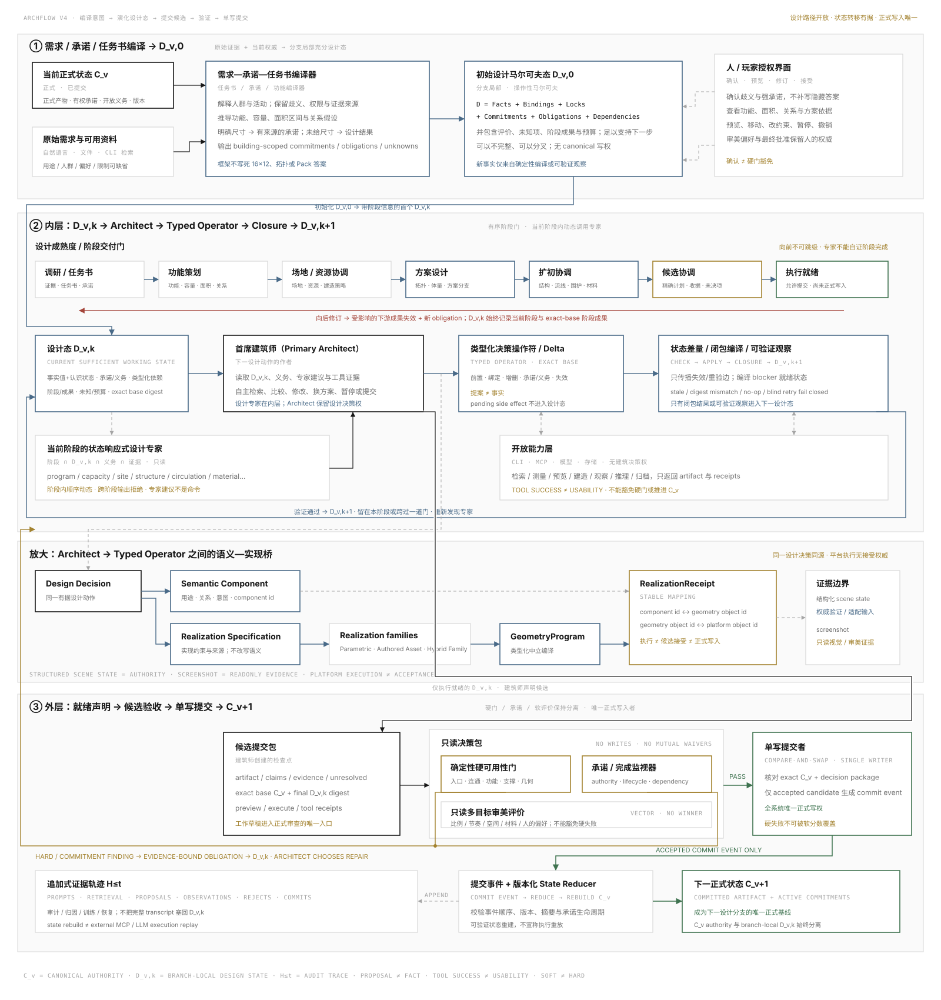

# ArchFlow V4 Dynamic Map

> Generated by `python tools/devctl.py render-map` from
> `governance/work_registry.json`. Architecture rationale remains in
> [ARCHITECTURE.md](ARCHITECTURE.md).

## Current state

- Phase: **P7 - semantic geometry production closure proven**
- Registry updated: **2026-08-28**
- Product capability: **runtime=architectural_failure_revision_typed; adapters=voxel_observation_and_cli_retrieval_proven**
- Next bounded transition: no dependency-ready work; integration decision required

## Architecture coverage

Coverage status describes the target architecture, not merely whether a card exists. A fixture or interface can be evidence while the layer remains partial, missing, blocked, or at risk.

| Layer | Status | Responsibility | Evidence | Open work | Gap |
| --- | --- | --- | --- | --- | --- |
| L0 Raw brief and authority | **proven** | Compile prompt, evidence, ambiguity, authority, and commitments without inventing a design answer. | [P001](mapping/archive/P001-p1-foundation.md) `done`, [P003](mapping/archive/P003-building-usability-contract.md) `done`, [P015](mapping/archive/P015-typed-commitment-contract.md) `done`, [P016](mapping/archive/P016-commitment-compiler-and-locking.md) `done`, [P028](mapping/archive/P028-building-scoped-cli-retrieval.md) `done`, [P042](mapping/archive/P042-pantheon-compiled-state-probe.md) `done`, [M009](mapping/archive/M009-operational-state-epistemics-and-dependency-effects.md) `done`, [P020](mapping/archive/P020-building-scoped-brief-evidence.md) `done`, [M012](mapping/archive/M012-commitment-transition-operator.md) `done`, [P043](mapping/archive/P043-phase-independent-human-clarification.md) `done`, [P029](mapping/archive/P029-primary-architect-model-provider.md) `done`, [P026](mapping/archive/P026-sandbox-prompt-to-usable-gold.md) `done` | — | Exact-base brief compilation phase-independent clarification real-model authoring and one accepted raw-request-to-sandbox-building Gold are proven without moving design authority into the framework. |
| L1 Program, capacity, area, relations | **proven** | Derive building-scoped functions, capacities, area ranges, and relationship hypotheses. | [P003](mapping/archive/P003-building-usability-contract.md) `done`, [P021](mapping/archive/P021-program-capacity-area-relations.md) `done` | — | P021 derives evidence-bound functions, capacity and area ranges, and relationship hypotheses without selecting spatial coordinates; topology remains a downstream P023 responsibility. |
| L2 Operational design state and experts | **proven** | Advance branch-local D_v,k through Architect proposals, verified transitions, and state-responsive experts. | [P006](mapping/archive/P006-state-responsive-expert-capabilities.md) `done`, [P008](mapping/archive/P008-obligation-driven-repair-loop.md) `done`, [P041](mapping/archive/P041-decision-operator-state-closure.md) `done`, [M008](mapping/archive/M008-operational-state-v1-compatibility.md) `done`, [P042](mapping/archive/P042-pantheon-compiled-state-probe.md) `done`, [M009](mapping/archive/M009-operational-state-epistemics-and-dependency-effects.md) `done`, [M012](mapping/archive/M012-commitment-transition-operator.md) `done`, [P043](mapping/archive/P043-phase-independent-human-clarification.md) `done`, [P039](mapping/archive/P039-design-maturity-stage-gates.md) `done`, [P022](mapping/archive/P022-operational-design-controller.md) `done`, [P029](mapping/archive/P029-primary-architect-model-provider.md) `done`, [P044](mapping/archive/P044-portable-skill-packages.md) `done` | — | The nested exact-base resumable controller, state-responsive expert and Skill discovery, real Primary Architect provider, and provider-neutral content-addressed Skill surfaces are proven without transferring runtime authority to a host adapter. |
| L3 Schematic design, design development, and candidate realization | **proven** | Turn the current program and site state into schematic alternatives, coordinate a selected branch through design development, and only then assemble an executable candidate. | [P002](mapping/archive/P002-real-mcp-vertical-slice.md) `done`, [P042](mapping/archive/P042-pantheon-compiled-state-probe.md) `done`, [P023](mapping/archive/P023-spatial-topology-footprint-proposals.md) `done`, [P040](mapping/archive/P040-design-development-coordination.md) `done`, [P024](mapping/archive/P024-candidate-assembly-handoff.md) `done`, [P047](mapping/archive/P047-neutral-geometry-program.md) `done`, [P048](mapping/archive/P048-deterministic-sandbox-realization.md) `done`, [P026](mapping/archive/P026-sandbox-prompt-to-usable-gold.md) `done`, [P051](mapping/archive/P051-unified-progressive-semantic-geometry.md) `done`, [P054](mapping/archive/P054-typed-semantic-spatial-authoring.md) `done`, [P055](mapping/archive/P055-joint-semantic-geometry-lifecycle.md) `done`, [P056](mapping/archive/P056-durable-production-runtime.md) `done`, [M050](mapping/archive/M050-quarantine-production-bypasses.md) `done`, [P057](mapping/archive/P057-derived-component-task-index.md) `done`, [P058](mapping/archive/P058-fresh-progressive-dome-pantheon-proof.md) `done` | — | Schematic alternatives, selected-branch coordination, provider-neutral semantic-spatial co-authoring, stable component identity, single coarse-geometry ownership, joint component-and-detailed-geometry lifecycle compilation, durable runtime persistence, legacy-route isolation, derived task context, direct candidate assembly, and fresh longitudinal generation are proven through P058; live-provider reliability, external-platform equivalence, and engineering or fabrication validation are not claimed here. |
| L4 Candidate review and promotion | **proven** | Keep hard usability, commitment completion, soft evaluation, and single-writer promotion distinct. | [P001](mapping/archive/P001-p1-foundation.md) `done`, [P005](mapping/archive/P005-deterministic-usability-gates.md) `done`, [P007](mapping/archive/P007-aesthetic-multiobjective-evaluation.md) `done`, [P008](mapping/archive/P008-obligation-driven-repair-loop.md) `done`, [P015](mapping/archive/P015-typed-commitment-contract.md) `done`, [M009](mapping/archive/M009-operational-state-epistemics-and-dependency-effects.md) `done`, [M012](mapping/archive/M012-commitment-transition-operator.md) `done`, [P017](mapping/archive/P017-commitment-monitor-and-dependency.md) `done`, [P018](mapping/archive/P018-event-log-and-state-rebuild.md) `done`, [P024](mapping/archive/P024-candidate-assembly-handoff.md) `done`, [P030](mapping/archive/P030-voxel-use-scenario-validation.md) `done`, [P026](mapping/archive/P026-sandbox-prompt-to-usable-gold.md) `done`, [P060](mapping/archive/P060-project-derived-architectural-usability.md) `done` | — | Candidate assembly hard gates source-bound realized-scene use-scenario validation typed commitments monitoring append-only reconstruction separated promotion authorities one accepted real-model Gold and exact-project architectural usability are proven without giving validation review promotion or canonical-write authority. |
| L5 Human and player authority | **partial** | Confirm ambiguity and provide preview, revision, pause, undo, material, and selection controls. | [P043](mapping/archive/P043-phase-independent-human-clarification.md) `done`, [P025](mapping/archive/P025-player-authority-interface.md) `done`, [M004](mapping/archive/M004-approval-commit-wiring.md) `done`, [P031](mapping/archive/P031-player-save-material-build.md) `done` | — | Phase-independent exact-base clarification and pause/resume are proven; P025 and M004 still own candidate-stage controls and approval, while P031 owns staged save/share. |
| L6 Evidence and state reconstruction | **proven** | Preserve append-only evidence and rebuild versioned state without claiming execution replay. | [P008](mapping/archive/P008-obligation-driven-repair-loop.md) `done`, [P042](mapping/archive/P042-pantheon-compiled-state-probe.md) `done`, [P018](mapping/archive/P018-event-log-and-state-rebuild.md) `done` | — | Append-only canonical event reduction and durable checkpoint reconstruction are proven; external execution replay is deliberately outside this layer's claim. |
| L7 Neutral geometry and sandbox realization | **proven** | Compile Architect semantics into generic geometry operations assemblies and assets then realize validate and render the exact candidate without an external platform. | [P004](mapping/archive/P004-voxel-observation-contract.md) `done`, [P024](mapping/archive/P024-candidate-assembly-handoff.md) `done`, [P029](mapping/archive/P029-primary-architect-model-provider.md) `done`, [P047](mapping/archive/P047-neutral-geometry-program.md) `done`, [P030](mapping/archive/P030-voxel-use-scenario-validation.md) `done`, [P048](mapping/archive/P048-deterministic-sandbox-realization.md) `done`, [P049](mapping/archive/P049-neutral-geometry-function-evaluators.md) `done`, [P050](mapping/archive/P050-record-driven-geometry-proposal-producer.md) `done`, [M024](mapping/archive/M024-sandbox-gold-evidence-honesty.md) `done`, [P026](mapping/archive/P026-sandbox-prompt-to-usable-gold.md) `done`, [P051](mapping/archive/P051-unified-progressive-semantic-geometry.md) `done`, [P038](mapping/archive/P038-pantheon-longitudinal-full-flow.md) `done`, [P027](mapping/archive/P027-uneven-terrain-adaptation.md) `done`, [P055](mapping/archive/P055-joint-semantic-geometry-lifecycle.md) `done`, [P056](mapping/archive/P056-durable-production-runtime.md) `done`, [M050](mapping/archive/M050-quarantine-production-bypasses.md) `done`, [P058](mapping/archive/P058-fresh-progressive-dome-pantheon-proof.md) `done`, [P061](mapping/archive/P061-parametric-and-mesh-family-protocol.md) `done`, [P062](mapping/archive/P062-multi-building-experiments-and-ablations.md) `done` | — | Direct component-to-geometry binding exact-base lifecycle sandbox realization and provenance-bound parametric or immutable mesh families are proven through P061; P062 is measuring multi-building behavior and bounded ablations before any paper claim. |
| L8 V3 heritage quarantine | **proven** | Reuse V3 only through explicit read-only capabilities with ownership handover and no fallback. | [P011](mapping/archive/P011-v3-legacy-asset-quarantine.md) `done`, [P012](mapping/archive/P012-v3-quarantined-cli-bridge.md) `done`, [P013](mapping/archive/P013-v3-readonly-diagnostic-pilot.md) `done`, [P014](mapping/archive/P014-v3-ownership-handover-guard.md) `done` | — | V3 responsibilities are classified and bounded through read-only provider contracts with no production fallback; algorithms may inform new implementations but V3 owns no generation authority. |
| L9 Instance-answer isolation | **proven** | Keep dimensions, rooms, topology, palette, and coordinates inside one building derivation. | [M002](mapping/archive/M002-instance-path-removal.md) `done`, [M005](mapping/archive/M005-probe-rooted-integration-smoke.md) `done`, [P042](mapping/archive/P042-pantheon-compiled-state-probe.md) `done`, [P020](mapping/archive/P020-building-scoped-brief-evidence.md) `done`, [P021](mapping/archive/P021-program-capacity-area-relations.md) `done`, [P023](mapping/archive/P023-spatial-topology-footprint-proposals.md) `done`, [P024](mapping/archive/P024-candidate-assembly-handoff.md) `done`, [P051](mapping/archive/P051-unified-progressive-semantic-geometry.md) `done` | — | Brief, program, spatial, component, candidate, and geometry records remain building-scoped with no duplicate candidate projection or framework-owned instance answer path. |
| L10 Site and build context | **proven** | Compile authorized world/site observations and build-mode constraints before spatial design without prescribing a site response. | [P002](mapping/archive/P002-real-mcp-vertical-slice.md) `done`, [P004](mapping/archive/P004-voxel-observation-contract.md) `done`, [P032](mapping/archive/P032-site-context-compiler.md) `done`, [P034](mapping/archive/P034-resource-constructability-compiler.md) `done`, [M047](mapping/archive/M047-generic-site-response-boundary.md) `done` | — | SiteContext retains observations and generic response obligations only; resource and build-policy compilation remain separate, while project strategy semantics stay downstream Architect work. |
| L11 Design option portfolio and lineage | **proven** | Preserve multiple branch-local alternatives, their lineage, trade-offs, and human or Architect selection without automatic winner authority. | [P007](mapping/archive/P007-aesthetic-multiobjective-evaluation.md) `done`, [P008](mapping/archive/P008-obligation-driven-repair-loop.md) `done`, [P022](mapping/archive/P022-operational-design-controller.md) `done`, [P023](mapping/archive/P023-spatial-topology-footprint-proposals.md) `done`, [P033](mapping/archive/P033-design-option-portfolio.md) `done`, [P047](mapping/archive/P047-neutral-geometry-program.md) `done` | — | Multiple alternatives trade-off rationale persistent branch lineage explicit park reject select lifecycle and selected-branch neutral geometry compilation are proven; realized sandbox acceptance remains outside this layer. |
| L12 External world mutation recovery | **partial** | Reconcile previewed plans, partial world writes, observations, compensation, canonical commit, and restart recovery. | [P002](mapping/archive/P002-real-mcp-vertical-slice.md) `done`, [M003](mapping/archive/M003-world-mutation-recovery.md) `done`, [P025](mapping/archive/P025-player-authority-interface.md) `done`, [M018](mapping/archive/M018-bounded-minecraft-volume-observer.md) `done`, [P031](mapping/archive/P031-player-save-material-build.md) `done` | — | Durable partial-write detection compensation outcomes and restart reconciliation are proven for the Minecraft adapter; deployment remains downstream of an accepted neutral artifact and platform equivalence receipts. |
| L13 Project document persistence | **proven** | Keep project identity, records, artifacts, runs, events, canonical snapshots, and HEAD inside one generic document boundary. | [M006](mapping/archive/M006-project-workspace-boundary-cleanup.md) `done`, [P035](mapping/archive/P035-project-persistence-boundary-skeleton.md) `done`, [M007](mapping/archive/M007-project-state-identity-and-authority-seam.md) `done`, [P036](mapping/archive/P036-durable-project-repository.md) `done`, [M014](mapping/archive/M014-canonical-digest-identity.md) `done`, [P037](mapping/archive/P037-pantheon-project-envelope-probe.md) `done`, [P020](mapping/archive/P020-building-scoped-brief-evidence.md) `done`, [P043](mapping/archive/P043-phase-independent-human-clarification.md) `done`, [P018](mapping/archive/P018-event-log-and-state-rebuild.md) `done` | — | Format-version-2 semantic state identity, immutable snapshots, P018 events, and P022 controller checkpoints now share one generic project repository boundary without claiming external-world replay. |
| L14 Development architecture governance | **proven** | Bind work completion to current machine verification and reject framework contamination, unowned artifacts, and oversized Agent context. | [M006](mapping/archive/M006-project-workspace-boundary-cleanup.md) `done`, [P035](mapping/archive/P035-project-persistence-boundary-skeleton.md) `done`, [P036](mapping/archive/P036-durable-project-repository.md) `done`, [M013](mapping/archive/M013-receipt-bound-work-completion.md) `done`, [P045](mapping/archive/P045-architecture-firewall.md) `done`, [P046](mapping/archive/P046-agent-context-capsule.md) `done`, [M033](mapping/archive/M033-context-compaction-recovery.md) `done` | — | Machine-bound completion the architecture firewall and P046 bounded context are proven; M033 governs lifecycle recovery after compaction while future invariants must still be added explicitly as the architecture expands. |
| L15 Downstream platform adapters | **partial** | Translate an accepted neutral artifact into Minecraft schem Rhino Revit agentic CAD or other targets without changing its design authority. | [P002](mapping/archive/P002-real-mcp-vertical-slice.md) `done`, [M003](mapping/archive/M003-world-mutation-recovery.md) `done`, [M018](mapping/archive/M018-bounded-minecraft-volume-observer.md) `done`, [P031](mapping/archive/P031-player-save-material-build.md) `done`, [M048](mapping/archive/M048-downstream-export-claim-sync.md) `done` | — | P031 proves source-bound exact lossy and failed platform-export receipts plus durable export persistence, but no concrete platform exporter or format-specific equivalence validation exists; Rhino Revit and agentic CAD remain adapter classes rather than dependencies. |
| L16 Production responsibility ownership | **proven** | Keep each production responsibility under one explicit active provider with shadow isolation exact-base handover no fallback and stale-result rejection. | [P014](mapping/archive/P014-v3-ownership-handover-guard.md) `done`, [P036](mapping/archive/P036-durable-project-repository.md) `done`, [P053](mapping/archive/P053-production-responsibility-handover.md) `done`, [P056](mapping/archive/P056-durable-production-runtime.md) `done`, [M050](mapping/archive/M050-quarantine-production-bypasses.md) `done` | — | The provider-neutral control plane, formal-runtime adoption, exact-base P053 resolution, no-fallback behavior, and direct-provider-injection quarantine are proven; optional live-provider availability remains environment-dependent and requires separate evidence. |

## Dependency lanes

These are the main responsibility chains. Individual cards retain their exact fan-in dependencies in the registry.

| Lane | Main chain | Purpose |
| --- | --- | --- |
| Project document persistence | [P019](mapping/archive/P019-dual-state-architecture-map.md) → [M006](mapping/archive/M006-project-workspace-boundary-cleanup.md) → [P035](mapping/archive/P035-project-persistence-boundary-skeleton.md) → [M007](mapping/archive/M007-project-state-identity-and-authority-seam.md) → [P036](mapping/archive/P036-durable-project-repository.md) → [P037](mapping/archive/P037-pantheon-project-envelope-probe.md) → [P020](mapping/archive/P020-building-scoped-brief-evidence.md) → [P043](mapping/archive/P043-phase-independent-human-clarification.md) → [P018](mapping/archive/P018-event-log-and-state-rebuild.md) → [M014](mapping/archive/M014-canonical-digest-identity.md) → [P022](mapping/archive/P022-operational-design-controller.md) → [P052](mapping/archive/P052-external-project-runtime.md) | Define identity and ownership before adding one atomic project repository, routing every retained record through it, and injecting an explicit external runtime root without changing authority. |
| Commitment-safe state | [P019](mapping/archive/P019-dual-state-architecture-map.md) → [P015](mapping/archive/P015-typed-commitment-contract.md) → [P035](mapping/archive/P035-project-persistence-boundary-skeleton.md) → [M007](mapping/archive/M007-project-state-identity-and-authority-seam.md) → [P016](mapping/archive/P016-commitment-compiler-and-locking.md) → [P041](mapping/archive/P041-decision-operator-state-closure.md) → [M008](mapping/archive/M008-operational-state-v1-compatibility.md) → [M009](mapping/archive/M009-operational-state-epistemics-and-dependency-effects.md) → [P017](mapping/archive/P017-commitment-monitor-and-dependency.md) → [P018](mapping/archive/P018-event-log-and-state-rebuild.md) | Compile typed design moves into sufficient branch-local state, make past commitments executable there, and reconstruct formal versions. |
| Building-scoped retrieval | [P019](mapping/archive/P019-dual-state-architecture-map.md) → [P028](mapping/archive/P028-building-scoped-cli-retrieval.md) → [M009](mapping/archive/M009-operational-state-epistemics-and-dependency-effects.md) → [P020](mapping/archive/P020-building-scoped-brief-evidence.md) → [P043](mapping/archive/P043-phase-independent-human-clarification.md) → [P021](mapping/archive/P021-program-capacity-area-relations.md) | Retrieve evidence per building, then compile it into program facts without global answers. |
| Brief to spatial candidate | [P019](mapping/archive/P019-dual-state-architecture-map.md) → [P028](mapping/archive/P028-building-scoped-cli-retrieval.md) → [M009](mapping/archive/M009-operational-state-epistemics-and-dependency-effects.md) → [P020](mapping/archive/P020-building-scoped-brief-evidence.md) → [P043](mapping/archive/P043-phase-independent-human-clarification.md) → [P021](mapping/archive/P021-program-capacity-area-relations.md) → [P032](mapping/archive/P032-site-context-compiler.md) → [P034](mapping/archive/P034-resource-constructability-compiler.md) → [P039](mapping/archive/P039-design-maturity-stage-gates.md) → [P022](mapping/archive/P022-operational-design-controller.md) → [P023](mapping/archive/P023-spatial-topology-footprint-proposals.md) → [P033](mapping/archive/P033-design-option-portfolio.md) → [P040](mapping/archive/P040-design-development-coordination.md) → [P024](mapping/archive/P024-candidate-assembly-handoff.md) → [P051](mapping/archive/P051-unified-progressive-semantic-geometry.md) | Derive one building through ordered maturity gates without writing its dimensions, rooms, topology, or discipline answers into the framework. |
| Framework to probe validation | [M002](mapping/archive/M002-instance-path-removal.md) → [M005](mapping/archive/M005-probe-rooted-integration-smoke.md) → [P042](mapping/archive/P042-pantheon-compiled-state-probe.md) → [M009](mapping/archive/M009-operational-state-epistemics-and-dependency-effects.md) → [P020](mapping/archive/P020-building-scoped-brief-evidence.md) → [P043](mapping/archive/P043-phase-independent-human-clarification.md) → [P021](mapping/archive/P021-program-capacity-area-relations.md) → [P032](mapping/archive/P032-site-context-compiler.md) → [P034](mapping/archive/P034-resource-constructability-compiler.md) → [P039](mapping/archive/P039-design-maturity-stage-gates.md) → [P022](mapping/archive/P022-operational-design-controller.md) → [P023](mapping/archive/P023-spatial-topology-footprint-proposals.md) → [P033](mapping/archive/P033-design-option-portfolio.md) → [P040](mapping/archive/P040-design-development-coordination.md) → [P024](mapping/archive/P024-candidate-assembly-handoff.md) → [P029](mapping/archive/P029-primary-architect-model-provider.md) → [P030](mapping/archive/P030-voxel-use-scenario-validation.md) → [P047](mapping/archive/P047-neutral-geometry-program.md) → [P048](mapping/archive/P048-deterministic-sandbox-realization.md) → [P026](mapping/archive/P026-sandbox-prompt-to-usable-gold.md) → [P051](mapping/archive/P051-unified-progressive-semantic-geometry.md) → [P038](mapping/archive/P038-pantheon-longitudinal-full-flow.md) → [P060](mapping/archive/P060-project-derived-architectural-usability.md) | Keep probes as thin building-run callers while the framework derives project answers compiles neutral geometry and evaluates exact project-authored criteria without owning instance defaults. |
| Site, resources, and option lineage | [P020](mapping/archive/P020-building-scoped-brief-evidence.md) → [P043](mapping/archive/P043-phase-independent-human-clarification.md) → [P021](mapping/archive/P021-program-capacity-area-relations.md) → [P032](mapping/archive/P032-site-context-compiler.md) → [P034](mapping/archive/P034-resource-constructability-compiler.md) → [P039](mapping/archive/P039-design-maturity-stage-gates.md) → [P022](mapping/archive/P022-operational-design-controller.md) → [P023](mapping/archive/P023-spatial-topology-footprint-proposals.md) → [P033](mapping/archive/P033-design-option-portfolio.md) → [P040](mapping/archive/P040-design-development-coordination.md) → [P024](mapping/archive/P024-candidate-assembly-handoff.md) | Compile site and build constraints, preserve multiple schematic branches, and coordinate only the selected branch through design development. |
| Real Architect provider | [P039](mapping/archive/P039-design-maturity-stage-gates.md) → [P043](mapping/archive/P043-phase-independent-human-clarification.md) → [P022](mapping/archive/P022-operational-design-controller.md) → [P028](mapping/archive/P028-building-scoped-cli-retrieval.md) → [P029](mapping/archive/P029-primary-architect-model-provider.md) → [P044](mapping/archive/P044-portable-skill-packages.md) → [P047](mapping/archive/P047-neutral-geometry-program.md) → [P048](mapping/archive/P048-deterministic-sandbox-realization.md) → [P050](mapping/archive/P050-record-driven-geometry-proposal-producer.md) → [P026](mapping/archive/P026-sandbox-prompt-to-usable-gold.md) | Connect bounded asynchronous model reasoning portable Skill surfaces and typed geometry compilation before the sandbox Gold claim. |
| Sandbox acceptance and player authority | [P043](mapping/archive/P043-phase-independent-human-clarification.md) → [P024](mapping/archive/P024-candidate-assembly-handoff.md) → [P025](mapping/archive/P025-player-authority-interface.md) → [M004](mapping/archive/M004-approval-commit-wiring.md) → [P030](mapping/archive/P030-voxel-use-scenario-validation.md) → [P047](mapping/archive/P047-neutral-geometry-program.md) → [P048](mapping/archive/P048-deterministic-sandbox-realization.md) → [P026](mapping/archive/P026-sandbox-prompt-to-usable-gold.md) → [P031](mapping/archive/P031-player-save-material-build.md) → [P027](mapping/archive/P027-uneven-terrain-adaptation.md) → [P060](mapping/archive/P060-project-derived-architectural-usability.md) | Add reversible control, compile and validate a neutral hybrid artifact against exact project criteria, save and stage it, and preserve explicit uneven-site alternatives with exact contact evidence. |
| World authority and recovery | [P018](mapping/archive/P018-event-log-and-state-rebuild.md) → [P024](mapping/archive/P024-candidate-assembly-handoff.md) → [M003](mapping/archive/M003-world-mutation-recovery.md) → [P025](mapping/archive/P025-player-authority-interface.md) → [M004](mapping/archive/M004-approval-commit-wiring.md) → [M018](mapping/archive/M018-bounded-minecraft-volume-observer.md) → [P031](mapping/archive/P031-player-save-material-build.md) | Keep optional external-world observation mutation and recovery downstream of accepted neutral geometry with exact candidate and authority binding. |
| Neutral geometry and sandbox Gold | [P024](mapping/archive/P024-candidate-assembly-handoff.md) → [P029](mapping/archive/P029-primary-architect-model-provider.md) → [P047](mapping/archive/P047-neutral-geometry-program.md) → [P030](mapping/archive/P030-voxel-use-scenario-validation.md) → [P048](mapping/archive/P048-deterministic-sandbox-realization.md) → [P049](mapping/archive/P049-neutral-geometry-function-evaluators.md) → [P050](mapping/archive/P050-record-driven-geometry-proposal-producer.md) → [M024](mapping/archive/M024-sandbox-gold-evidence-honesty.md) → [P026](mapping/archive/P026-sandbox-prompt-to-usable-gold.md) → [P027](mapping/archive/P027-uneven-terrain-adaptation.md) → [P051](mapping/archive/P051-unified-progressive-semantic-geometry.md) → [P038](mapping/archive/P038-pantheon-longitudinal-full-flow.md) → [P061](mapping/archive/P061-parametric-and-mesh-family-protocol.md) | Compile Architect semantics into generic geometry operations typed assemblies and provenance-bound parametric or mesh families then validate render repair and accept without an external platform. |
| Downstream platform adapters | [P002](mapping/archive/P002-real-mcp-vertical-slice.md) → [M003](mapping/archive/M003-world-mutation-recovery.md) → [M018](mapping/archive/M018-bounded-minecraft-volume-observer.md) → [P048](mapping/archive/P048-deterministic-sandbox-realization.md) → [P031](mapping/archive/P031-player-save-material-build.md) → [M048](mapping/archive/M048-downstream-export-claim-sync.md) | Translate accepted neutral artifacts into Minecraft schem Rhino Revit agentic CAD or other targets with explicit equivalence or loss receipts and no reverse design authority. |
| V3 heritage quarantine | [P019](mapping/archive/P019-dual-state-architecture-map.md) → [P011](mapping/archive/P011-v3-legacy-asset-quarantine.md) → [P012](mapping/archive/P012-v3-quarantined-cli-bridge.md) → [P013](mapping/archive/P013-v3-readonly-diagnostic-pilot.md) → [P014](mapping/archive/P014-v3-ownership-handover-guard.md) | Keep V3 as explicit read-only evidence/capabilities with ownership handover and no fallback. |
| Production responsibility isolation | [P014](mapping/archive/P014-v3-ownership-handover-guard.md) → [P036](mapping/archive/P036-durable-project-repository.md) → [P053](mapping/archive/P053-production-responsibility-handover.md) | Register implementations without authority run replacements in shadow and switch exactly one active provider by monotonic exact-base handover with no fallback or canonical-write power. |
| Development architecture governance | [M006](mapping/archive/M006-project-workspace-boundary-cleanup.md) → [P035](mapping/archive/P035-project-persistence-boundary-skeleton.md) → [P036](mapping/archive/P036-durable-project-repository.md) → [M013](mapping/archive/M013-receipt-bound-work-completion.md) → [P045](mapping/archive/P045-architecture-firewall.md) → [P046](mapping/archive/P046-agent-context-capsule.md) → [M033](mapping/archive/M033-context-compaction-recovery.md) | Make architecture rules executable, bind completion evidence to the verified source state, and give each Agent only its bounded work context. |
| Semantic geometry production closure | [P051](mapping/archive/P051-unified-progressive-semantic-geometry.md) → [M049](mapping/archive/M049-semantic-geometry-production-truth.md) → [P054](mapping/archive/P054-typed-semantic-spatial-authoring.md) → [P055](mapping/archive/P055-joint-semantic-geometry-lifecycle.md) → [P056](mapping/archive/P056-durable-production-runtime.md) → [M050](mapping/archive/M050-quarantine-production-bypasses.md) → [P057](mapping/archive/P057-derived-component-task-index.md) → [P058](mapping/archive/P058-fresh-progressive-dome-pantheon-proof.md) | Preserve the proven component and geometry invariants, then add typed co-authoring, one joint lifecycle, one durable runtime, isolated providers, derived task context, and fresh proof without creating another design or persistence authority. |

## RMPA ledgers

| Ledger | Meaning | Items | Index |
| --- | --- | ---: | --- |
| Retirement | Replacement-first removal of old ownership | 0 | [R](mapping/retirement/INDEX.md) |
| Modify | Scoped repair of the active path | 0 | [M](mapping/modify/INDEX.md) |
| Planning | Not implemented or not yet accepted | 0 | [P](mapping/planning/INDEX.md) |
| Archive | Completed and evidenced work | 124 | [A](mapping/archive/INDEX.md) |

R, M, and P are parallel ledgers, not mandatory runtime stages. Archive is
the cleared construction record, not a fourth execution phase.

## Active and ready work

| ID | Stream | Status | Goal | Card |
| --- | --- | --- | --- | --- |
| - | - | - | No active work | - |

## Module state

| Module | Status | Responsibility |
| --- | --- | --- |
| [state](../archflow/state/README.md) | semantic_geometry_and_component_families_proven | Canonical decision state, never raw transcript |
| [runtime](../archflow/runtime/README.md) | architectural_failure_revision_typed | Bounded Architect session coordination |
| [workspace](../archflow/workspace/README.md) | p1_proven | Isolated mutable drafts and tool outputs |
| [capabilities](../archflow/capabilities/README.md) | semantic_spatial_single_repair | Open discovery without fixed expert pipeline |
| [submission](../archflow/submission/README.md) | obligation_repair_proven | Only boundary from working to formal review |
| [validation](../archflow/validation/README.md) | project_derived_architectural_usability_proven | Read-only deterministic gates and obligations |
| [evaluation](../archflow/evaluation/README.md) | repair_locality_evidence_proven | Read-only multi-objective observations |
| [commit](../archflow/commit/README.md) | in_memory_proven | Single-writer canonical promotion |
| [adapters](../archflow/adapters/README.md) | voxel_observation_and_cli_retrieval_proven | External MCP/CLI/model/storage boundaries |
| [project](../archflow/project/README.md) | provider_success_rejection_recoverable | Project identity, layout, references, and persistence ports |

## Promotion boundary

```text
Canonical C_v + raw brief/evidence
        -> compile branch-local D_v,0
        -> Architect + state-responsive experts
        -> Proposal/Delta -> verified transition -> D_v,k+1
        -> CandidateSubmission
        -> hard usability + commitment monitor
        -> separate read-only aesthetic observations
        -> single-writer commit event -> reducer -> C_v+1
```

Hard gates constrain submitted artifacts, not the Architect's internal
reasoning or draft tool sequence. Complete history and raw MCP receipts
remain outside canonical state.

## Change rules

1. Change machine work state only through `tools/devctl.py`.
2. A work item may write only inside its declared `write_scope`.
3. Completion requires named evidence and moves the card to Archive.
4. A soft evaluator cannot waive a failed hard gate.
5. Do not claim replay until an executor reproduces transitions.
6. Real MCP or LLM behavior requires its own claimed work item and
   an explicit bounded smoke test; registry readiness alone is not a claim.


