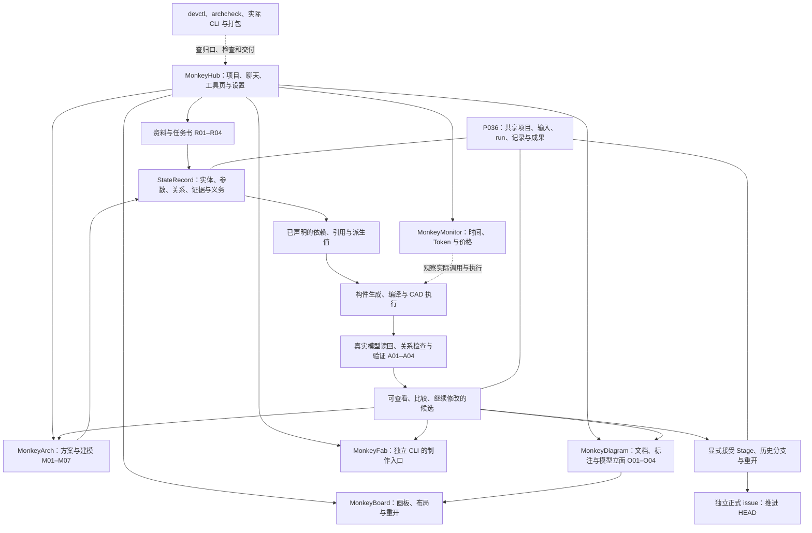
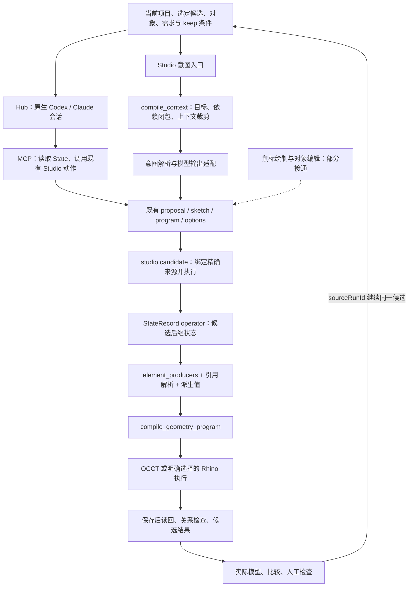
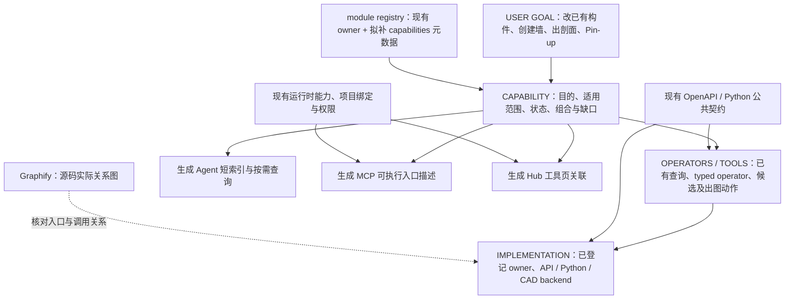

# P115 — 能力总索引与逐项整理

### #32 Phase 0：整轮任务观测与 MonkeyMonitor

`P115/agent-latency` 从 `293756cf` 开始，复用分配的 `597e` worktree，
EXTEND `monkeymonitor`、`hub.shell`、`studio.shell` 与 `studio.candidate`。
Hub 用户消息、Agent 活动、工具、Studio 请求、候选队列、CAD、读回、验证与浏览器预览
归入同一 turn。原 `UsageEvent` / `UsageLog` 是唯一诊断日志，P036 保持原有设计保存权。

Monitor 首页提供真实记录驱动的摘要、五泳道水平耗时图、嵌套活动树、阻塞区间与重复请求诊断。
模型调用次数只统计明确的请求边界；原生用量事件数与 Agent 活动段分别显示，边界不足时保留未知。
Agent 等待区间不冒充纯推理，首文本到达也不冒充浏览器首帧。
进程内时长取单调时钟，跨进程位置保留毫秒墙钟口径；并行时间不相加，关键分支证据不足时保留未归因。
计价按精确 provider/model/billing plan 与有来源、生效日期的费率；未知身份显示不可用。
原调用表和假设计算器保留在高级工具。JSON 下载与页面使用同一归一化记录。

固定 simple-create / incremental-edit 基准与可丢弃 Hub/Studio/OCCT 运行入口位于
`tests/monkeymonitor/`。真实 provider 测试只使用合成项目和隔离端口；不更新安装包或活动服务。
已核实真实 Codex 回合能产生并读回候选，实际浏览器加载与原生 token 记录出现在同一 trace。
同一源码提交 `bfbaca62` 的真实 Codex/OCCT/headless Chrome 单次基线：创建任务总历时 43.533 s、
首帧 29.282 s；檐口高度 0.3→0.5 m 的增量任务总历时 55.583 s、首帧 49.377 s。
两者各 3 次观测工具调用、5 条原生用量事件；几何包围盒与对象集合符合固定场景，项目 HEAD 不变。
这些单次样本不构成速度提升或分布统计。实际模型请求数、自动价格与未调用的正式验证时间保留未知。
原底座升高且保护依附檐口的场景被既有保护规则拒绝；其失败样本不计入上述成功基线。
源码检查包括监控/聊天/队列/候选/验证、实际 3DM 模型载入浏览器、OpenAPI、构建与 archcheck。
完整旧浏览器套件另有绘图工具按钮被 footer 遮挡的问题；聚焦模型计时场景均通过。

后续切片以这些真实记录为基线：先加入同任务比较与精确 focus/base 的 ContextPack，
再沿现有 proposal/candidate 完成一次声明式设计事务。尚未在本片改变 Agent 权限、
生命周期、缓存所有权或设计语义；不据此关闭 #32。

### #21 Phase C：完整包与隔离安装

`P115/desktop` 在独立 `a6c0` worktree 从 `293756cf` 继续，分支为
`codex/desktop-product-package`。PR #33 的原生宿主已经合入；本片沿既有
`package_monkeyapps.py --desktop` 生成完整 ZIP，并让 Windows workflow 从该包安装，
使用包内 Python 和 EXE 默认入口完成真实生命周期与项目重开检查。
安装测试清除开发 Python/Node/虚拟环境路径，使用独立用户目录；重装前后比较项目和用户配置，
版本升级测试保留旧安装和既有用户文件。`build-info.json` 记录实际 Node/ACP、Python 依赖清单
以及前端资源身份。Windows run `34765256386` 在 `02e9d5f8` 完成完整 ZIP 构建、
校验/解压/隔离安装、5 项包内原生生命周期检查和 13 项打包/安装检查；主仓库 CI 全部通过。
该 runner 已有 WebView2，第二台干净 Windows 机器、真实旧版本数据迁移和可选 MonkeyFab/provider
仍未完成此包验收。可安装包不等于活动环境已升级。
本片不修改 Hub runtime 源码；#12/#8 的重叠接口在后续切片前协调。

### #21 Phase A：Windows 桌面窗口与 Hub 生命周期

`P115/desktop` 从实际主线 `0ce0c111dbfeab2cb6373cf9050392e537caf20a` 开始，
复用 `12ee` worktree 与 `codex/desktop`。EXTEND `hub.shell` 的入口，新增薄 Tauri
宿主；EXTEND `tools.package_monkeyapps`，沿用其精确源码快照、前端资源、Python/Node
运行时及候选 ZIP 路径。壳只管理一个通过 PID、父进程、实例 ID、源码版本和健康检查
确认的 Hub 根进程；Studio、Monitor、ACP 继续由 Hub 管理，项目保存继续使用 P036。
实际 Hub 持有非项目 runtime 目录锁直到工作进程完成收尾，覆盖桌面与浏览器 CLI；
壳被强制结束后立即重开，也不能并发改写同一份聊天配置。已核实的自有工具页可打开
受限原生子窗口，保留画板原文和比较入口；壳没有通用命令桥。

本阶段实现独立窗口、启动/崩溃诊断、受限导航和 stdin 协调退出，保留原浏览器开发入口。
测试仅用隔离项目、配置和端口。源码 PR 与 EXE 运行验证不代表独立安装包已完成验收；
App Server 故障恢复、独立安装环境和更新/重装验收继续由 #21 后续阶段处理。
后续与 #14 手动 Sync 集成时，只按明确提交的批次验证避免重放；桌面不保存建模草稿，
也不宣称能够恢复未同步工作。

首片验证包括 Windows release 编译、宿主边界、真实 EXE 生命周期、暂时失联时保留页面输入、
隔离项目重开、Hub 生命周期与打包测试。已加载后健康检查暂时超时仅改变原生标题，
同一进程恢复时不重载当前页面。既有安装脚本按包元信息选择原生入口，
桌面包和浏览器包使用不同版本目录及快捷方式；缺少 EXE 会拒绝安装。PR #25 等待最终 head
的 Windows／主线检查及协调审查，不据此关闭 #21。

### #23：完整使用路径复验

PR #26、#27、#30 已合入。`P115/board` 在 bb66 worktree 的 `codex/board-acceptance`
从主线 `293756cf6b10a49bff303c3d37f60dac0e9c2754` 继续验收，复用 `studio.board`。
现有真实 Studio／P036 浏览器流程补入：空白板独立文字便笺、PDF 拖入与旋转裁切第二页添加、
选区原图替换后的摆放与批注保持、撤销替换后重开，以及 CAS 冲突中另开已保存版本比较。
全部使用测试创建并清理的项目、端口和浏览器；文件粘贴使用浏览器 File 事件，未验收操作系统剪贴板。

既有交接浏览器复现了首次模型绑定失败后的问题：图纸仍能打开，但交接一直等待 ready，
原意见没有出现在对话中。修复仅扩展 `App.tsx` 的 Board handoff effect 与 `ErrorPanel.tsx`
对应两类来源错误提示；拒绝时保留输入框原文，普通模式说明原因及“意见尚未发送”，
保留开发模式原诊断。交接在拒绝时结束，后续手动恢复与刷新不自动重放。
共享文件范围已经主协调任务与 #14／#32 协调，原有 Stage／来源拒绝和提交条件继续生效。

36 项 Board 单元测试、11 项 Board API 测试、真实白板浏览器（89 次请求、2 次显式交接）、
原替换浏览器、六项交接浏览器、构建与 archcheck 通过。交接浏览器模拟模型／intent 响应，
验证真实 Connected → App 调用及拒绝、澄清、恢复和刷新行为，不代表真实 Agent 已完成模型修改。

现场盲测仍需一名用过 Miro／FigJam／Canva、未用过 MonkeyBoard 的人员。
给出空白测试板、PNG／PDF，以及可在 MonkeyDiagram 关联的测试模型，只交代任务：
放图、圈画、画箭头、写意见、平移；关联图纸后找到并发送选中意见；更换原图后撤销并重开。
观察入口是否自行发现、是否需要提示、原文是否需要重输；实际需要的提示与失败才作为体验结论。
自动化通过不完成这项人员验收；#24 多人白板继续后置。

### #23：选中图页就地更新来源

白板界面整理与选区反馈（PR #26）、选中文字免重输与首次保存读写竞态修复（PR #27），
均已由协调任务独立复验并合并。第三片复用 c68e worktree，分支 `codex/board-source`，
基线为 `e988f940a44953fb91930c30179d1e9f07ee1068`，继续 EXTEND `studio.board`。

本片补齐 #23 Phase 6 的选区更新来源入口：明确选中一个图像，或选中原生图框且其中只有一个图像时，
就地显示“更新此页原图”，复用现有 `ReplacementDialog` 与确切页替换路径，并保留资料栏原入口。
选择依据实际图像的 run／asset／revision／page 和原生 frameId，不使用图框标签或附近圈线推断来源。
多图选择（包括同页的两个副本）不提供更新；单独选择绑定箭头或文字也不会选择其关联图片。
更新原图不要求模型关联、未裁切图像或可转换的批注几何，这些条件仅属于设计反馈。
点击时再次读取当前选区与资料列表；替换继续沿用原有位置、裁切、批注、删除和 CAS 处理。
替换窗口取消后将焦点还给触发按钮，修复了键盘 Escape 关闭后焦点落到页面主体的问题。

36 项 Board 前端行为测试、构建与架构检查通过。既有替换浏览器从新增按钮完成一次精确上传，
覆盖图像／图框／多图歧义、裁切比例与位置批注保持、原资料栏入口、Crit／撤销／重开、
取消焦点和一次预期 CAS 拒绝；完整真实白板浏览器同时通过（63 次请求、2 次显式反馈交接）。

生产修改限 `apps/archflow-studio/web/src/workspaces/monkeyboard/Board.tsx` 与 `boardScene.ts`，
扩展既有 `boardScene.test.ts` 和 `boardReplacement.browser.mjs`，不改变公开 API／DTO 或模块契约。
共享卡片和登记保留其他 lanes，独立 PR 由协调任务审查准确 head 与 CI 后合并。

真实新用户能否无说明完成整条操作仍待试用；不把自动化回归当作零培训验收。
本轮不新增便签预设、HTML／远程图片粘贴或多人协作，也不刷新活动服务。

### #14 Phase 5：连续建模中的吸附保持与释放

`P115/interaction` 从已合入 PR #19/#20/#22/#28/#36/#37/#38 的 `293756cf` 继续，
使用分配的 `48ca` worktree / `codex/issue14-snap-retention`，EXTEND 原有 Stage、
可丢弃 interaction session 与 feature-edge 查询，不修改后端、Monitor 或候选契约。

端点、中点和边以默认 14 px 捕获、21 px 释放；小幅指针抖动不再切换目标，
手势短暂越过轮廓也能保持原目标。靠近另一固定点且明显更近时允许切换，避免短边中点被旧端点挡住。
保留的边按当前射线更新边上位置，草图已有轴推断保留同一轴后继续滑动，离开保持区后需重新捕获。
普通 hover 使用当前真实命中的面，与点击选取一致；相机、可见性、模型／草稿替换及工具结束清除旧吸附。

隔离的 Chrome 1440×1000 浏览器覆盖轮廓跨越、边上滑动、端点／中点切换、失效清理、
轴保持／释放、原数值覆盖与取消。同一轮廓保持回归在 `293756cf` 的原视口实现上失败，在修复后通过。
真实 Studio/OCCT 连续创建、P、Move/Copy、删除及撤销／重做通过；
新增 Move 回归将另一体块角点作为目标，经指针抖动、确认、几何读回与撤销验证精确平移。
原冻结 Sync 验证仍通过：后续本地编辑留在当前画面，一次提交只生成冻结批次的一个候选，实际 3DM 与冻结几何一致。

本机 400 网格／4,800 三角形合成体块场景，480 次指针事件合并为 120 帧，复用预览资源、
零 pointer React 提交、零 API 请求；pointer 到预览渲染返回 P95 17.9 ms，帧间隔 P95 16.9 ms，
单次 pointer handler P95 0.5 ms。真实操作的自动化观察中，本地建模确认约 16–57 ms；
一组吸附 Move 的确认至下一 RAF 为 17 ms。这些读数不代表 GPU 呈现或人工易用性验收。
连续建模的 Sync 包含后续编辑的人为等待 424 ms，总计约 3.17 s，扣除等待约 2.75 s；
无后续输入的 Sync 至候选可见约 5.24 s，其中成功任务读回约 3.12 s，3DM 解析约 135 ms。
HTTP、解析和 UI 等待有重叠，不能相加，也不能把后端候选耗时归为手势延迟。

Phase 6 仍需代表性真实大模型的完整吸附测量。本次合成场景未显示需要空间索引，未添加索引；
101,760 三角形曲面的已有面连通性查询检查只测 face lookup，不证明该场景的完整射线／吸附速度。
复杂模型、长时间连续操作及真实建筑师试用仍待后续验收，#14 保留这些余项。
Web 检查 199 通过、2 跳过，生产构建、类型检查及 archcheck 通过；两项独立审查发现已修复并复查。

### #14 Phases 2/3：本地会话与预选

`P115/interaction` 在 PR #19 合入后的 `62c90302` 上继续，复用 `685e` worktree，分支为
`codex/i14-hover`。EXTEND `studio.shell`／`studio.intent` 的 Stage、视口和既有点击解析调用者。
交接前合入包含 PR #18 的主线 `6158a5bf`，保留 Blender lane 的实现、登记和验收记录。

Stage 与视口共用一次可丢弃的手势会话，保存草图、当前命中、指针、按下位置和一个 RAF；
inactive／hovering／armed／anchored／dragging／value-override 从当前动作推导，不复制进项目状态。
对象身份在模型加载时按文件原有 user strings 建索引，只凭同一 component 与明确 cad-object 引用
关联显示对象。鼠标移动只在本地射线检测，复用中性轮廓、连通共面、边和吸附点图层；点击立即使用原选中高亮。
原异步 semantic resolve 仍决定可操作对象，保留 exact-base、旧响应丢弃和空白点击清除路径。

工具／相机／图层／比较与 ghost 切换立即清除 hover，模型替换和卸载释放临时资源。
新模型清除旧锚点、面平面和测量，保留已选草图工具以连续绘制。隐藏子网格不参加轮廓或吸附；
共面合并容许 Float32 存储舍入，并保留真实折角、偏移面和断开区域。

验证覆盖本地 hover 的零 API／零 React 提交、图层与资源复用、点击即时反馈、ghost 到达与旧模型清理，
以及既有草图完成、数值覆盖、平面、轴锁与取消路径。真实 Studio／OCCT 的 19 组回归通过，
包括异步点击等待期间有本地高亮但仍不可删除，以及空白点击丢弃旧回复。
本机独立 headless Chrome、1440×1000 的 400 网格／4,800 三角形场景，480 次 hover 移动合并为
120 次绘制，零 React 提交、零 API 请求；帧间隔 P95 17.0 ms，pointer 到 Three.js onAfterRender
P95 17.2 ms。该回调不代表 GPU 呈现时刻；本场景不代表复杂曲面或所有建筑模型的响应。
类型／构建、相关 Web 单元测试与 archcheck 通过；独立 PR 由协调任务复核集成。

独立审查补充的曲面回归：`SphereGeometry(5,320,160)` 含 101,760 三角形，连续查询 800–814
的八个偶数 seed，各返回两片三角形。原每次全网格重建邻接的 Node 查询为 23.15–32.43 ms；
现随模型一次建立只读拓扑，按 seed 局部查找，同机查询为 0.003–0.213 ms，加载准备约 246 ms。
源数组读取计数确认多次新 seed 不再重读几何；共享 geometry 的实例只建一次索引。
浏览器单独检查跨面查询与显示缓冲更新、复用和释放；该计时不包含既有 raycast／snap／render，
不据此推断整个曲面 hover 帧耗时，绝对时间不作为 CI 门槛。

此切片不实现 P/M/Q/S 拖动或新项目写入路径；原命令、候选接受和撤销仍由现有实现处理。
空间索引和更大建筑模型的响应评估仍是后续任务，#14 保留未完成。

### #14 Phase 1：临时草图预览

`P115/interaction` 从 `bcc5fbbb1fa28d9f560cd38502c4f2aa20df9024` 开始，
在分配的 `685e` worktree / `codex/i14-preview` 分支实施。EXTEND 现有 Stage sketch ref、
ThreeDmViewport 临时图层与浏览器测试；移动保留在本地，完成仍只交给原 typed sketch 回调。
本阶段只做预览对象复用、RAF 合帧及相关验证，独立 PR 交总待办审查集成。

临时轮廓、面与拉伸边现复用同一组对象、几何、材质和动态属性；只有多边形超出已分配容量时扩容。
空轮廓隐藏现有对象，结束、取消和卸载释放；主题切换原地更新颜色。几何仅在 sketch ref 中移动，
RAF 每帧读取最新值，数值输入、点击完成及轴锁同样读取该 ref；原 typed 提交和 exact-base 路径保持不变。
浏览器检查确认轮廓与高度各 1,000 次移动合并为 20 次刷新、零 React 提交、零 API 请求；
覆盖完成前尚未刷新的移动、三种形状、数值覆盖、平面、轴锁、主题、切换、取消和卸载清理。
真实 Studio/OCCT 的 `modelShortcuts.browser.mjs` 19 组交互通过；Web 单元检查 142 通过、2 跳过，类型/构建及 archcheck 通过。

本机 headless Chrome、1440×1000 的 400 网格／4,800 三角形合成体块场景，480 次移动合并为 120 次刷新。
独立运行的帧间隔 P50/P95 为 16.7/16.8 ms，pointer 到渲染函数返回为 16.3/17.2 ms，
单次 pointer handler 为 0.1/0.3 ms，预览更新与渲染为 1.6/2.6 ms。
同机并发另一浏览器回归时帧间隔 P95 曾到 50.1 ms；这些是所述场景的测量，非 GPU 呈现延迟或所有建筑模型的达标证明。
吸附仍逐 pointer 计算，轮廓三角化与临时数值数组仍在每次预览更新中计算；本阶段未引入空间索引。

Phase 2/3 已由 PR #20 合入。Phase 4 从 `cbf833f7` 在原 `685e` worktree 的
`codex/i14-pushpull` 继续，只接入现有绘制面／体的 P 推拉：选面解析后沿法向移动显示本地预览，
精确距离覆盖鼠标，单击或 Enter 提交一次原 typed 请求，Esc 取消。保留原数值面板，
移动、旋转、缩放及复制仍沿用数值操作。工具栏采用统一线性图标，名称和快捷键在悬停／聚焦时显示。
局部预览读取现有 state 元素的只读绘制参数；无法解析宿主 datum 时明确回退数值面板。
真实浏览器 P 检查已通过：沿选中面一侧更新临时几何，鼠标移动零 API／零 run，
对象复用、同帧末次移动确认、数值覆盖、重复 Enter、Esc、等待语义解析与迟到 proposal 均覆盖。
修复原 producer 的凸三角形侧拉越过坍塌点后反转，预览与最终计算同步检查边界。
Web 单元 158 通过／2 fixture 跳过，projection 52、sketch API 28、producer 63 通过；
类型、构建、OpenAPI 生成一致性及 archcheck 通过。完整 22 组真实 Studio/OCCT 交互回归通过；
[PR #22](https://github.com/cogco1/ARCHFLOW_V4/pull/22) 经独立审查和准确 head 四项 CI 通过后合入 `0ce0c111`。运行中的应用尚未更新。

用户新增基础绘图需求从该 main 基线在同一 `685e` 的 `codex/i14-drawing-curves` 继续：
EXTEND 现有 sketch / CURVE / OCCT / candidate 链路，补齐 L 直线、自由曲线和 A 二点分段圆弧。
开放路径保存为同一个 curve producer 的模型线对象，保留工作平面、基准绑定和既有选择／删除／撤销；
工具采用统一图标与悬停／聚焦名称。用户随后明确以“不能卡手”为验收边界：
绘制、P、数值变换、删除和撤销立即更新可丢弃的本地草稿，不再逐手势请求 proposal／candidate。
手动 Sync 固定当时的快照，通过既有 sourceProposalId 合并操作后只执行一次 candidate；
等待期间继续编辑。有后续操作时只刷新候选列表；没有后续操作时后台加载结果并衔接为下一编辑来源，
下载和解析期间仍可操作，任何新输入都取消自动换图。失败保留草稿，候选重试沿用 Hub 的 Idempotency-Key。
本地草稿随当前任务的精确来源保留，页面刷新恢复尚未接入；Sync 不认可 Stage 或发布 HEAD。
本切片已通过 9 组真实 Studio／OCCT 浏览器回归，包括连续 P、净零试验、延迟同步继续编辑、
无后续操作自动衔接、422 后修正、下载中半成手势保护和失联后原 job 重连。
小模型自动化观测：本地绘制 21–33 ms、P 20 ms；空闲 Sync 到可继续编辑 2.977 s，
28,417 B 的 3dm 下载 76 ms、解析安装 87 ms。去掉第二次 state 读取并并行独立元数据后，
请求数减少；前一轮总耗时为 2.091 s，运行波动下尚不能声称端到端提速。
旧逐手势 candidate 快捷键脚本已由本地建模／Sync 回归替换，保留视图、选择、标注和文档快捷键边界。
验收覆盖零逐操作网络请求、延迟同步时继续编辑、净零试验不生成候选、失败重试和真实保存重开。
已有设计状态但尚无模型文件的项目，也可直接开始本地绘制、选择、删除和撤销；
首次 Sync 绑定已验证的状态，`sourceRunId` 保持空值，不把 `studio-projection` 当作已有 run。
首个导出到达时遵循相同的输入保护；普通初次打开已有模型的自动定位保留。
同步中的快照或相对已同步快照的改动也受保护，撤销到空画布不会被误认为没有本地工作。
零导出真实浏览器回归验证首次自动衔接、延迟 Sync 期间继续画／删，以及同步中全部撤销后保留空画布；
每次都仅生成一个冻结快照的候选，后续操作不会进入已提交快照或被首个导出覆盖。
独立线网自动成面、已有面的切分和解析圆弧参数编辑不在本次已实现能力内。

PR #28 已合入 `4552d2e4`。Issue #14 接续切片在 `codex/i14-move-copy`，
基于 `15c8c262` 扩展现有 Move／Copy：鼠标指定基点和目标、即时预览、XYZ 数值覆盖，
单击／Enter 完成，Esc 取消；继续复用本地撤销和手动 Sync，不扩展旋转、缩放或通用交互架构。
真实浏览器验收核对位移、复制身份、撤销／重做、零逐手势请求和延迟 Sync 期间后续编辑保护。
四组真实 Studio／OCCT 回归已通过：顶面与侧面操作、浮点指针确认精度、XYZ 覆盖、取消、
复制身份及撤销／重做、延迟 Sync 后保留后续移动，导出读回与冻结快照一致。
预览对象复用，批量指针移动期间 Stage 没有 React 提交；42 项相关既有测试、构建和架构检查通过。
当前沿用已支持直接编辑的绘制面／体；开放曲线等对象的变换能力没有在本片扩展。

PR #36 已合入 `3a6ce713`。接续切片在 `codex/i14-rotate` 复用既有对象世界包围盒中心和
X／Y／Z 轴语义：按 Q 后指定参考方向，鼠标预览带正负号的角度，数值可覆盖，单击／Enter 完成，
Esc 取消。指针和完成动作继续留在本地，只有手动 Sync 生成冻结快照的候选。
旋转预览与本地提交共用既有变换计算，确认使用会话里最新的浮点角度；参考点击时缓存一像素的
平面容差，回到旋转中心时不提交旧角度，也不因浏览器鼠标坐标量化而得到任意角度。
本片不扩展任意基点、缩放／镜像、开放曲线变换、后台 API 或公共契约。
四组真实 Studio／OCCT 验证通过：非对称三角棱柱的六顶点分别核对 Z 正向、Y 数值负向、
X 鼠标负向预览；参考无跳变、同帧浮点确认、撤销／重做、中心取消、零手势写入均通过。
连续预览复用几何／材质，Stage 零 React 提交；延迟 Sync 只保存前两次旋转的一个候选，
真实导出读回符合冻结快照，期间第三次旋转继续保留本地。42 项相关测试、构建和架构检查通过。

旋转已集成到 `1a238398`。最后一个交互切片在 `codex/i14-scale` 扩展现有 S 缩放：
绕既有世界包围盒中心点参考位置，再沿参考方向移动；XYZ 模式等比，X／Y／Z 模式鼠标只改变
选中轴的倍率，数值可覆盖全部三个轴，负值沿用原有镜像规则。单击／Enter 完成，Esc 取消。
参考点击缓存一像素平面容差，指针接近零倍率时清空预览，不能提交之前的结果；逐指针只保留
原有平面查询和一次 RAF，手势继续进入本地历史，Sync 使用冻结快照且不锁住后续编辑。
既有绘制棱柱不支持把拉伸方向变为斜向的非等比缩放，此限制仍由原计算拒绝；本片不新增
自由中心、Mirror 后端合同、通用变换框架、吸附索引或其它建模功能。
四组真实 Studio／OCCT 验证通过：非对称三角体等比 1.4 倍、X 轴负倍率鼠标预览、
逐字符输入负数及 XYZ 非等比覆盖、指针中心和输入零值拒绝、同帧确认、预览资源复用与零指针 React 提交、
取消和撤销／重做；冻结 Sync 的前两次缩放经实际导出读回一致，期间 Y 轴后续缩放仍保留本地。
42 项相关测试、类型／构建和架构检查通过，安装中的 Hub 未更新。

### Hub 项目运行时（issue #12）

首期源码已由 [PR #16](https://github.com/cogco1/ARCHFLOW_V4/pull/16) 合入 main，
6 项实现与 11 项验收完成。协调任务确认没有继续写入后，本次移除已完成的 `hub-runtime` live lane。
现有服务尚未升级；全入口覆盖与更多 worker 的后续验证仍保留，issue #12 的后续工作独立推进。

本 lane 从已合并 PR #11 的 `f3b928399a092f2a0b51853a737377fd969aa96a` 开始，
复用分配的 `efa8` worktree 与 `codex/hub-runtime` 分支。归口为 `hub.shell`，
窄范围是 Hub API/Web、既有 Studio candidate/job 的状态读取与受管候选 admission，以及对应测试。
共享治理文件只更新这两个 owner、本 lane 与生成地图。#13 的 CAD backend 契约和 runner dispatch 独立推进。

Hub 现按项目标识和精确目录维护运行时，统一读取 worker、聊天、操作、正式 HEAD 与已提交 Stage；
界面通过 SSE 重连并重建所选候选页面。通用 worker 监督保留实际进程、实例、源码和项目身份校验，
崩溃后只能显式恢复原端口的受管 Studio。候选执行前分配 run 标识，操作去重与诊断 span 分开，
恢复先核对 P036：提交后的结果只读恢复，提交前无完整结果则保持 `needs_recovery`，不重放修改。

隔离测试已经覆盖双项目并行、并发重复提交、页面刷新、真实受管进程在提交前退出、Stage 提交后退出、
原端口新实例恢复、错误项目及过期基底拒绝。保留态检查区分完整候选、真实 branch 可达提交和仅准备的 Stage 文件。
ACP 关闭测试确认只取消目标项目的 turn 和待决权限，并保留另一项目会话及两个项目的原始文件；完整检查结果以本 lane 的 PR 为准。

运行时 admission 与 HTTP 回复属于当前 Hub 进程；Hub 冷启动重建已有候选、提交链和对话，
不恢复尚未保留的请求或丢失的 proposal/job registry。原有 warm provider/geometry 路径继续由 Studio/ACP 管理，
本 lane 不替外部 Rhino bridge 创建新的生命周期或自动重启机制。源代码验收不代表安装包或当前服务已经更新。

### #13 Phase 0：共同 CAD 后端契约（2026-09-12）

- Issue：[#13](https://github.com/cogco1/ARCHFLOW_V4/issues/13)，Phase 0 已由 [PR #15](https://github.com/cogco1/ARCHFLOW_V4/pull/15) 合入 `main`，合入提交 `1e77a32a8b5ad939a86e45c0fd14f22a7c77268d`。
- 基线：远端 `main` / 已合并 PR #11，`f3b928399a092f2a0b51853a737377fd969aa96a`。
- Lane：`codex/cad-contract`，本任务分配的 `8a9c/ARCHFLOW_V4` 独立 worktree；实施由本 Codex 任务负责，人工 reviewer/Blender 接手成员待指定。
- Owner 与窄路径：EXTEND `adapters.cad_execution` 的 `cad_execution.py`、同 owner 的 `cad_backend.py` 及 README；`runtime.project_runner` 的 `project_runner.py`；共同 CAD/runner tests；仅相应 module 条目、P115 scope/本段与生成 SYSTEM_MAP。
- 与 #12 的边界已协调：#12 使用独立 `codex/hub-runtime` / `efa8` worktree，负责 Hub/App Server/runtime/recovery；本 lane 不修改其应用或 UI 源码。双方共享治理文件按各自条目修改；后续出现共享契约需求时先上游落 main。

共同入口现为 `get_cad_backend(id).execute(CadExecutionRequest)`。结果携带确切绑定、具名产物、读回与语义覆盖，并保留 OCCT/Rhino 原生 receipt；`CadProgramBinding` 成为真实公共类型，历史 Rhino import 与 schema 保持兼容。runner 共用注册、执行、P036 保存和已验证结果复用；Rhino patch/rebuild/oracle 与 OCCT STEP/preview/增量执行保留。

本 lane 的本地契约验证包含真实 OCCT 写入与冷读回、受控 Rhino 宿主监督，以及测试后端注册后无需修改 runner 的执行/复用。受控 Rhino 验证不代表真实 Rhino 宿主几何验收。用户主工作区源码、现有项目及运行中的 Hub/GRAVE/ABC/Monitor 不用于测试。

### #13 Phase 1：并行任务与交接

本次从 Phase 0 的合入提交开始，EXTEND `tools.devctl` 与 `tools.archcheck`，复用本卡 `lanes`、policy 和既有 CI。`devctl work` 显示当前任务；`work P115/team-lanes` 展开实际基线、责任、范围和交接。卡片范围仍是提交上限，active/review lane 声明本次窄路径；重叠时缩窄范围或将后行 lane 阻塞至上游交接完成。没有 lanes 的旧卡保留原规则。

真实 #12 `codex/hub-runtime` / `efa8` 的路径与基线已向该任务核对，并以 [PR #16](https://github.com/cogco1/ARCHFLOW_V4/pull/16) 的实际文件登记；本次仅修改协作工具和文档。共享 policy、注册表、测试与生成地图按已有 shared scope 机制处理，各任务只修改自己的条目。Blender 记录为 planned，尚未把同事、宿主或独立复跑写成完成。

本地协作工具与历史范围测试 66 项通过；独立 review 后补核旧卡斜杠标题、Windows 同一检出和 lane 关闭行为，4 项聚焦检查通过。archcheck、文档链接与生成地图一致性通过。真实 Blender 运行和成员接手仍属于下一阶段。

Phase 1 已由 [PR #17](https://github.com/cogco1/ARCHFLOW_V4/pull/17) 合入 `main`，合入提交 `681fc9f101bbe7f0a2bec1ef63fec7ebbd76c3c4`；独立审查和四项 CI 通过。测试中的三成员与故意路径冲突是临时仓库演练，真实成员的独立接入继续保留验收。

### #13 Phase 2：Blender 首个保存与冷读闭环

`codex/blender-backend` 从 Phase 1 的实际合入提交开始，由本 Codex 任务负责。EXTEND `adapters.cad_execution`，新增 Blender mesh 后端与独立宿主 worker，并在原 `CAD_BACKEND_REGISTRY` 登记。`project.record_kinds` 只增加 runner 实际保留的 `seat-blender-execution`；runner 调度、Hub/App Server、Canonical State 与 Stage 规则保持既有实现。

首片支持正尺寸 solid 和简单平面 profile 的直线 extrusion，含 datum 的 base_level/base_offset；其他操作在启动宿主和写文件前明确返回 unsupported。两个新进程分别保存 `.blend` 和独立读回几何、单位、ArchFlow 对象/语义身份与完整来源绑定。Blender 名称被截短时仍以 ArchFlow 身份读回。源码范围和实际责任在 `P115/blender`，复跑方法见 [adapter README](../../../archflow/adapters/README.md#blender-scene-execution)。

指定本机 Blender 4.3.2 运行的 15 项测试无跳过通过，包含真实宿主保存/冷读；公共 CAD、runner、record kinds 与 CLI 的另外 112 项检查通过。验证覆盖毫米与斜三角拉伸、大坐标绝对容差、容差内舍入与薄实体的顶点对应、凹形截面的面连接和等价索引重排、篡改拒绝、P036 回执保留、重开后精确复用和同对象改稿，项目 HEAD 不变。指定 source 时完整重建并保留原文件，未实现局部 patch；产物为 mesh，不承诺全量 CAD 等价或 `.blend` 字节重现。

Phase 2 已由 [PR #18](https://github.com/cogco1/MonkeyHub/pull/18) 合入 `main`，合入提交 `6158a5bff373d203a1c6f4200d1272cfd3487329`。新同事自己的独立复跑和跨 lane 交接继续保留验收；本卡与 #13 不关闭。

### #13 剩余宿主与团队验收（2026-09-13）

复用 `P115/blender`，从远端 `main` 的 `293756cf6b10a49bff303c3d37f60dac0e9c2754` 开始，在分配的 `7ae0/ARCHFLOW_V4` worktree 使用 `codex/issue-13-acceptance`。#15、#17、#18 均为该基线的祖先；#12 的 #16 已在独立 `codex/hub-runtime` 合入，#18 的实际文件不含 Hub/App Server 实现。沿既有 `adapters.cad_execution` 和 `runtime.project_runner` 验收，没有暴露需要修改生产实现的问题。

显式启用 `ARCHFLOW_RHINO_ACCEPTANCE=1` 后，`tests/test_cad_backend_contract.py` 的 3 项真实宿主测试在 Rhino `8.28.26041.11001` 全部通过。每次导出使用新的隐藏 COM 宿主和临时 workspace，契约与 runner 用例另建可丢弃 P036 项目；保存后独立清理宿主，再冷读原生 3DM。共同检查覆盖精确 project/run/base/program、对象身份、单位、具名产物和文件篡改拒绝；另外核对原生材料名称、对象材料绑定与颜色、变更图层/材料映射拒绝，以及 P036 项目重开后沿原回执复用原模型而不启动宿主，项目 `HEAD` 不变。测试结束未留下 Rhino 进程。复跑命令见 [adapter README](../../../archflow/adapters/README.md#rhino-host-acceptance)。

默认 CAD/patch/OCCT/共同契约/runner 检查共 211 项：207 通过，3 项真实 Rhino 需显式启用，1 项 Studio loader 因本 worktree 没有前端依赖跳过；上述真实 Rhino 3 项已另行无跳过通过。协作工具与范围检查 56 项通过，包含三条独立模拟 lane、故意路径重叠、依赖阻塞与有序交接。四份生成地图保持一致，相关文档链接已核对。上手说明改用更名后的 MonkeyHub 仓库，并明确新成员不能从尚无 Blender 实现的旧 Phase 1 基线开始验收。

**剩余验收：** 新成员在自己的环境，从约定 main/issue/简短文档完成一次独立复跑和真实任务交接，并反馈给约定 reviewer。自动化模拟和本机 Rhino 宿主通过不代替这一项。当前 PR 交主协调任务集成；现用服务、安装包与真实设计项目没有参与测试。

### 空项目进入建模（2026-09-12）

新建项目及连接旧空项目时，Hub 经同源入口调用 Studio 的 `POST /api/project/modeling`。
P036 对照原始输入和初始 HEAD，补齐建模根、零标高与建模分工；保留已有模型、上传资料和画板。
该准备动作不生成占位几何或 run。首个真实候选继续使用既有 sketch、candidate、OCCT 和图纸入口，
临时 `studio-projection` 不再被工具提示误传为 `sourceRunId`。
制作和用量分别管理自己的启动与状态，不再要求重绑 Studio。
聊天可读取 MonkeyDiagram 文档列表；没有真实运行基底的项目按项目列出图纸，
页面内容与标注使用所选图纸的真实来源，不使用临时投影编号过滤。

已在 Edge 完成新建空项目、自动准备、生成 4×2×6 英尺候选、保存正立面及图纸页显示；
原生会话成功读回图纸名称、页数与来源候选。3DM 实体包围盒独立核对为上述尺寸。
制作配置和用量面板正常打开；P036、Studio/Hub 相关行为测试、浏览器回归、
前端构建、生成客户端一致性和架构检查通过。成果保持候选，未接受或发布项目版本。
原 `GRAVE_REPRODUCTION` 已经 Hub 自动准备并重新打开画板与图纸页；只补齐初始建模输入，
原图片、画板记录、资料记录及 HEAD 等 9 个已有文件逐字节保持不变。

### 并行项目与完整建模链（2026-09-12）

Hub 按项目复用独立的 Studio 进程与端口，同项目的建模、图纸、画板继续共用服务；切换不停止其他项目。
已打开的工具页直接切换并保留页面状态，候选保存成功即自动打开，不再等待聊天整轮结束，后续轮询不反复刷新。
一次方案的多个形体可由 sketch 的 `sketches` 一次提交；后续修改通过 `sourceProposalId` 沿同一精确来源在内存累积，
最后才执行一次 candidate 保存 Stage 检查点候选，不自动接受或发布。失败保留前一份 proposal；原有单操作请求继续兼容。
ACP 以 900 秒无会话活动判断超时，消息、工具进展和权限交互续期；有持续活动的长任务不再按总时长强制取消，超时不重发。

GRAVE_REPRODUCTION 本轮只读统计：148 次工具调用中有 30 次 sketch、30 次候选提交、30 次 job 读取和 29 次候选读取，
另有 19 次源码/环境查询。30 个 job 全部成功，后台执行合计 95.823 秒；相邻 job 之间累计间隔 602.563 秒。
这说明主要成本是逐件执行与查询往返，不能把全部间隔称为模型推理时间。末候选 `studio-cand-20260912-195608-e239e7e3-10a0`
在聊天总时限触发后仍成功完成，结果保留。批量提交和单次检查点减少重复往返；后续真实模型对照见下节，墓碑原任务未重跑。

用户授权重启后，修复版已在原 Hub 地址与原 runtime 数据目录启用；浏览器已载入新构建。
GRAVE 与 ABC 住宅的 Studio 实际同时运行，分别读回正确项目；五条聊天文件重启前后逐字节一致，
GRAVE 末候选及其 3DM/STEP 冷读仍可用。没有重发原墓碑请求；原任务的图纸与整体复原仍未完成。

### DEEPENING 接入日常创建与续改（2026-09-12）

Hub 可直接向既有 `POST /api/proposals` 提交 `semanticEdit`，沿同一精确来源创建构件、参数和依赖，
无需再调用一轮意图模型。后续只更新独立控制参数，省略的表达式、实体字段及保持条件继续保留；
多个步骤通过既有 proposal 续接，最终只保存一次候选。原 DEEPENING 雨棚测试的首次语义编辑，
已改为从公开 API 输入，实际 OCCT 几何、连续修改及冷启动续改均通过。

棱柱和平面轮廓坐标可以引用 `@parameter`；现有 loft 已通过同一 producer 契约接到语义输入，
等顶点数的多截面形成一个连续实体，高度比例可由参数表达式驱动。没有新增几何执行器。
候选读取直接返回 retained inspection 中的逐对象包围盒、单位及轴向；缺少实测记录时明确返回不可用，
首个候选不再请求不存在的 before-run 比较。工具的完成回答同时带回实测结果，减少后续查找。

真实对照使用同一自然语言提示及 `gpt-6-astra / xhigh`，在两个独立试用项目中分别创建四构件小亭，
再同时改雨棚宽度和底标高。旧入口对照已经包含参数及轮廓联动，因此这里测的是工具指导、
重复返回内容和读回缺陷修复的收益，不能解释为有无参数系统的差值。

| 任务 | 修复前 | 修复后 | 用时下降 | 工具调用 |
| --- | --- | --- | --- | --- |
| 创建主体、雨棚及两柱 | 229.060 s | 149.103 s | 34.9% | 17 → 10 |
| 雨棚宽 3 → 4.2 m、底标高 2.8 → 3.1 m，两柱联动 | 87.738 s | 34.092 s | 61.1% | 3 → 2 |

两轮合计 316.798 → 183.195 s，下降 42.2%；各轮均只有一个成功候选，实测尺寸正确。
后台 runner 分别为修复前 1.617／0.193 s、修复后 1.703／0.187 s，主要收益来自模型与工具往返，
没有证据表明 CAD 计算本身加快。这里是一组配对试用，未据此宣称所有任务都有相同提升。

进一步的真实验收：整个 Hub／Studio 关闭再启动后，原生会话和参数依赖继续可用，
只改雨棚宽度至 5.2 m、柱边退至 0.4 m，30.631 s／两次工具／一个候选完成，柱中心为 ±2.2 m、柱高 3.1 m。
随后用自然语言请求新增渐变展示台，79.652 s／三次工具／一个候选完成；新增恰为一个 Element、
一个 loft 操作及一个有效闭合 STEP 实体。实际模型截面为底 0.3 m、中 0.6 m、顶 0.4 m，总高 0.9 m，
中截面标高绑定总高的一半。原四物体的几何摘要及参数绑定全部保留。

创建样本中还出现两次语义字段错误及两次 5.6 万字符 schema 查询。样本之后已补清
`semantic_kind` 使用注册别名的字段示例，并让 `studio_schema` 按所需 producer 返回真实请求契约；
棱柱约 1.7 万字符、loft 约 1.2 万字符，完整契约仍可读取。这两项后续优化没有计入上述耗时降幅。

相关 proposal／参数／候选读回、producer／真实 OCCT、Hub API 行为测试通过；
生成客户端、类型检查、生产构建和架构检查通过。修复已在原 Hub 地址与原 runtime 数据目录启用，
GRAVE 与 ABC 项目服务仍可同时读取正确项目；六条聊天文件及两项目 HEAD 重启前后逐字节相同。
试用记录留在既有 runtime 日志与 P036 项目中，成果均为未接受候选；随后墓碑重做及出图见下节。

### 墓碑重做、图纸风格与切换延迟（2026-09-12）

Edge 中的新 Hub 任务已从原始建模根完成一个完整墓碑候选；两花瓶各用单个连续 loft，
装饰花束可单独隐藏。冷读底座为 1600×380×150 mm、碑板 960×160×650 mm、石作总高 800 mm；
花瓶直径 160 mm、高 330 mm、中心距 1280 mm，左右镜像与接触已核对。原图和画板保留，HEAD 未推进。

MonkeyDiagram 复用已有 PaperCanvas 与 PDF/DXF 输出，增加 ARCH400 白底方形图版和 ARCH364 A3 技术图纸。
样式来自实际课程/柜体图纸，图纸页右栏可选择风格和明确比例，生成后自动打开最新 PDF，旧图纸仍可选择。
同一模型的显隐、轮廓简化与注记跟随样式切换；完整 recipe 和模型来源保留在图纸记录及 PDF 中。
墓碑 ARCH400 1:5 三视图已通过正式接口保存，ARCH364 1:10 已在 Edge 右栏生成并自动打开，
两张图都包含总尺寸、部件尺寸注记及暂定尺寸说明，PDF 与 DXF 共用同一纸面。
目前复用的是这两套已提取的程序化样式；任意 PDF/图片的一键风格提取仍未实现。

旧的六个 Hub 对话已可恢复地归档，新墓碑任务保留；除归档字段和更新时间，原聊天内容逐字节语义摘要一致。
Hub 工具回复中两处大列表保留总数、截断数和完整详情入口，冲突、锁、保持条件与覆盖限制完整返回。
该墓碑真实提案的简短回复由 392146 减至 15348 字符；此数衡量传输内容，不是新一轮模型耗时实验。

候选读取原来扫描整个 36-run 项目并重复解析执行态：本地 describe 冷读 5.341 s，温读 5.225 s。
限定已知 run 的资产读取、跳过不需要的执行态、复用参数键集合并解析已经校验的 JSON 字节后，
同一来源的新进程 describe 为 1.505 s、重复读取为 1.656 s；DTO/对象序列化分别为 0.098/0.092 s。
单候选资产扫描为 0.046 s；无关损坏 run 的提示与全图库行为保留。
Hub 折叠面板保留工作区，隐藏 iframe 保持尺寸，首次打开同项目其他工具复用已就绪的 Studio。
浏览器回归确认反复切换/折叠不重载页面，未保存输入保留，首次工具准备的两组重复请求被消除。

首次真实出图还暴露 Windows 工作线程初次加载 NumPy/Shapely 原生库的阻塞；栈同时显示主线程等待新工作线程启动。
停止请求后该次绘图成功完成，因此不将其称为永久死锁。只在 ASGI lifespan 初始化仍晚于托管 stdin 监听线程，
真实 Hub 再次出现启动阻塞；最终顺序是在开启该监听线程之前由绘图 owner 显式初始化依赖。
冷子进程测试覆盖真实 stdin 管道持续打开、不输入任何命令时健康检查成功，再正常停止。
最终版本在原 Hub 地址成功启动，GRAVE 与 ABC 分别读回正确项目；墓碑候选 HTTP 读回为 1.844 s，
右栏出图期间健康检查为 0.278 s。Edge 连续切换建模/图纸/画板并折叠重开，CDP 记录为零页面重载、
零重复启动/准备请求，隐藏工作区仍保持 1696×1234 的画布尺寸。共享项目服务不承担绘图初始化。

后续 Monitor 启动失败确认是 `SERVICE_IDENTITY_MISMATCH`：运行中的 Hub 仍持有更新前版本，
新启动的 Monitor 已读取新提交；统一重启后恢复，原 79 次操作与 745 条记录仍可读。
现改为 Hub 启动时自动准备 Monitor，进入项目时由同一准备入口启动或复用共享 Studio，
前端合并并发准备、复用已就绪服务，服务停止或更换后使准备状态失效。新项目准备失败可在原项目重试。
项目创建成功但会话连接失败时仍选中原项目；列表复用配置工作目录的项目发现，重启后仍可找回。
版本校验继续保留，并明确提示源码更新后重启 Hub；打包可固定依赖环境，不能替代上述生命周期修复。
图纸首次打开优先显示当前模型来源的最新成图，否则显示项目最新成图；保留显式选择及真实来源标识。
图纸耗时记录复用 Monitor 既有 `input_identity.view_recipe` 字段，修复字段不符导致绘图事件被丢弃。

### 开发目录复用（2026-09-12）

- [x] `tools/workspace.py` 与打包 CLI 共用已保存的开发根；新增源码 worktree 位于
  `workspace/worktrees/<task>`，打包暂存、输出和缓存也从同一配置取得。
  新增 `tools.workspace` 是因为既有 `tools.devctl` 只做查询，打包 owner 不负责源码检出。
  重复创建会复用同一 worktree；已有其他位置的分支报告原目录，保留各检出的 WIP。
  两个工具共 11 项检查及 `tools/archcheck.py` 通过；已随本轮源码整合接入。
  新工作区只含选定的已提交版本，旧工作区可通过绝对路径调用此工具。

### 本地执行与共享项目（2026-09-09 夜间）

用户已授权在其他任务空闲后实施，从交付分支 `4a887f15` 建立隔离工作区。
本轮 EXTEND 现有 P036 项目传递端口、Studio 项目绑定和 HTTP 身份入口；
两个本地 Runtime 独立生成候选，共享服务接收必要工件并沿既有 Stage 接受/CAS 更新分支。
候选上传、版本拉取与接受均不推进正式 HEAD。认证配置只用于本轮外部测试环境。

已通过三个进程、三个同身份项目根的真实 HTTP/OCCT 闭环，包括增量传递、归属、
权限拒绝、旧基底拒绝后保留候选、断开重试和重启续改；STEP 冷读验证接受后的实际几何。
源码验证完成后使用既有打包入口构建隔离候选，并在包内 Python 上复跑同一闭环。
跨机器网络与真实成员试用不由同机验证代替；当前 Hub/Studio 安装不在修改范围内。

**2026-09-11 主线整合验证。** 本轮合并保留当前 Hub 原生会话、显式阶段和项目绑定，并重新通过项目传递、身份权限、三进程真实 HTTP／OCCT 与相关项目／Stage 检查。测试初态改为使用其实际 harness 声明的阶段；生产投影继续要求显式阶段。传递和接受仍不推进正式 HEAD，现有安装包与其他工作目录中的未提交实验保留原样。

**状态：active。** 先完成现有与计划能力的分类，再按本卡逐项整理；不是全部重写，也不同时启动所有计划。
**核对基线：** 2026-09-06，盘点时 `main` 为 `fe182a1`；执行期间并发治理提交推进到 `a587156`，保留其变更及本轮已存在的未提交修改。
**请求：** 把功能分成容易记住的职责，包含计划中的模块；使用 P 卡索引，整理一项就标记一项，后续不靠会话记忆重新开工。

本卡是这次整理的唯一执行清单。已有能力的契约仍以
[module registry](../../../governance/module_registry.json)／[SYSTEM_MAP](../../SYSTEM_MAP.md) 为准；
已有工作仍回到原 P 卡，不复制验收。总入口由
[work registry](../../../governance/work_registry.json) 生成到 [planning INDEX](INDEX.md)。
本轮完成的子项保留 `[x]` 和结果，不删行；整张卡结束时按仓库规则退出 live registry，记录由 Git 保留。

**2026-09-09 Stage 收敛。** 用户已同意 [Stage / Branch / Candidate 方案](../../STAGE_BRANCH_CANDIDATE_PLAN.md)。本地实现已接常驻候选预览、显式 Stage 接受和历史 fork、确切模型立面、跨 run 局部复用及同 Stage 独立修改合并；相关 API／OCCT、41 个隔离浏览器场景、构建和架构检查已通过。沿现有 owner 实施，保留真实项目的显式初始接受与正式 issue 边界。此项不关闭 C08 的建筑方法闭环或其他未完成任务。

## 功能节点图与开发校准

**核对日期：2026-09-12。** 本图把本卡的功能清单连接到现有实现；第 6 节覆盖当前注册表的全部 76 个 owner。
图中节点是功能的阅读入口，箭头表示输入、调用或成果交接，不新增模块或持久化对象。
注册表中的 `canonical` 表示能力归口已确立，不表示所有入口、真实项目和安装包都已验收。

### 从用户操作看全景



资料抽取、环境模拟、通用平剖面与施工图等尚未形成完整服务的方向，仍见第 2–3 节。
模型立面已有 exact STEP → SVG/PNG 的实现；文档画布、模型截图和正式图纸各自沿现有入口使用。
MonkeyFab 的算法在独立项目中，Hub 只调用其 CLI；它不是本仓缺少的另一套建模模块。

### 建模时两条 Agent 入口与同一条执行链



State/Graph 查询、`dependency_edges` / `closure` 和 `compile_context` 已有实现。
Hub CLI 通过 MCP 调用确定性动作，与 Studio 意图入口是两条实际路径；不能假定前者已经自动经过后者的上下文裁剪。
后续接线应核对当前选择、来源和必要依赖怎样进入实际调用，而不是另造 State、Graph 或上下文编译器。
主要入口见 [chat.py](../../../apps/monkeyhub/api/monkeyhub_api/chat.py)、
[state.py](../../../apps/archflow-studio/api/archflow_studio_api/routes/state.py)、
[intent_context.py](../../../apps/archflow-studio/api/archflow_studio_api/application/intent_context.py) 和
[candidate.py](../../../apps/archflow-studio/api/archflow_studio_api/application/candidate.py)。

### 当前六组交互的节点状态

本表记录本轮源码与实际试用的差别；未列为完成的部分继续留在本卡，不能从枚举、数据类型或按钮存在推断可用。

| 功能节点 | 已有能力与本轮结果 | 尚需补上的连接或行为 | 沿用 owner |
| --- | --- | --- | --- |
| F01 线、矩形、圆、闭合成面、面分割 | 闭合 profile → prism 的确定性候选 API 与矩形交互初版已有 | 线、圆、通用成面、面分割及其可编辑结果未交付 | `studio.intent`、`state.geometry_program`、`capabilities.element_producers` |
| F02 盒子、推拉、改轮廓／高度、局部开口 | prism 已实际生成并续改高度；默认矩形沿 XY 画底、沿 Z 拉高，第二角点拉高的预览与提交通过验证；producer 已有 `rectangular_cutouts` | cutouts 的 sketch 字段／UI 未接；空项目首体块未完成 | `studio.intent`、`studio.candidate`、`capabilities.element_producers`、`compilers.geometry`、`runtime.project_runner` |
| F03 工作平面、吸附、轴锁、精确输入 | 轴网、标高、frame、单位和引用解析已有；默认 XY 工作面与 Z-up 视口路径已修正；视口吸附、轴锁与数值输入有初版 | 过滤遮挡点；验证其他工作面与更广的吸附场景 | `studio.shell`、`state.geometry_program`、`capabilities.reference_resolver` |
| F04 选择、移动、旋转、复制 | 对象拾取、高亮和身份读取已有；当前视图上的单对象删除已通过真实候选与几何读回；几何程序存在变换与阵列词汇 | 完整变换入口与结果未交付，枚举存在不算实现验收 | `studio.binding`、`studio.intent`、`state.record`、`state.geometry_program` |
| F05 组、组件定义、实例、隔离编辑、独立化 | Component、语义绑定、类型引用与资产实例表示已有 | 共享定义联动、实例变换、隔离编辑、Make Unique 的完整行为未交付；新增子组件不等于这些功能完成 | `state.record`、`state.geometry_program`、`studio.intent` |
| F06 视角、测量、Esc、模型撤销 | 相机工具已有；当前页面的 Delete、Ctrl+Z、Ctrl+Y、Esc 已实际验证；12 个连续浏览器场景通过，覆盖批注／图纸模式、非默认来源、重做与撤销后再编辑 | 更广的测量与交互扩展仍暂停 | `studio.shell`、`studio.binding`、`studio.candidate`、`state.design_portfolio` |

**优先补的断点：** 新建项目 → 第一可执行构件；手绘坐标 → 实际模型位置与高度；
当前选择／候选 → Agent 修改同一对象；完成修改 → 检查并继续。
新建项目已经创建空 StateRecord 与 P036 根，缺的是可执行建模起点的接线；沿用 `tools.create_project`、
`project.inputs`、`studio.binding` 和 `studio.candidate` 核对，不以样例项目的 seat 假装普通空项目可用。

**本轮已实测：** 在既有试用项目中，Hub 助手生成 8 × 6 × 3.3 m 主体和入口雨棚，随后将主体改为 4.2 m；
读取实际 3DM 确认平面与雨棚不变。首次调用曾将无执行 seat 覆盖的 `building` 根目标报告成功却漏掉新几何；
当前源码已改为准确拒绝，并支持在已有可执行范围下创建合法子组件。
这项修正、compare 的 `against` 参数说明和中性的候选查看提示已通过检查，**本次记录时尚未更新试用服务**。

### 开发时如何按图校准

1. 从本图和第 2 节定位用户要完成的动作，查看它的前后节点及第 6 节 owner。
2. 用 `python tools/devctl.py module <owner-id>` 读取当前契约，再查真实调用方；明确是已有能力、接线缺口、行为缺失还是尚未验证。
3. 在原 owner 内补本次断点，用实际输入到实际结果的短路径验证。只有现有 owner 确实不能承担时才提出新增；功能类别不是建包清单。
4. 修改完成后更新本表对应行与原 live 项；公开契约变化才改 module registry，随后用既有 `render-map` 更新生成视图。

### 功能 Graph：在现有注册表上补任务层

当前已有机器可读的 module registry、`devctl module --json` 和运行时 `server_capabilities(settings)`。
缺少的是从用户目标检索到**具有明确适用范围、可执行入口和组合关系的能力**，而不是从零建立软件归口或依赖图。
以下是本轮合并后的扩展设计；能力查询、同源 MCP 投影和自动校准尚未实现。



| 层 | 回答的问题 | 复用位置与拟补内容 |
| --- | --- | --- |
| User goal | 这次用户要完成什么？ | 在能力条目中补 `goals`／检索词；一个目标可关联多个能力，一个能力可服务多个目标 |
| Capability | 现有哪项能力适用，完成到什么程度？ | 扩展现有 module registry 的能力条目，引用 owner；补状态、范围、组合和已知缺口，不复制 owner 的契约全文 |
| Operators / tools | 通过什么已存在的操作完成？ | 指向真实 API 与 typed operator；输入类型引用 OpenAPI／原 Python 契约，避免手写第二套字段定义 |
| Implementation | 由谁执行、在哪里实现？ | 继续引用现有 module id、公开入口、backend 与测试；Graphify 作为实现关系的辅助证据 |

**三类图各自回答不同问题。** 功能 Graph 连接目标与能力；Graphify 的代码关系图连接实现；
设计 dependency graph 连接当前建筑的实体、参数、引用和条件。后者继续由 StateRecord 与已有解析器负责。

#### 能力条目保持短，并绑定真实适用范围

建议在现有 `module_registry.json` 中增加可检索的 `capabilities` 条目，保留 `modules` 的 owner 语义。
一个 owner 可以实现多个能力；一个组合能力通过 `composes` 引用已有能力，不能把组合清单写成第二套执行引擎。
`kind` 可区分 primitive、workflow、analysis、authoring、representation，仅用于检索与展示。

下面是**拟议条目格式**，示例入口和 schema 名已对照当前代码；它尚未登记为运行时能力：

```yaml
id: authoring.prism.create
owner: studio.intent
kind: authoring
status: PARTIAL
purpose: 在已有可执行项目中，从闭合轮廓创建或修改 prism 候选。
goals: [创建体块, 修改轮廓, 修改高度]
requires: [bound_project, exact_source, buildable_component, base_reference]
reads: [StateRecord, project_levels, component_membership, authored_seat_scope]
writes: [candidate_run_via_P036]
effects: [create_or_update_element, preserve_keep_conditions]
inputs_ref: "OpenAPI:#/components/schemas/SketchPrismRequestDto"
entrypoints:
  - "POST /api/proposals/sketch"
  - "POST /api/proposals/{proposal_id}/candidate"
  - "GET /api/jobs/{job_id}"
  - "GET /api/candidates/{candidate_id}"
validators:
  - "compilers.geometry:compile_geometry_program"
  - "capabilities.relation_checks:check_relations"
execution:
  owner: studio.candidate
  backend: existing_StudioSettings_cad_export
ui:
  preview: MonkeyArch
tests:
  - apps/archflow-studio/api/tests/test_sketch.py
missing:
  - ordinary_empty_project_first_form
  - verified_pointer_to_model_coordinate_mapping
```

`reads`／`writes`／`effects` 说明契约，不授予写入能力；validator 列表只指向实际会运行的检查，也不表示全部建筑要求已检查。
运行环境中的 backend 可用性继续由现有设置与健康检查决定，不把本机暂时不可用改写成全局功能缺失。

#### 状态与查询行为

| 状态 | 准确含义 | Agent 的下一步 |
| --- | --- | --- |
| PRODUCTION | 在条目声明的范围和前提下，有当前生产调用路径及相应结果验证 | 直接复用；遇到缺陷时在已有 owner 内修复 |
| EXPERIMENTAL | 有明确试验入口，但尚未成为生产路径 | 返回试验边界，不能默认代替生产调用 |
| PARTIAL | 已有部分可用链路，未覆盖的行为明确列出 | 使用支持的部分；开发请求沿原 owner 补缺口 |
| DEPRECATED | 已被替代，或仅保留历史读取用途 | 指向替代能力，不用于新工作 |
| MISSING | 对本次明确目标确认没有等价能力或可用组合 | 开发授权内补实现；需要用户决定的设计取舍才询问 |

这些状态属于**具体能力与适用范围**，不能直接复制 module 的 `canonical` 或工作卡的 `active/blocked`。
暂缺证据时保留未判定，不硬塞进 PRODUCTION 或 MISSING。`capability.query` 没命中时，先查同义词、组合能力、
现有 owner 和公共入口；搜索无结果不等于已确认缺失。

开发原则是：**任何实现前先查等价能力；找到就复用、修复或扩展，确认缺失后才新增。**
已有 PRODUCTION 的 bug 和 PARTIAL 的缺口仍可修改；不采用“只有 MISSING 才能碰源码”的规则。

#### 组合关系先描述真实链路

“修改已有候选”先引用当前来源，再查目标和改动影响，经既有 operator、producer、compiler、CAD 与检查返回候选。
这项能力的输入是已有候选，不应被替换为从零生成建筑。组合关系应描述已查明的执行顺序、输入输出与 keep 条件；
不同入口实际没有调用的步骤不能为了画齐图而接上。例如 Hub CLI 当前没有自动经过 Studio `compile_context`。

MCP 工具描述、Agent 索引、Skill 的能力入口摘要和 Hub 工具页关联应由同一组能力元数据生成；
请求 schema 继续引用 OpenAPI，长篇方法 Skill 按需读取。Hub Apps 使用显式 `ui` 关联聚合能力，不为每项能力新建 App。
只有真实存在、当前可用且符合原有权限范围的入口可以成为可执行工具；MISSING 节点保留检索说明，不暴露伪工具。
动态执行权限、项目绑定及正式 issue 的授权仍由原 owner 检查。

#### 第一段实现范围

沿 `tools.devctl` 扩展有界的能力检索，在现有 `hub.shell` 工具入口使用同一份短索引。
**2026-09-11 已授权实施：先闭合“修改已有构件 → 生成候选 → 查看与继续”。** 六组交互扩展继续暂停，
创建空项目首体块和指向／坐标映射留在这条路径验收之后。
首能力 `candidate.modify_existing` 限于当前支持的数值修改和显式 keep 条件；沿 `studio.intent` 的目标解析、
上下文和 proposal 契约进入 `studio.candidate`，Hub 不额外调用一次模型编译。能力查询、描述与执行共享现有注册表，
不将每个 owner 单独暴露成工具。`composes` 和 `produces` 只描述真实调用及成果；检查入口统一使用 `validators`，
`estimated_cost` 仅提示执行开销，实测时间和 Token 仍由 Monitor 记录。

验收从同一个已留存的 3.3 m 候选开始：主体改到 4.2 m，雨棚不动，查看实际模型并继续修改同一对象。
正常 Agent 执行应调用已知能力或检索结果中的现成入口，不读实现源码、不写临时 Python、不猜接口；目标、精确来源与 keep 条件贯穿执行。
核对实际模型尺寸与保留对象，检查返回结果准确说明范围；静态状态在实测通过后才能按已验证范围标为 PRODUCTION。
同类旧路径的基线约为 62 秒、8 次模型调用；首次创建的约 4 分 31 秒、15 次调用不是这次改高的直接比较基线。
新旧入口共用现有状态、编译器和 P036；本轮比较入口查找、请求组合及结果保持，不据此归因于新增持久状态或证明建筑语义优于通用 Agent runtime。

2026-09-11 实际 Hub 聊天已从上述 3.3 m 来源，通过能力查询、描述和执行生成新候选。
独立读回 3DM：主体为 8 × 6 × 4.2 m，其余五个对象（含雨棚与两根柱）的完整几何与来源一致，正式 HEAD 未变。
Monitor 记录本轮 6 次模型调用、88.3 秒，旧入口同类修改为 8 次、61.8 秒；调用减少两次，但本轮没有加速。
两轮使用同一聊天、模型与项目，聊天上下文和缓存条件不同，因此这是单次调用链对比，尚不能作为受控性能结论。
随后同一助手从新候选继续改到 4.5 m，来源正确，实际 3DM 仍仅改变主体高度，其余五个对象保持一致。
该续改为 6 次模型调用、55.7 秒；它验证候选可接续，不与不同目标的旧轮次混作加速比例。

2026-09-12，Hub 新 Codex 对话已接入 ACP Python SDK 0.12.1 与上游 Codex 适配器 1.11.0，
使用本机 Codex 0.153.4，沿用原项目绑定 MCP。旧 CLI 对话仍保留其原生续接路径。
真实测试使用已有 P036 测试项目：同一适配器进程连续两轮，第二轮经 Studio 草图与候选接口生成并读回
`studio-cand-20260912-093759-7da78730-6d17`；重启 Hub 后恢复同一 ACP 会话，能回忆原代号与候选，
恢复轮没有再次提交工具操作，项目文件前后相同。此轮关闭 CAD 导出，不代表独立几何或安装包验收。
权限选择、取消、超时和子进程退出已有聚焦回归；首次空白项目仍缺建模基础初始化入口。
本轮证明了进程与会话复用，尚未做用量完整性核对或受控性能比较。

**已完成的执行耗时优化：明确数值修改。** 保留原生 Codex／Claude CLI 和同一项目执行链，
优先将提交之后的等待、读回与比较交给程序连续执行，减少模型逐步调度；不新增模型编译器或工作流引擎。
正常路径返回实际候选、精确来源和保持检查，失败、冲突与等待超时保留可继续处理的真实状态，不重复提交候选。
优化前的同轮调用顺序为：能力索引与状态、目标详情、提交、查询任务、候选与比较、最终回复，共六次模型调用。
调用端曾用 `Promise.all` 派发两组独立读取，但 stdio 转接仍逐条执行 `tools/call`，未形成端到端并行。
本轮将独立绑定读取和任务完成后的候选／比较读取放在一次工具调用内部并发；有依赖的提交与等待仍顺序执行。
2026-09-11 对当前十二个 run 的项目进行三次只读请求测量：候选读取中位数约 601 ms，比较 81 ms，
28,665 字节模型下载 347 ms；工具绑定检查中的项目读取约 205 ms，聊天记录读取约 11 ms。
独立进程的调用分析定位到候选与下载均先枚举全部 run 的工件，候选还读取默认项目投影；
这些是已定位的次要热点，不能把完整模型调用耗时归为几何计算或建筑推理。

首轮加载优化后，真实的 4.2 → 4.5 m 修改仅调用一次能力详情和一次完整执行工具；
实际 3DM 仍为六个对象，主体 8 × 6 × 4.5 m，其余五个对象的完整几何与来源一致，正式 HEAD 未变。
但该轮记录到十次模型调用、约 71.0 秒：原生 CLI 在运行中压缩长会话，外层执行包装器又以一秒提前返回，
增加了等待轮次。因此本轮不能报告加速；已进一步要求包装器保留默认等待，让完整工具调用直接结束后返回。
本轮刚重启服务，候选执行记录为 1.555 秒，亦不与此前暖服务的 0.233 秒当作同条件比较。

修正等待指引后，在同一会话的暖服务上继续执行 4.5 → 4.2 m：三次模型调用、26.3 秒，
工具顺序为一次能力详情、一次包含提交与读回的完整调用、最终回复。候选执行记录为 0.226 秒。
实际模型仍为六个对象，主体为 8 × 6 × 4.2 m，其余五个对象的完整几何未变，正式 HEAD 仍为 v0。
此次会话已压缩，输入上下文与 55.7 秒基线不同；结果说明调度轮次减少，不作为受控加速比例。
绑定读取及候选／比较读取的并发、超时后保留真实任务与只读续查，已由 31 项 Hub chat 测试验证。

**同轮新增修复：对象删除与常用快捷键。** 将当前视图的已绑定选择接到既有 typed 删除与候选执行，
Delete／Backspace 删除实际选中的对象；Ctrl+Z 撤销模型操作，Ctrl+Y／Ctrl+Shift+Z 重做，Esc 取消操作或清除选择。
撤销与重做沿留存候选恢复实际模型和编辑来源；撤销后另作修改结束当前重做分支，但保留旧候选与正式 HEAD。
输入文本时保留原生编辑按键，批注撤销与模型撤销按操作范围区分。删除已有依赖时使用现有完整性检查，
不静默扩大到未选对象；此项不恢复其他暂停中的交互扩展。
当前试用页已实际验证：在 4.2 m 候选中选中主体并删除，3DM 只少了该对象，其余五个对象完整几何不变；
Ctrl+Z 恢复、Ctrl+Y 重做、再次 Ctrl+Z 返回完整 4.2 m 方案。正式 HEAD 保持 v0。
隔离浏览器的 12 个连续场景已通过，覆盖真实 3DM 删除、撤销／重做、撤销后再编辑、文本输入、
批注与图纸模式、视图来源不同于编辑来源，以及拾取回答尚未返回时禁止误删旧选择。
2026-09-11 分支整合时，`candidatePreview` 已按当前任务绑定、显式编辑来源恢复及互斥面板行为修正旧测试，35 个完整场景通过；生产项目隔离检查保持原样。
`intentViewSource` 的本地文件点击遮挡仍为上轮保留的浏览器检查限制，未纳入此次修复；当前结果不代表全部浏览器场景通过。

验收看 Agent 是否查到并调用现成入口、是否保持选定来源、是否准确返回支持范围，以及实际候选能否继续修改。
已有 MCP 手写摘要由对应生成视图逐项替换，不同时保留两份可编辑的同类描述；无需新建注册服务、插件平台或编排引擎。

[Graphify](https://github.com/Graphify-Labs/graphify) 可为上述第 2 步提供代码调用、依赖及文件关系图。
它的查询、增量更新和 Agent 指引帮助保持图与源码一致；自动提取的实现关系仍需与本卡的目标、注册表归口及实际结果对照。
图谱没有发现某条边，不足以判定能力不存在；代码里已有某个节点，也不证明用户能完成该功能。
代码关系图采用工具的生成结果，本卡继续保存功能判断与缺口，不再复制一份功能注册表。

## 2026-09-11：项目现状与下一步待讨论

**本次结论。** 已有模型上的受支持修改、候选执行、保存与接续已形成实际调用链。把模糊指示发展为建筑方案，再检查、修正并交出完整成果，仍缺一段应用内的工作循环。本次先梳理现状；C08/C09 相关下一项建筑任务的范围，待 Kaiwen 白天思考后确定。

**历史背景。** Kaiwen 补充：ARCH400 工作开展时，State 和 dependency graph 尚未完全做出来。项目脚本承担了当时缺失的建模和编排工作，并留下真实模型、图纸与可研究的方法。不能用今天的底座反推当时不该写脚本，也不能把这些成果归为无效工作。现在要判断的是：已有底座能够接管哪些反复发生的修改，哪些设计关系还留在每个项目的代码中。

### 整合前的三个代码基线（历史快照）

| 位置 | 本次核对时的状态 | 可以据此判断什么 |
| --- | --- | --- |
| `D:/ARCHFLOW_V4` | `main`，HEAD `3ca85aff`，含已有未提交的上下文与任务界面等修改 | 下表描述当前主线工作区的实际代码路径；不把已有 WIP 一并计作安装包能力 |
| `E:/ArchFlowEfficiency/20260910` | `codex/model-load-efficiency`，HEAD `3ffba934`，含本轮实验修改 | 已有输入精简、显式禁用工具的模型调用、限定请求的字段保持约束及相应验证；尚待集成 |
| 桌面快捷方式指向的 MonkeyHub | `versions/52b0cc25990f-fab-6128f99c8fbc`，candidate 安装包 | 比上述工作区旧；工作区中的改进不能直接算作桌面已交付 |

E 盘真模型复验验证了输入编译、回答与内存 operator 行为；另有模拟模型回答驱动的真实候选、持久化和重启测试。这两类证据尚未合成真实模型自主设计、检查、修复和 CAD 交付的整轮证明。详细记录见本机实验说明：`E:/MonkeyHubBuild/perf-comparison/20260910/efficiency/input-cleanup-20260911/输入精简与保持约束_20260911.md`。

### 按一轮建筑工作看现有链路

| 工作 | 已接通的部分 | 尚需补齐的部分 |
| --- | --- | --- |
| 接指示、读取项目 | 所选 candidate/Stage 的状态投影；scalar/component/design 上下文分层；至多两轮明确引用补查 | 从零散 brief 建立可工作的初态；跨轮持续取用相关设计决定。已有 authored StateRecord、尚无 run 的启动不等于空白项目生成建筑 |
| 推敲方案、选方法 | 模型把请求编译为受支持的结构化修改 | 检索相关资料、选择方法、调用建模工具、查看结果并修正的完整循环；目前补查循环只处理上下文，不处理候选执行失败后的修复 |
| 建模改稿 | 增删改 operator、真实 runner 与几何导出；墙及 hosted openings 的语义创建入口 | 更广的语义创建与整项建筑编排。执行器支持的构件种类多于聊天创建契约，不能将两者等同 |
| 连带修改 | 参数、派生表达式、引用与声明关系的依赖传播；已有局部接触关系重建 | 自动发现必要但遗漏的建筑关系，并判断改动应如何传递；普通数值和描述文字不会自动取得这种能力 |
| 检查与纠错 | 接触、间距、洞口、搭接及实体穿透等限定检查；缺项可以报告 unchecked | 完整项目要求进入验收；通行组织等建筑检查；模型读取诊断后自动修复。目前几何检查不代表结构承载或全面规范审查 |
| 保存与接续 | 精确来源的候选、显式接受 Stage、历史分支、重启回读与续改；正式 HEAD 独立 | 阶段目的、仍有效的保留条件与设计理由完整进入下一轮理解。Stage 已能固定接受的模型，设计判断的连续继承仍需核对 |
| 出图与汇报 | 模型导出、指定来源的精确立面、图板及其来源接线 | ARCH400 的剖切位置、平剖组合、比例、版面和部分校核仍由项目脚本编排，尚未形成通用的整套成果工作流 |
| 正式交付 | `project.issue` 与 CLI 可推进正式 HEAD | 成套成果编制、跨图校核、审签和发送。底层发布动作不能代替事务所交付流程 |

实现入口与边界见 [ARCHITECTURE](../../ARCHITECTURE.md#architectural-revision-responsibilities-and-actual-gaps)、[上下文编译](../../CONTEXT_COMPILATION.md)和 [Stage / Branch / Candidate](../../STAGE_BRANCH_CANDIDATE_PLAN.md)。本次核对实际源码与已有验证记录，未新增模型调用或重跑应用测试。

### State 与依赖图接下来应承担什么

下一轮已经能读取所选版本的结构化状态，已声明的参数关系也能继续执行。ARCH400 的部分历史脚本则在 Python 中保存布局、循环、构造规则和逐版修补，再把部分设计信息与生成结果写入记录。这类结果可以保存、展示或重放；涉及其隐含生成关系的修改，仍可能需要回读和改写脚本。

因此需要分别看三件事：当前 State 能否表达继续设计所需的事实和条件；依赖关系是否进入实际计算；稳定工具能否依据修改后的状态重新生成结果。只保存快照，或只保留一张没有执行作用的关系图，都不能独立消除反复重建上下文的成本。当前实现已在部分修改上做到这些，整项建筑上的覆盖仍需真实改稿检验。

代码仍适合实现可复用算法，新方法也可能需要写代码。需要逐步减少的是：每轮常规改稿都让模型阅读并改写某栋建筑的专用生成脚本。设计中出现的新关系应能保留下来，让下一轮从当前设计接续。

ARCH400 会话的课程项目位于 `D:/PROJECTS/02_SCHOOL_课程项目/ARCH 401 HOUSING`。当前模型与图纸以其 `docs/CURRENT_STATE.md` 为准；本次读取的 E 平面、B 结构和组合生成脚本用于理解历史工作方式，不替代当前成果或用户的后续模型修改。

### 留给白天考虑的两个问题

1. **下一轮先验证什么？** 从已有建筑的一次关联修改进入，可以集中检验 State、依赖和工具是否真正接管续改；从少量 brief 形成第一版候选进入，可以检验初态建立与设计创作，但还会涉及当前缺失的入口。先选择一个真实任务，不同时铺开两条路线。
2. **这一轮要交回什么，才足以继续设计？** 结合该任务明确需要查看的模型、图纸和建筑条件；Stage 应保留当轮被接受的结果及相关决定，不必把每次试验都变成阶段承诺。

可用于判断接续能力的一个标准是：同一项任务连续改两轮，第二轮能从当前状态、相关决定和工具契约出发，无需重新追回第一轮专用脚本。已有关系合法传播，必要的新关系可以被提出、检查和保留。具体任务尚未选定，这一标准不构成已经实现的能力。

上述问题回到既有 C08/C09 及其真实消费者处理；本次不新增模块、任务卡或另一套项目状态。

## 1. 先记住四块

### Dependency-aware context compilation（2026-09-10）

**已完成的源码子项，待 PR 集成。** 本轮沿 `tools.devctl`、`studio.intent`、
`studio.shell` 与 `monkeymonitor` 扩展：用 `devctl module <query>` 按模块读取契约；
模型调用前选择 scalar/component/design 输出词汇并沿既有 StateRecord 依赖图提取上下文。
确定范围的单字段或同构件多字段数值修改使用缩小请求；结构、类型、引用和不确定范围
保留完整设计路径。精确引用最多补充两轮，只增加读取，不增加修改目标或字段。
每次请求记录分段文本估算、预算提示和独立 provider 用量，保留原有确定性绕过与候选验证。

**控制与推理解耦续改。** 数值请求的依赖、锁、绑定与来源保留在服务端私有上下文；
模型仅收到请求字段、当前值、可验证单位和相关设计事实，返回简短 actions。
服务端处理单位、字段合并和原有 proposal 适配，不再要求模型复制完整构件记录。
共享或派生控制返回设计选择，锁定控制拒绝，确定性预检不调用模型；明确的墙体高度／
厚度绝对赋值增加有限中英文零调用路径。复杂设计继续使用完整合同。

验收包括作用域、参数绑定和约束保留、输出校验、补充次数与引用有效性、provider seam
的模拟调用及计量、离线同请求基准；不以字符或参考 tokenizer 数值冒充真实账单，
不以模拟回答证明模型设计成功率。开发方法、命令和限制见
[上下文编译说明](../../CONTEXT_COMPILATION.md)。现用安装包与项目数据未改写，
本子项不关闭 P115 其余建筑与产品验收。

Monkey 家族的用量、计价与预算接口归独立 [MonkeyMonitor](../../../monkeymonitor/README.md)。
它通过 Studio 的可选元数据适配器联动，采用家族同款界面；具体优化策略和同步调整按该方案中的实际测量结果推进，不混入建筑评价或项目发布。

### MonkeyMonitor：时间与 Token 记录补齐（2026-09-09）

**本地实现与实际浏览器闭环已完成。** 从 `069c6c39` 的独立工作区扩展既有 Monitor 与 Studio owner：
候选 worker、几何导出、浏览器模型加载和显式 Stage 保存写入同一可选诊断日志，带项目、run 和保留来源。
候选耗时包含内部导出；浏览器等待、Codex 轮次和模型调用分别呈现。人工查看时间不计入服务耗时，
没有模型调用的阶段不填 token。受控 OCCT 项目已通过实际 HTTP 和视口加载并点击保存 S1；
日志故障测试下 S2 仍可保存并冷重开，诊断不会重复业务调用。

Codex 来源可在 Monitor 页面显式填写父任务及已知子代理 JSONL，或逐个使用 `--codex-session`。
来源只在当前进程选择，不扫描任务历史。已知会话副本与继承轮次去重；缺少父来源／turn_id 的旧日志
显示归属未核实和原文提示，不猜扣计数，也不从 token 行间距推算模型耗时。
旧日志保持可读。该实现尚未纳入安装包；不会重启现用服务或回写冻结的发行工作区。
详细口径与使用方法见 [MonkeyMonitor](../../../monkeymonitor/README.md#时间口径)。

**六问诊断本地实现完成。** 用户追加要求以一次实际修改说明总等待、模型请求、OCCT 子步骤、图纸重算、重复调用和缓存原因。
沿同一日志与既有 owner 接入操作根及父子阶段、跨 API/worker 关联、真正 provider 调用边界、生产对象与图纸输入比较。
相同输入只证明观测到相同请求或计算；是否可以跳过仍受 provider 缓存规则与既有项目绑定约束。
真实浏览器已验证 1.2 米窗改为 1.8 米、OCCT 候选显示、对象重建/复用、立面首次生成与精确缓存命中；模型回答使用受控本地 CLI，未据此声称真实模型推理速度。
该测试输入的既有关系校核拒绝 Stage 接受，诊断正确记录失败；没有放宽接受条件。35 个浏览器场景、相关 API/运行时/Monitor 检查、生成客户端、构建和架构检查通过。
保留图纸全模型遮挡、精确来源、失败/取消与诊断故障隔离；当前为独立源码实现，安装包与现用服务尚未包含这轮改动，P115 其余验收保持原状态。

### MonkeyHub：共用设施与桌面入口（2026-09-09）

**请求已授权实施，尚未交付。** 用户要求总结现有基础设施，分给不同会话执行。功能基线是
`5813fb4`；各实现会话从本次交接提交建立独立工作区，保留 `D:/ARCHFLOW_V4` 的未提交内容。
第一版闭环：下载固定版本包 → 首次准备 → 打开 Hub → 打开应用 → 正常退出 → 再次打开。
MonkeyArch、MonkeyDiagram 共用 Studio；MonkeyMonitor 独立启动。Hub 最初交接时 MonkeyBoard
尚未实现；其后单独授权的白板实施与 Studio 共用入口，见下节。

| 执行会话 | 交付与文件边界 | 完成条件 |
| --- | --- | --- |
| 界面交互｜MonkeyArch工作台 | 共用翻译、显示偏好与基础样式，新增 `apps/monkeyhub/web/`；共用前端文件限 `apps/shared-web/`，只迁出真实第二消费者所需部分。可修改 Studio 的 i18n、settings、样式及对应构建/测试和 Monitor 的 Web 消费端。 | 现有 Studio 行为保留；Hub 使用相同的语言、主题、字号和控件。对接真实启动 API 后验证状态与按钮；界面模拟不算集成完成。 |
| 团队开发｜环境、协作与接入准备 | `apps/monkeyhub/api/`、Hub 根目录运行入口和 README；扩展既有 Studio 启动器及确需调整的 settings/进程退出路径，以及 Monitor 的四个精确共用资源地址与退出路径。先提供最小实际 OpenAPI，再交界面会话生成客户端。此会话独占本轮 module/work registry、architecture policy 及生成地图更新。 | Hub 无项目也能启动；Arch/Diagram 共享一组服务；Monitor 可独立开关并读取共用显示资源；重复点击不重复启动；核对正确服务身份；退出协调运行中任务。 |
| 仓库维护｜巡检、清理与归档 | `apps/monkeyhub/installer/`、`tools/package_monkeyapps.py`、根目录 `OPEN_MONKEYHUB.cmd` 和首次安装/发行说明；在独立集成工作区接入另外两条线的已检查提交。 | 产出明确源提交对应的 Windows 候选安装包；前端预构建，普通使用者无需运行 npm；验证路径含中文/空格、重开和不覆盖原数据。干净机器/第二位使用者未验证时明确保留该项。 |

**已确认可以复用的实现。** Studio 的 `i18n/browserTranslator.ts`、`useT.ts`、中英词典、
`features/settings/preferences.tsx`、基础样式、错误显示与 OpenAPI 工具链；现有 Windows 启动器的
托盘、日志和进程监测；ArchFlow 的项目定位、文件/记录保存、稳定引用、原子写入和重开校验；
共享模型调用值与 MonkeyMonitor 用量/计价。公共 UI 只提取真实共用部分，不创建全面组件迁移工程。

**接入时必须处理的实际差异。** `useT` 依赖 React，Monitor 当前是普通 JS；不同端口的
localStorage 不共享。用户默认值已有 `%APPDATA%/MonkeyArch/settings.json`，优先沿原 owner
补读取/配置，不建立第二份互相争用的设置源。现有 generated client 使用全局单连接，多服务必须
按真实实例隔离，不能手写一套已有 DTO。Studio 的 `project_dir` 是必填配置；Hub 不能靠虚假项目
或 `None` 冒充已有无项目模式。启动器现有 `taskkill /T /F` 不等于正常退出，Hub 必须区分自己拥有
的进程与外部进程，并协调在途任务。用户的当前应用、Rhino、浏览器和 runtime 配置不用于强制重启测试。

**保留领域边界。** 队列仍是进程内候选任务，SSE 只有有限内存回放，不声称持久队列或跨重启续跑；
现有 Codex/Anthropic 编译器仍绑定建筑意图，不是通用 AI 网关。Stage 仍绑定模型和运行记录，普通
图版保存不能复用为伪建模 Stage。原图导入可以沿既有接口，但持久保存需要真实 run。
检索、通用预览等预留 port 不算已接通的插件系统。此轮不增加应用市场、云账号或自动更新服务。

**协作与交接。** 界面抽取与启动服务可并行；服务会话先交实际 API，界面再完成真实接线；安装会话
先准备构建包装，接收两条已检查提交后完成候选包。各会话只提交自身明确路径，不推送，不覆盖主目录
或他人 WIP；需要其他会话的文件时先定向交接。每条线返回提交、文件、检查与具体剩余项给本会话，
同时交安装会话做集成。集成会话在自身工作区处理合并，公共契约冲突由原 owner 修复，不改受保护主线。
检查采用现有相关行为测试、受影响 Web 类型/构建/OpenAPI 检查和 `tools/archcheck.py`；纯包装验收
以真实可启动成品为准。最终状态区分本地实现、候选包与第二台机器已验证。

### MonkeyBoard：公司内部单人投屏白板（2026-09-09）

**本地实现与真实浏览器验收已完成。** 首版由一人编辑并在会议中投屏，操作沿用
Miro 的无限画布习惯，从已发布候选源码 `4d2c7c2` 单独实施。PDF／PNG／JPG 已接上传、
拖放和粘贴；PDF 可按页加入画布。MonkeyDiagram 的新资料自动追加为独立图框，保留
已有图纸的位置与讨论；主动移除的图纸不会在下一次自动收取时重新出现。
图框、文字、箭头和手绘标记可在画布排列，布局经串行保存后可重开恢复。
每张图均可按原文档的 run、确切 drawing revision 和页码返回 MonkeyDiagram。
原始文件仍由 `studio.artifacts` 保存在项目原有 P036 对象和记录中。

**实现归属。** EXTEND `studio.artifacts` 的跨 run 文档发现和无模型上传；新增
`studio.board` 仅承担当前真实消费者需要的持久画布场景，使用 `studio-board` run
内的 `studio-board-scene` 记录。已有文件 owner 不负责画布排布，页批注 owner 不负责
多图位置，因此此场景拥有单独 owner；不另建项目存储或 Design Stage。Hub 的 Board
入口与 Arch／Diagram 共用 Studio 进程。画布采用 MIT 的 Excalidraw 0.18.1，保留本地
字体与许可，使用现有显示偏好和生成客户端。

**验收状态。** 相关 API 和前端保存／来源身份测试已通过。主代理继续在真实浏览器中
核对自动收图、上传与 PDF 分页、拖动与标记、撤销、保存重开，以及确切原图页返回。
多人实时协作不在本次明确使用方式内。

**会议接入。** 官方已提供 Zoom RTMS 和腾讯会议 `meeting.asr-push` 实时转写路径。
目标是会议原句／发言时间对应当时白板上的图纸与区域，再形成该来源 Stage 的意见。
当前账户权限、会议接入与真实转写尚未配置；普通白板保存不宣称完成了会议自动传输。
腾讯会议 OAuth 接入限相应授权创建的会议，Zoom 公司内部与对外分发的审批条件不同。
[Zoom RTMS](https://developers.zoom.us/docs/rtms/meetings/add-features/) ·
[腾讯会议转写推送](https://cloud.tencent.com/document/product/1095/107522)。

| 工作领域 | 回答什么问题 | 输入 → 输出 | 不负责 |
| --- | --- | --- | --- |
| **资料与任务｜读** | 项目要做什么，哪些资料与条件有关？ | 任务书、原文、图片、项目情境 → 空间需求、可定位资料、条件与判断依据 | 自动把资料中的每句话变成硬约束；直接生成建筑 |
| **方案与建模｜做** | 如何形成或修改这个方案？ | 设计意图、当前候选、保留条件 → 可继续修改的候选模型 | 正式发布；把几何生成成功当作设计正确 |
| **分析与校核｜验** | 这个方案表现如何，有什么问题？ | 指定模型、工况、检查问题 → 指标、发现与建议 | 默认改变设计；替设计师批准方案 |
| **表达与出图｜出** | 如何把指定方案清楚地表达和交付？ | 指定模型、视图／表达用途 → 图纸、图像或模型文件 | 另建一份设计真相；把截图当施工图 |

这不是四道必须依次通过的关卡，也不对应四排工具栏。前期分析可以横跨“读、做、验”；
修改节点几何属于“做”，把已有节点表达成图属于“出”。Agent 与工作台按意图组合调用，
共享底座承担版本、计算、文件和正式发布。

**产品工作流归属（2026-09-08）。** MonkeyArch 是 3D 建模与空间修改工作流；MonkeyDiagram 是
平行的图纸与图解工作流，承接下文已有和计划中的出图、图纸编辑、PDF／图片批注、文字尺寸、
家具与节点表达、排版和导出。两者通过明确来源联动，共用 ArchFlow 底座；长期目录分为
`archflow/`、`monkeyarch/`、`monkeydiagram/`，真实文件迁移沿既有 owner 和调用链执行。
当前文件到目标归属、依赖方向与迁移顺序统一见 [REPO_LAYOUT](../../REPO_LAYOUT.md)。
界面采用两个同级工作区；这个方向已确定，具体入口尚未实现。详见
[ARCHITECTURE](../../ARCHITECTURE.md#parallel-user-workflows-monkeyarch-and-monkeydiagram) 和
[MonkeyDiagram 方案](../../DRAWING_MODULE_ARCHITECTURE_PLAN.md)。

## 2. 现有功能清单

“已有”表示当前生产代码存在，不自动表示真实项目试用、所有建筑场景或团队远端交付已验收。
处理方式分为：**保留**（继续复用）、**合并**（移除重复入口，先核对调用）、**删除**（确认退役后删除）、
**待实现**（没有对应生产闭环）。先归类，不按分类搬动代码目录。

### 2.1 资料与任务

| 编号 | 能力与现状 | 处理 | 实现／工作索引 |
| --- | --- | --- | --- |
| R01 | ProgramSheet：部门、空间、面积／数量／净高／功能、邻接需求；可读 authored sheet 或从选定记录派生 | 保留，作为任务书入口 | `state.program_sheet`、`studio.program`；P115 C02 |
| R02 | 将任务书应用到 Space、Relation、Connection 等状态并生成候选；不是自动满足全部需求的 massing 求解器 | 保留；与建模共用候选链 | `application/program.py`、`state_record.py` |
| R03 | Reading、types、parameters、relations、basis/evidence refs 可承载资料与判断并进入 Agent 上下文 | 保留；来源引用不等于检索服务或已执行约束 | `state.record`、`application/intent_agent.py`；[P113](P113-evidence-ledger.md) |
| R04 | 旧 `state.program` 仍被 canonical 状态使用，与 ProgramSheet 不是两个面向人的任务书产品 | 入口合并；底层兼容表示暂留，不能整包删 | `state.program`、`state.model`；P115 C09 |

### 2.2 方案与建模

| 编号 | 能力与现状 | 处理 | 实现／工作索引 |
| --- | --- | --- | --- |
| M01 | 体量方案：加／减楼层、移动／缩放／切分体量、显式 pack；方案可测量、比较、选择并执行 | 保留；不是通用任务书生成器 | `studio.options`、`state.spatial` |
| M02 | 数值修改与 typed `EDIT_COMPONENTS`：构件、参数、关系增改删；显式 removals，保留条件与来源绑定 | 保留；数值语法只作内部工具，不作为所有建筑任务的边界 | `state.record`、`studio.intent` |
| M03 | 构件生成：墙、开口、柱列、柱头、梁、山花、prism、ring、loft、dome-cap、楼梯、窗及 declined 声明 | 保留生成器；方法逐步由任务 skill 组织，不为每种构件另建应用 | `capabilities.element_producers`、`wall_solver`、`opening_solver`；[P105](P105-classical-order-producers.md) |
| M04 | 轴网、标高、宿主、偏移、派生比例、type 继承、依赖闭包与拓扑生产 | 保留；已声明依赖的传播不等于发现正确的建筑关系 | `capabilities.reference_resolver`、`state.derivation`、`state.record` |
| M05 | 中立 Geometry Program → 编译 → OCCT exact STEP＋mesh 3DM，或明确选择 Rhino 兼容导出；Rhino 增量 patch／rebuild。按明确请求可把该 run 的 exact STEP 逐个具名实体导入本机 Rhino，另存同一几何的可编辑 `*.work.3dm`（源 STEP 与 preview 原义保留） | 保留共同编译和执行入口；不新增第二套几何执行器 | `state.geometry_program`、`compilers.geometry`、`adapters.cad_*` |
| M06 | 已有模型对象的语义身份读取、选择与 reindex；未映射对象不能借邻近构件的参数假装可编辑 | 保留 | `capabilities.element_reindex`、`tools.reindex_project`、`studio.binding` |
| M07 | 整段楼梯与墙拱洞可以生成候选，但当前侧向通道的既有入口对齐仍有实际缺陷 | 继续修真实建筑效果，不再以“实体有效”结案 | [ARCHITECTURE](../../ARCHITECTURE.md)；[P108](P108-vibe-modeling-frontend.md) |

### 2.3 分析与校核

| 编号 | 能力与现状 | 处理 | 实现／工作索引 |
| --- | --- | --- | --- |
| A01 | 体量面积、层数、高度、比例与包络检查；计量基于当前 voxel lattice，不是精确 B-rep 算量 | 保留，并在结果中说明计量基础 | `state.massing_metrics`、`studio.options` |
| A02 | 关系检查可区分 held、violated、unchecked；有 support 等声明及测量输入 | 保留；支持高度一致不是接触面积或承载力计算 | `capabilities.relation_checks`、`relations.contracts` |
| A03 | 几何语义编译、对象／资产／接口 datum 检查、3DM 独立读回 | 保留真实错误和读回；只删除无消费者的内部包装 | `compilers.geometry`、`adapters.three_dm_inspector`；P115 C03 |
| A04 | 候选 validation、承诺／义务 validator、review readiness；Studio 部分 canonical facts 仍未接入 | 保留有效检查，补真实输入；不能用空 findings 代替要求已满足 | `validation.*`、`studio.validation`；[P110](P110-canonical-state-projection.md) |
| A05 | 阶段 closure 与独立 issue 已有；检查通过、继续候选、认可方向和正式发布仍是不同动作 | 保留，正式发布不作普通预览的前置步骤 | `state.stage_workflow`、`project.issue` |

### 2.4 表达与出图

| 编号 | 能力与现状 | 处理 | 实现／工作索引 |
| --- | --- | --- | --- |
| O01 | 读取导出回执证明的 STEP／3DM，也可明确登记完整外部 3DM 并绑定其模型来源；提供下载和视口展示。工作模型经 `POST /api/artifacts/{sha256}/rhino-export`（body 带 `runId`）产生，作为同一 run 的另一条 exact 3dm 行列出，带 `sourceStepSha256` | 保留共同 artifact 入口；登记与原生导出读回证明分别显示 | `studio.artifacts`、`ThreeDmViewport.tsx`；P108 |
| O02 | run-bound 的视口 PNG capture，模型选择、高亮、视角调整与候选比较 | 保留；这些是检查／表达交互，不是正式图纸 | `routes/captures.py`、`routes/compare.py`、`web/src/viewer/` |
| O03 | `/api/state` 的 frame／volumes／closure projection | 归到模型查询，不计入平立剖出图能力 | `routes/state.py` |
| O04 | exact STEP 的模型轴向立面已可生成 SVG／PNG；底层已有 BRep 剖切线／区域、图纸语法和纸面 PDF／DXF 输出。通用平剖面、正交轴测、模型关联标注、Sheet 与成套施工图的应用流程仍待完成 | 保留已有立面与固定柜的图纸消费；完整流程分别见第 3 节 | `runtime.drawing_elevation`、`adapters.drawing_svg`、`documentation.drawings`；[出图方案](../../DRAWING_MODULE_ARCHITECTURE_PLAN.md) |

### 2.5 Agent、工作台与共享底座

| 编号 | 能力与现状 | 处理 | 实现／工作索引 |
| --- | --- | --- | --- |
| W01 | 自然语言、点击、圈选／箭头／keep 等手势、目标／动作／范围解析、澄清与 proposal | 合并重叠路由；保留真实设计歧义，不把字段问题变成人的补填任务 | `studio.intent` 下现有应用模块；P115 C06–C08 |
| W02 | deterministic／Codex／Anthropic 等 Agent provider，类型化语义修改及来源上下文 | 保留调用边界；尚无完整“取方法→调用工具→看结果→修正”循环 | `ports.model`、`application/intent_agent.py`；P115 C08 |
| W03 | proposal／pending intent 仍有进程内状态；本地工作事项的 A／B 选项和继续起点、2D／3D 批注已可从项目记录重开 | 继续、认可和 issue 分开；不将这些恢复能力写成全部聊天／在途任务恢复 | `application/{intent,clarification,episodes,gestures}.py`；P108、P115 C04／C05 |
| W04 | 候选任务队列、进度／事件、完成结果回读；完成的 retained candidate 可重读 | 保留；任务和 proposal 的进程内信息不等于完整重启恢复或取消服务 | `studio.candidate`、`routes/candidates.py`、`application/jobs.py` |
| W05 | 精确来源：查看／继续候选、默认参考选择、跨项目／旧起点拒绝；Program／options 的 API 与客户端已贯通 sourceRunId | 保留一个来源链；旧响应不能成为新来源的操作依据，不新增项目版本库 | `studio.binding`、`studio.candidate`、`studio.program`、`studio.options`；P115 C02 |
| W06 | 工作台布局、会话、对象属性、模型、事件、候选与设置；技术细节部分已可按需展开 | 保留真实结果交互，逐步移除默认参数审批和诊断主屏；不逐功能增 toolbar | `web/src/app/`、`web/src/features/`；[P108](P108-vibe-modeling-frontend.md) |
| W07 | StateRecord、语义词汇、关系、承诺、派生值、operator；旧 developed／portfolio 表示尚被投影消费 | 保留项目事实与兼容读取；只在真实调用链合并，不另建“统一状态” | `state.*`、`semantics.*`、`relations.contracts`；P115 C09 |
| W08 | 项目定位、输入、内容寻址记录、run／branch、文件 writer、原子 HEAD 与独立 issue | 保留，其他模块只用共享项目端口 | `project.*` |
| W09 | 单一 runner、seat 范围与交接、模型调用边界、CAD host 监督 | 保留真实执行；确定性生成不应伪装成一次模型调用 | `runtime.project_runner`、`capabilities.{discipline_seats,geometry_proposal}`；P115 C10 |
| W10 | 本机／远端 API 模式、token／CORS、协议能力声明、OpenAPI 生成 SDK、启动器与环境配置 | 保留；本机 runtime 配置继续只读，UI 设置持久化另见 P114 | `studio.shell`、[PROTOCOL](../../PROTOCOL.md)、[P114](P114-user-settings-bridge.md) |
| W11 | run／verify／freeze／open／issue／reindex 命令，archcheck、devctl、CI、独立 clone 接入说明 | 保留真实入口与行为检查；不扩建清理专用检查框架 | `tools.*`、[接入指南](../../WORK_ENVIRONMENT_AND_EXTENSION_GUIDE.md) |
| W12 | `labs/` 目前只有探索规则；论文、比较实验和共享工具箱是独立工作线 | 保留分工，不把试验或投稿门槛加到普通建筑修改前 | [labs](../../../labs/README.md)、[P094](P094-caadria-2027-manuscript.md) |

## 3. 已有与计划中的 P 卡对应

现有 7 张 live 卡全部列入。P115 只做总索引和本轮整理，不取代它们的功能验收。
尚无独立 P 卡的想法先以本节条目索引；确定首个实现切片及负责人后再拆卡，不把待定计划伪装成 ready。

| 能力／工作 | 当前状态与 P 索引 | 下一步及复用边界 |
| --- | --- | --- |
| 论文与比较实验 | [P094](P094-caadria-2027-manuscript.md) blocked；用户已暂停论文工作，摘要进入全文评审的通知已回填 | 独立研究线；本轮关联排程见第 5 节，不为写论文启动未授权实验 |
| 古典构件与旋转实体词汇 | [P105](P105-classical-order-producers.md) ready | 按真实缺失构件扩展 producer；当前已有楼梯／窗等，旧能力枚举需刷新；不复活逐建筑硬编码工具 |
| Studio 真实使用闭环 | [P108](P108-vibe-modeling-frontend.md) active；完整模型、图纸来源、A／B、批注恢复、界面收纳和新模型提示已交付；页面图像、完整批注与明确参照进入意图调用已在本地实现并通过隔离验收 | 视觉输入待接入现用页面并验证真实改稿效果；同一澄清保留首轮图像与修改起点，查看另一模型不改编辑来源 |
| 要求进入真实校核 | [P110](P110-canonical-state-projection.md) blocked，等待具体要求与授权来源 | 一个真实 obligation／授权 claim → 现有 validator；移除同路径空 facts，不另造 validator |
| 候选连续修改 | [P111](P111-continuing-design-cycle.md) blocked，等待当前页面与新的试用修改 仅指试用，代码与隔离验证已交付 | 不重复开发；Program／options 的已完成补齐回填 C02，真实建筑效果仍独立验收 |
| 研究证据组织、导入／导出 | [P113](P113-evidence-ledger.md) blocked，等待首个消费需求与既有表示缺口核对 | 先核现有 Reading／source refs 能否满足首个消费需求，再决定新增记录；不把私人 Atlas skill 字段写成核心的永久前提 |
| 本机用户设置持久化 | [P114](P114-user-settings-bridge.md) 本地实现与验证完成，随共享改动收尾 | 本机 API、启动器与现用面板已接通；保存前合并最新未改字段，模型默认值下次启动生效 |
| 自动任务书拆解、文档结构化 | P115 F01：计划，尚无独立实施卡 | 接到 R01／R02；输出可定位的需求和来源，歧义交给人判断，不捆成整栋自动生成 |
| 案例／规范 RAG、图像资料检索与校准 | P115 F02：计划；P113 仅覆盖证据承载，不是完整 RAG | 方法 skill 调用解析／检索工具，查询相关原文与图；复用已有项目文件和 Reading，不先建通用知识平台 |
| 墙体／开口与楼梯改稿方法 | P115 F03：方法 skill 试点；真实使用由 P108 承接 | 先解决本次通道，再用另一场景检验复用；领域方法可携带脚本，几何／引用／保存仍调用现有工具 |
| Agent 按语义调工具、查看结果、自修复 | P115 F04：计划，现有 typed 单次编译尚不等于该能力 | 先消除 C05–C08 的旧耦合；一项任务只加载相关方法和工具，不把全部 registry 塞进 prompt |
| 环境分析：日照／辐射、采光、热环境 | P115 F05：用户提出的方向，尚无生产执行 owner | 首先选一种分析，输入选定模型和工况，输出指标与发现；领域 adapter 可调用 Ladybug 类工具，不拥有设计写权 |
| 平立剖与正交轴测 | P115 F06：`runtime.drawing_elevation` 已实现 STEP 派生正交立面 SVG／PNG、项目保存及冷读回；Studio 入口、平面与剖面尚未接通 | 先把现有立面输出接到当前模型和图纸界面，再逐类扩展；复用 [既有出图方案 A](../../DRAWING_MODULE_ARCHITECTURE_PLAN.md)、CAD source、执行监督和项目文件 writer |
| 图形样式、线宽、标注、Sheet 与模型变化更新 | P115 F07：既有出图方案 B／C／E | 在真实视图输出后扩展；模型、视图、纸面排版分工，不复制模型；先核实际需要，不预造全部 schema |
| 施工图与详图、材料层、节点、表格 | P115 F08：既有出图方案 D | 需要实际模型和构造信息；表达缺口不能用虚构节点补齐，独立手绘详图注明其来源 |
| 建筑渲染、色稿、材质／光照表达 | P115 F09：用户提出的方向，尚无完整服务 | 复用选定模型与 artifact 输出；视觉候选不能静默改模型，精确模型图与生成图分清 |
| 通用结果展示、分析／图纸 artifact 接入 | P115 F10：按首个非 CAD 结果需要扩展 | 复用 ProjectArtifactRef／WorkspaceSink 与现有 artifact 入口；没有真实消费者前不建第二 runner 或万能任务总线 |
| episode／任务重启恢复、取消 | P115 F11：已知有限缺口，未作为今晚全部完工条件 | 分清完成结果可回读与进行中任务不可恢复；有实际使用需求时扩展已有 owner，不建聊天数据库 |
| 算法搜索策略／OCBA／预算分配 | P115 F12：[架构文档](../../ARCHITECTURE.md)明确暂缓，由算法方向后续研究 | 不恢复旧 controller，不当作这轮建模的前置 |
| 队友独立开发与接入 | P115 F13：已有入口、本机隔离验证及 PR #3 的远端 CI 通过；第二位成员复现待完成 | 选定源码基线 → 独立 clone／短分支 → PR／Actions／review；不在同一个检出里多人切分支，不复制维护者私有项目 |
| 模型制造准备：3D 打印缩放拆件，后续板材排料与激光／CNC | P115 F14：MonkeyFab 独立工具实现闭合 STL／OBJ 等比缩放、X1C／H2S／H2D 封闭拆件与装配清单，以及已切片文件的 LAN Send；Hub 提供现有 CLI 的操作页面，整合包共用 Python 并绑定两个仓库提交 | 主归“出”，改变设计的拆件／接头回到“做”，工艺条件归“读”、制造检查归“验”；源码留在独立 [MonkeyFab](https://github.com/cogco1/MonkeyFab)，Hub 扩展固定工具入口，几何结果由用户明确指定外部目录。Stage 工件回写、实机发送验收、板材排料、激光／CNC 仍待实现 |

## 4. Agent、skill 与工具的分工

- **方法由 skill 组织：** 判断当前任务需要什么资料、如何解释意图、选择做法、检查结果、调整方案。
  围绕“入口改造”“任务书拆解”等任务组织，不为每扇门、每个参数建一个 skill。
- **工具完成执行：** 解析、检索、构件生成、几何运算、模拟、投影、文件写入。领域方法可以携带自己的
  适配脚本；共享几何、项目状态、执行与存储不复制。
- **项目数据留在统一状态与项目文件里：** 墙／门类型、尺寸、材料、来源、关系和候选版本不是写死在 skill 的实例值。
- **运行方式确实要改变：** 读取相关方法 → 查询模型／资料 → 调用工具 → 看结果 → 必要时修正。
  只给当前单次 JSON 编译器包一份 SKILL.md 不算完成；工具字段和可修正错误在内部解决。
- **界面按任务呈现结果：** 模型或分析／图纸为主，推荐少量相关操作；参数、对象编号、诊断可按需看。
  保留直接选择、拖动和快捷操作，不要求一切只能聊天。

队友接入时先约定一条实际调用：**做什么、读哪个来源、需哪些输入、返回什么、是否写设计／仅写结果、失败如何返回**。
这是工具说明与现有 API 的内容，不新增一套跨模块总 schema。共享入口的最小约定如下：

| 接缝 | 复用什么 | 每个贡献者不得各做一份的内容 |
| --- | --- | --- |
| 指定工作来源 | ProjectBinding、StateRecord、选定 run／exact base | “最新文件”推断、私人状态库、手动填写 run ID 的 UI |
| 修改设计 | 现有 typed operator → candidate → runner | 直接覆盖 canonical、第二套候选执行器 |
| 只读分析／出图 | 选定模型及现有项目文件 writer；结果带来源 | 为了分析先造一个假建模候选，或擅自修改设计 |
| 结果交回工作台 | 现有 artifact refs／API，按实际新结果扩展 | 文件路径硬编码、每个领域各起一套下载／任务服务 |
| 模型调用与技术失败 | 现有 provider seam，内部可定位错误和有限修正 | 把 schema 错误改写成“请建筑师补参数”；无限重试 |
| 正式交付 | 独立 project.issue 与既有检查 | 把自动生成、保存或显示等同于人的认可或发布 |

## 5. 逐项整理清单

每项只在删除／改动实际落地、相关检查完成后勾选；“已盘点”“已派发”“计划中”不等于实现完成。
同一卡内保留已完成记录。未勾项按顺序取一个最小切片，不把整表当作本轮必须全部实现的项目。

- [x] **C01｜完成分类与索引。** 初次覆盖 67 个 owner、7 张原 live 卡；2026-09-08 已补齐到 69 个 owner、8 张 live 卡以及本轮明确的计划方向；按职责归组，不搬包。本卡先落盘，再开始以下整理。
- [x] **C02｜完成选定来源前后端贯通。** Program／options GET 接收 `run`，POST 接收 `sourceRunId`；option 选择与 worker 保留创建来源，无效来源不退回 WIP。客户端读写传递选定来源，只允许来源和绑定摘要均匹配的结果生成候选，旧响应不会覆盖新来源。OpenAPI SDK 和协议已同步；program／options 61 测、候选续改 5 测与客户端 13 项接线测试通过。现有项目的建筑效果仍由 P108／P111 试用核实，不重做本项实现。
- [x] **C03｜已删除无消费者的编译回执自摘要。** 移除 `GeometryCompilationReceipt.receipt_digest` 及其冻结断言；保留 `to_dict()`、编译程序身份、错误、asset substitution 的真实摘要和历史 round 读取。编译器／接口 datum／语义几何 27 测通过，两文件净删 8 行。
- [x] **C04｜已退役空转的 declared-controls 入口。** 核实无设计 successor／candidate 消费及保留记录格式后，删除 `/api/controls` 的 endpoint、store、DTO 三文件、挂载和两项专属冻结测试，并更新协议、模块索引与生成 SDK。仍供澄清解释用的 AuthoredControlDraft 保留；clarification catalog 7 测与接口生成一致性检查通过。删除源码可从 Git 恢复，无项目数据迁移。
- [x] **C05｜已解除“运行候选＝替人接受方案”的耦合。** candidate 路径只生成预览并保存既有人工判断，不再自动 accepted／rejected。显式采纳复用现有 decision 入口，必须指定同 proposal 的成功 `candidateId`，证据读取该候选的 retained StateRecord；2026-09-09 已进一步取消自动作废同起点其他选项，保留原文理由、旧 episode 格式和读取，不移动 HEAD／issue。episodes／candidate／proposals 95 测通过、1 项真实 Villa 环境测试跳过，包含默认来源变化后的精确采纳回归。自动视觉候选与方法循环仍见 C08。
- [ ] **C06｜合并普通意图的重复分流。** 核对 route regex、target／action／scope resolver 的真实用途，移除让非 scalar 任务提前掉进数值补问的分支。保留明确数值输入、滑杆、选中目标和 keep 条件；不是删除所有 parser。
- [x] **C07｜已完成技术错误责任边界。** Agent 无效 scalar／字段／单位／element 下沉错误为 `502 INTENT_AGENT_FAILED`，不向人返回语法补问；Agent 可明确返回 `unsupported`，沿既有终止结果解释工具限制。确定性直输和真实设计澄清保留。相关四组 90 测通过，另补 scalar unsupported 分支回归。自动修正属于 C08，本项不冒充自修复已实现。
- [ ] **C08｜完成一个方法＋工具＋检查的 Agent 闭环。** 先用 F03 通道任务，不建立泛化技能平台；Agent 需要能读相关资料／视图、调用现有工具、查看候选并修正。以真实通行与后续修改验收，不以 JSON 合法或测试数量验收。
- [ ] **C09｜核对旧状态投影的合并。** `StateRecord → developed/portfolio` 与旧 program 仍有生产消费者；先列读写双方和身份计算，再折叠适配。保留历史记录读取、依赖和 exact-base，不能仅删 guard 或伪造 option_id。
- [ ] **C10｜折叠确定性 proposal 的 provider 往返。** 现有 producer 的已知结果绕 `RecordedProposalProvider`、回执和 authoring 解析；在已有 owner 直接编译并保留真实校核、seat 范围和持久化。真实模型 provider 与 retained rounds 读取保留。
- [ ] **C11｜校准过时 P 卡文字（本轮相关部分完成）。** 已更新 P111 的 Program／options 来源限制，移除 P108 的旧重建清单和“尚无候选”快照，并将重复整理清单归到本卡。2026-09-08 已同步 P094 的暂停状态、P110／P111／P113 的具体等待条件及 P114 的源码交接状态；P105 的旧能力枚举仍待实际消费者核对；本轮不关闭原功能验收，也不将尚未核对的卡标成完成。
- [ ] **C12｜队友接入交回。** 确定可分发基线，给首位成员一个明确领域切片和现有接口；第二环境复现后标完成。推送、仓库成员权限和私人资料分享由用户明确授权，不自动执行。

**今晚实现切片：C02 前端接线、C03、C04、C05、C07，以及 C11 的本轮相关回填。**
用户在清单落盘后要求完成基础设施再收工，并允许现有 Claude 任务与 5.6 Terra 分担执行。
主代理负责契约和验收；Terra 负责 C03／C04 机械删除；Claude 协作任务调用 Claude 完成 C05。
**最高完成标准是队友快速上手、并发快速迭代。** 只有减少已复现接入摩擦的改动进入今晚切片，不新增审批层或通用平台。
C06、C08–C10 与尚未实施的 F01–F13 留在后续队列，不以这轮基础整理冒充建筑方法或新业务已交付。
UI、真实建筑项目、研究等现有任务的写入边界不因总索引而改变。

**持续功能推进（2026-09-08）。** 用户要求继续实施未完成能力后，当前切片落在 P108 的完整模型与图纸批注连续使用，以及独立的 P114 用户设置。P108 包括完整资产显示、图纸到模型的明确来源、同一事项的 A／B 继续与重启恢复、3D 批注保存、后续候选保留外部设备。先完成同一入口的实际使用，再回填已验收结果；不同时启动其余研究、分析或制造计划。

**室内施工图试用（2026-09-06，c518 工作树；2026-09-11 整合）。** 平面表面、棱柱独立标高、OCCT 剖切及纸面 PDF／DXF 输出现已整合到主检出，图纸语法与纸面输出统一归 `monkeydiagram` 的 `documentation.drawings`；不改变上方整项能力的完成状态。

- **读｜R03／F01–F02：** 读图定位、单位换算、平立面对齐及缺失厚度的标准／厂家做法查证，已整理为个人 skill `rebuild-interior-from-drawings`。当前没有已实现的规范 RAG；本轮使用官方网页和厂家手册检索，将具体来源及选用理由放入项目既有 Reading，由参数的 `source_ref` 引用。
- **做｜M03–M05：** 扩展现有生成链的 `planar-surface` 表面表达，以及 `prism.elevation`。未知构造厚度保留已知表面；有厂家系统依据的板厚作为可修改候选，标高与厚度独立控制。复用既有 OCCT／runner，没有新增房间模块或几何执行器。墙地衔接沿 R03／F01–F02 查证原图材料与标准适用条件、M03–M05 用既有 `prism`／派生参数表达装修层及结构板、A02–A03 核对平面饰面和竖向标高；标准与跨度支持的板厚仅为候选，不是原结构实值。
- **验｜A02–A03：** 已执行真实候选及 STEP／3DM 读回，分别验证面板标高移动和厚度变化；同时修复无 massing 的 StateRecord 投影丢失多条来源的问题。没有声明的建筑关系仍为 unchecked，不以导出成功替代图纸对应判断。
- **出｜O01–O02：** 首轮室内候选已由 MonkeyArch 的 state／artifact API 读取，模型加载器检查通过，并生成实际模型的轴测预览。界面人工核对、其余空间与构造细化继续沿项目推进；不计为 F06–F08 的正式平立剖或施工出图能力。

### 可在 Rhino 继续修改的工作模型（2026-09-12）

用户要的是能在 Rhino 接手继续改的工作模型，而不是只能看的 mesh。现有链路里
`write_preview_three_dm` 有意只写渲染网格，所以本轮补的是导出链本身：同一个 run 的
exact STEP 按其自带的具名 shape 逐个拆成单对象 STEP（`split_step_objects`，几何不重建、
不修补、不网格化，每份都回读并与来源实体的实体数、面数、闭合性、体积和包围盒核对），
再由既有受管 Rhino host 逐个 `FileStp.Read` 读回，存为 `*.work.3dm`。

已实测的边界与做法：rhino3dm 8.32.2 的 Python 绑定没有 face／loop／trim 构造，也无法
可靠附加渲染网格（本机 segfault），因此纯 Python 侧无法诚实地生成闭合精确实体；
Rhino 的 `FileStpReadOptions` 没有命名开关，批量导入后 `Attributes.Name` 全空且顺序与
源不同，所以身份只能来自“读的是哪一个文件”，绝不按顺序或包围盒配对。一个具名 shape
可能落成多个 Brep，保持一个语义对象对应多份实体，并按 count 严格校验。

保留的性质：P036 仍是唯一写入方，退出回执沿用既有 `seat-rhino-execution`（记 `export_path:
work-model`、来源 STEP 摘要与来源回执）；图层、`archflow:*` 语义、组件材质与玻璃透明度取自
该次导出自己保存的 preview inspection／materials，复制不出来就明确拒绝而不是改层或改色；
保存后在 host 内用 RhinoCommon 的体积与闭合性对照来源 STEP，再写完成标记。候选导出与
工作导出共用同一个进程内 Rhino 锁；OCCT 自身仍不启动宿主。

界面入口在 Stage 既有视图工具里（Hub 嵌入时同样可见，不隐藏在开发者模式下）：按当前所见模型
自身的精确 STEP 导出，视图显示多席位或登记/合成模型时明确说明而不代选一席；导出的
`*.work.3dm` 只作下载，不与同一交付的 preview 重复加载。

真机侧已确证一处必修问题并已修：导出工作区路径常超过 260 字符，Rhino 内嵌 CPython 3.9.10 打不开
这么长的普通路径（模型已写、完成标记写失败，监督端因此看不到结果）。现在按各 API 实测的接受形式
分别取名，同一文件、回执里持久化的相对身份不变：Python 自己的文件调用与 Rhino 的读取
（`File3dm.Read`、`FileStp.Read`）用 Windows 扩展长度名；`RhinoDoc.WriteFile` 实测拒绝该前缀，已改回
普通绝对路径；`File3dm.Write`（RhinoCommon 归档写）已由真实导出用普通绝对路径成功写出，只是未单独
测试其对扩展路径前缀的接受性，因此同样保持普通绝对路径。有三项真实深路径行为测试。PowerShell
监督、host witness 与 COM 协议未改。

真机验收（2026-09-12，本机 Rhino 8）：两构件与六构件装配两例整链通过。六构件一次请求 201、约 30 s，
冷读得到 6 个有效闭合 Brep、6 条语义见证、米制；窗框与玻璃的原生材质与来源 preview 一致——窗框
diffuse (82,52,74)，玻璃 diffuse (150,200,225)、透明度 0.6。来源不动：STEP、preview 与项目 HEAD 未变，
下载字节的 sha 与回执一致；重复请求在毫秒级返回同一工作模型 sha，重建客户端后仍复用，不再启动宿主。
最初提出这项需求的主楼 4.35 m 候选同样通过：一次请求 201、约 30 s，冷读 6 个有效闭合 Brep、
每个 6 面、米制，原有对象名与语义齐全；来源 STEP、preview 与 HEAD 的摘要与导出前一致，下载字节
校验通过，重复请求与重建客户端都在一秒内复用同一工作模型。路径过长与 STEP 导入层污染两处真机
缺陷已修并复跑通过。

本轮固定柜进一步消费了 `occt_backend` 实现并由 `cad_execution` 公开的 `project_occt_lines`／`section_occt_lines`：从真实 STEP 的 BRep 返回可见、隐藏及剖切折线，由项目消费端形成平立剖图。该结果归 M03–M05、A02–A03、F06–F08 的相关切片及 O01–O02；目前只完成本柜消费的实际验证，不代表通用自动施工图能力，也不改变上述整项状态或 checkbox。

### CAADRIA 关联排程（2026-09-08，仅纳入计划）

按论文任务转来的整改顺序承接已有 P 卡，不新增任务编号或实现框架。
权重只表示本轮论文结论影响、证据缺口与依赖程度，不表示工时、录用概率或全局产品优先级。
当前核对基准为 `D:/ARCHFLOW_V4` 的 `a5871564` 加当时 WIP；本轮未执行新论文实验。

| 顺序与归口 | 已核断点及最小范围 | 完成条件与依赖 |
| --- | --- | --- |
| **先核范围：18% 历史判断与状态充分性；C09／F11，`state.record`、`studio.intent`，论文判断归 P094** | `developed_design_view → bootstrap_developed_state` 的适配结果仍将义务、依赖、决策和转换留空；`intent_agent.record_sheet` 没有专门输入义务、承诺或 episodes。`EpisodeStore.retain/flush` 已能把判断写入匹配 run，但未附着 run 的判断可仅留在内存，已保留拒绝理由也未自动进入下一次提案 | 先列清实际下一轮输入、已恢复内容和遗漏反例；候选／验证恢复不重列开发。作者决定要论证“限定状态下续改”还是包含长期判断连续性，再决定是否需补现有输入或恢复接口；不默认实现通用记忆系统 |
| **工程首项：22% 义务／承诺接线；[P110](P110-canonical-state-projection.md)，与 P108 协调 Studio caller** | 现有 `studio.validation` 仍给规范 validator 空的 canonical 内容；字段存在和 claim 引用存在不等于要求被测量。按 P110 的现有 state／validation owner，从一条真实、有来源及授权的要求接到候选绑定与实际检查结果 | 同一要求分别验证满足、违反、未测和旧基底；违反有 finding，满足有实测证据，未测不自动注销义务。先确定要求和来源，缺项不靠造字段填补；该卡为 blocked，等待具体要求与授权来源，未启动实现 |
| **并行准备：10% 独立实体复核；A02／A03、M07／F03 与 P108，正式实验归 P094** | 复用 `adapters.three_dm_inspector`、`adapters.cad_execution`、`capabilities.relation_checks` 和 `runtime.project_runner`。明确导出实体读回与 `compiled-predicted-bounds` 的差别，仅为所选任务补缺少的测量或 checker 输入 | 用作者确认的允许变化、保持条件及容差，测目标、漏改、误改和必要接口；预测 bbox、实体合法及建筑关系分别报告。若沿楼梯／平台案例，独立核对宽度、轴向位置、标高、踏步及连接剖面，未测项保留未测；不以 8 个对象变化宣称只重算 8 项 |

10% 先复用已有 inspection 比较和 CAD adapter 内部的 STEP 冷读、形体测量与点内外判定，
无需等待 P110 全部接通。只有实际任务需要把复核结果接回 candidate 时，才在现有
runner／CAD／checker 边界补输入；导出 CAD 的 Z-up 与 checker 的 Y-up 坐标、单位必须对齐。
实测 bbox 仍不能代替形体接触或净空检查；当前楼梯参照的顶面比平台顶面低一个级高，也不能误设为两者等高。

论文负责人需交作者确定三件事：**保留的主张及 Markov 状态边界；正式精确案例、允许变化／保持条件、来源授权与容差；三条件比较的共同预算及独立复核办法。**
论文任务 2026-09-08 的定向核查已确认：候选 `studio-cand-20260906-010451-dca4de25-4e9d`
的 intent `base_state_digest` 匹配 A03 保留 runner 的 `design_state_digest`，应保留
[RESEARCH_POSITIONING](../../RESEARCH_POSITIONING.md) 现有的 A03 配对依据。
候选 StateRecord 的 `predecessor_ref` 虽指 A02，也不能仅据这一字段把 A02 称为该意图的精确输入；
A02 保留为另一次几何对照，不据此推断额外历史执行顺序。
同次只读重读 A03 的实际 `preview.3dm` 与该候选，仍为 443 个命名对象、8 个几何变化
（四楼梯与四平台）、435 不变、无增删。该核查回报、A02 几何对照及工具箱三次 A03 工程重复
分别引用，不混用执行起点或分母；确定性工程重复不替代模型比较。本轮主线未另跑实验。

25% 的正式比较由论文／实验 owner 锁定协议后另按授权执行；12% 的已有结果纠错和 7% 的方法说明可由论文整理立即并行。
P062／P063 原始记录保持不变，旧计数与候选／选择／issue 的表述由 P094 对回来源纠正。
P094 原 9/7 的“资格未知”表述也属于 12% 的立即文稿纠错，依据用户 9/8 已提供的接受通知更新；
不得继续列为等待用户提供通知。
来源协商 4% 与资源增长 2% 保留在论文关联后续范围，只在选定主张确实需要时进入对应既有 owner。
总待办已收到论文清单，本卡承接工程依赖，不重复另派。已验收的 3DM 显示修复保留完成状态；
本轮排程不重开该产品任务，也不把一般曲面 tessellation 或论文实验加入它。

## 6. 全部 owner 的覆盖索引

下表覆盖 2026-09-12 注册表中的全部 76 个 owner，每个只列一次，按主要职责归组；一个能力可服务其他组，不能因此复制 owner。
精确 `owner_path`、API、tests 与 invariants 链接回 [SYSTEM_MAP](../../SYSTEM_MAP.md)，本卡不镜像这些字段。

| 分类 | owner ID |
| --- | --- |
| 资料与任务（3） | `state.program`、`state.program_sheet`、`studio.program` |
| 方案与建模（10） | `capabilities.element_producers`、`capabilities.geometry_proposal`、`capabilities.opening_solver`、`capabilities.reference_resolver`、`capabilities.wall_solver`、`capabilities.element_reindex`、`state.spatial`、`state.developed_design`、`state.decision_operator`、`studio.options` |
| 分析与校核（7） | `capabilities.declaration`、`capabilities.relation_checks`、`state.massing_metrics`、`validation.engine`、`validation.model`、`studio.validation`、`adapters.three_dm_inspector` |
| 表达与出图（5） | `studio.artifacts`、`studio.board`、`adapters.drawing_svg`、`runtime.drawing_elevation`、`documentation.drawings` |
| Agent 与工作台（7） | `ports.model`、`capabilities.discipline_seats`、`studio.binding`、`studio.candidate`、`studio.intent`、`studio.shell`、`hub.shell` |
| 共享：状态与语义（12） | `state.commitments`、`state.derivation`、`state.design_portfolio`、`state.model`、`state.operational_state`、`state.record`、`state.stage_workflow`、`relations.contracts`、`semantics.conditions`、`semantics.registry`、`semantics.roles`、`submission.model` |
| 建模编译与共用 CAD 执行（6） | `state.geometry_program`、`compilers.geometry`、`runtime.project_runner`、`adapters.cad_execution`、`adapters.cad_patch`、`adapters.cad_program` |
| 共享：项目与版本（11） | `project.containers`、`project.digests`、`project.inputs`、`project.issue`、`project.layout`、`project.location`、`project.manifest`、`project.ports`、`project.record_kinds`、`project.refs`、`project.repository` |
| 共享：通用契约（3） | `contracts.authority`、`contracts.canonical`、`contracts.fields` |
| 实际命令入口（7） | `tools.freeze_project_stage_workflow`、`tools.open_stage_run`、`tools.run_project`、`tools.issue_project`、`tools.verify_state_record`、`tools.reindex_project`、`tools.create_project` |
| 运行观测与研发支撑（5） | `monkeymonitor`、`tools.archcheck`、`tools.devctl`、`tools.package_monkeyapps`、`tools.workspace` |

## 7. 本卡边界与检查

- 文档：本卡、原 P111 的来源限制／简化条目、ARCHITECTURE 的入口链接、work registry 及其生成索引。
- 首个代码切片：`archflow/compilers/geometry.py` 与 `tests/test_geometry_compiler.py`。
- 今晚 API 实现沿已有 P108 的工作范围：controls 三文件、main／router 挂载、episodes／candidate／proposal decision 路由、intents／intent／intent_agent／clarification 入口与对应测试；PROTOCOL、模块 registry 和 OpenAPI 生成 SDK 由主代理统一同步。P115 只索引这些子项，不重复占有 P108 的 API 路径。
- 后续切片只有在具体目标／调用者核清后才扩展本卡 write_scope；已有 owner、既有行为测试优先。
- 保留私人项目、当前服务／浏览器／Rhino 和未知 WIP；2026-09-11 的已提交分支合并、GitHub 推送与旧分支清理按用户本轮明确授权执行。
- 文档检查：链接可达、76 owner 完整对应、生成地图无漂移、scoped diff。C03 使用现有编译器、接口 datum、语义几何测试及 `tools/archcheck.py`。

**本轮收尾（2026-09-06）：** API 全套 558 passed／2 skipped；Web 30 passed／2 skipped；
编译器相关 27 测、OpenAPI 生成一致性、类型检查／生产构建、archcheck（213 files）与 diff 检查通过。
跳过的是需要额外真实项目／3DM 输入的测试；构建仍有现有大 chunk 提示。
Claude 协作任务已实际调用 Claude 完成 C05，Terra 完成机械清理、技术错误边界和来源接线；
主代理完成集成验收。改动已落在本地源码，未提交／推送，现用服务未重启，真实建筑效果未以自动测试代签。

分类借鉴了当天 Zoning Paper Method 的“每个模块回答一个不同问题、输入输出可解释”组织方式，
不复制其四模块算法流水线：[Zoning Paper §3.3](https://docs.google.com/document/d/1P-8tvrhHd8pv5DYds6DTvE7XzgVll-XxyyPfbs-5DHE/edit)。

**规则统一（2026-09-08）。** AGENTS 只管稳定工作边界，模块注册表管软件职责与接口，工作注册表管现行任务，architecture_policy 管可执行检查。独立模块从真实消费者的现有 API／适配接入；预留协议不等于已有插件加载器。已把论文暂停、校核来源未定、续改待试用、证据消费者未定改为 blocked，保留未完成验收。范围检查使用各提交当时的卡与策略，关闭卡后不倒查成越界；P000 只覆盖明列维护路径。贡献指南、接入指南、labs 与 PR 模板同步同一规则，不另加登记流程。
