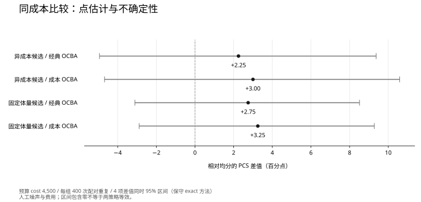

# 把评价预算用在会改变选择的地方

OCBA 研究讨论稿 · 2026-09-21 · 建议讲述 10–15 分钟

本次讨论希望确定：在固定的一组设计候选中，自适应分配评价预算能否提高选择可靠度；下一轮怎样用有明确不确定来源的结构评价检验这一收益。MonkeyHub 提供候选、评价和结果复查的实验环境，研究贡献由实际比较决定。

**本实验分配的对象是各候选的追加评价次数。** 例如固定 8 个方案、允许 1,000 次随机荷载场景求解，均分约为每个方案 125 次；OCBA 根据已观测的差距、方差与费用调整后续分配。这里的总预算由实验预先给定，分配器不生成方案，也不决定下一步去建模、检索、修正还是校核。

因此，本轮是“候选评价预算”的受控基准，不能作为“通用 Agent 任务提速”的直接证据。若明天希望研究后一问题，首先应定义实际动作、可比较的收益、状态变化和必须保留的校核预算，再判断哪一段满足 OCBA 的固定候选与重复评价条件。

## 1｜先区分两类性能问题

| 用户遇到的问题 | 直接影响因素 | 本轮工作 |
| --- | --- | --- |
| 一次修改后，等很久才能看到可继续编辑的候选 | 模型往返、上下文准备、工具执行、候选读回与界面呈现 | 固定[性能实验方案](performance-experiments.md)，先测工具回合折叠和有保护的上下文选择 |
| 已经有多个方案，却没有足够时间把每个方案都评价得很精确 | 候选差距、评价方差、单次成本与总预算 | 集中比较 OCBA 与简单分配策略 |

两者都关心效率，终点不同。前者测“到可用候选的时间”；后者测“在同等评价预算下选得多可靠”。输入 token 减少、评价次数减少与墙钟提速分别报告。

> 讲述：先把研究问题放在真实工作里。OCBA 的作用出现在候选比较阶段；它不会直接让聊天模型或有限元求解器运行得更快。

---

## 2｜OCBA 与代理模型分别做什么

**OCBA（Optimal Computing Budget Allocation）决定下一次评价给谁。** 当两个方案的均值接近、观测波动较大时，多做几次评价可能改变最终选择；明显落后的方案未必值得继续平均分配资源。经典问题的目标是在固定预算下提高选中真实最优候选的概率，即 PCS。

**代理模型（surrogate model）近似一次昂贵评价。** 它通过已计算样本预测新输入的响应，减少单次求解的代价，同时带来预测误差、训练成本及适用范围。

```text
固定候选 → 硬有效性检查 → 评价器 → 均值 / 方差 / 成本
                           ↑                ↓
                       下一批评价 ← 预算分配
                                            ↓
                                  预算结束后的候选比较
```

代理模型可以成为评价器的一部分，但它的系统偏差不能直接作为独立采样噪声交给 OCBA。加入代理模型后，需要把训练、更新、校准和高保真复核一并计账。当前尚未训练代理模型，也尚未完成 OCBA 与 FEA 的真实耦合。

> 讲述：可以把两者理解为“下一次测谁”与“能否用便宜的测量近似一次昂贵测量”。研究中应先分开验证，再比较组合收益。

---

## 3｜现有实验已经覆盖什么

现有实验保持候选集不变，比较均分、轮询、按方差分配、ε-greedy、经典 OCBA 和固定成本 OCBA。预热与失败尝试都占预算；无效候选不会因为分数高而进入软指标比较。

经典分配使用均值差与方差的比例关系；成本扩展假设单次费用已知、固定、可加。两者依据渐近近似，不提供当前有限预算下的成功保证。初始采样不足尤其可能影响后续分配。[Chen 等，2000](https://doi.org/10.1023/A:1008349927281)；[Wu 与 Zhou，2018](https://arxiv.org/abs/1811.12183)。

旧轮次包含 171 个条件、每条件 200 次外层重复。其中 24 个 MonkeyHub 体量候选通过既有接口生成并留存，其面积是实际测量值，叠加的噪声与费用是实验设定。

这些结果支持检查分配规则、预算核算与有限样本表现；建筑性能、设计偏好和实际求解时间需要另一个评价场景。详见[原始实验报告](../../labs/candidate_evaluation/BENCHMARK.md)。

> 讲述：把当前成果定位为可替换评价器的分配实验，而不是已经完成的建筑优化系统。

---

## 4｜为什么需要重新固定成本口径

旧轮次的两个结果决定了本轮问题：

- 在“前两名接近”的 900 次采样条件下，均分 PCS 为 0.750，经典 OCBA 为 0.935。
- 在异方差条件下，经典 OCBA 为 0.760，简单 ε-greedy 为 0.915。
- 在异成本条件下，同为 900 次采样，均分消耗 3,780 成本单位，经典 OCBA 消耗约 11,579；对应 PCS 为 0.740 与 0.870。

最后一组同时改变了支出，不能单独归因为分配更高效。本轮固定每次试验总成本为 **4,500**，比较均分、经典 OCBA、成本 OCBA；选取“异成本合成候选”与“固定体量候选”两种场景。

本轮每组 **400 次外层重复**，共 6 个条件、2,400 次执行。策略之间使用同一试验／候选随机流，直接估计配对差值；新随机种子在运行前固定。规模是探索性 pilot，不视为已经完成充分的功效设计。

> 讲述：公平问题是“相同支出能否选得更可靠”，随后才是“达到相同可靠度能否减少支出”。后一问题需要完整预算曲线，本轮一个预算点不能回答。

---

## 5｜本轮同成本结果

| 场景 | 均分 PCS | 经典 OCBA | 成本 OCBA |
| --- | ---: | ---: | ---: |
| 异成本合成候选 | 70.50% | 72.75% | 73.50% |
| 固定体量候选 | 93.25% | 96.00% | 96.50% |

| 相对均分的差值 | 点估计 | 四项比较同时覆盖的 95% 区间 |
| --- | ---: | ---: |
| 异成本／经典 OCBA | +2.25 个百分点 | −4.94 至 +9.37 个百分点 |
| 异成本／成本 OCBA | +3.00 个百分点 | −4.68 至 +10.59 个百分点 |
| 固定体量／经典 OCBA | +2.75 个百分点 | −3.11 至 +8.51 个百分点 |
| 固定体量／成本 OCBA | +3.25 个百分点 | −2.89 至 +9.28 个百分点 |



**本轮观察到正向点估计，但四个区间均包含零，尚不能确认优于均分。** 这也不是等效性证明。两类场景中，OCBA 减少了采样次数，但平均消耗成本仍均为 4,500；不能把次数下降写成节省了费用。

配对区间直接描述同一试验中两种策略的选择差异。各策略单独的置信区间不能替代差值区间。所有计划比较均保留，不按结果挑选胜出的策略或场景。

> 讲述：先读方向与区间，再讨论可能的机制。区间包含零时，应据此决定是否增加独立试验或改变问题，而不是只读小数点后的领先。

---

## 6｜下一步怎样接入 FEA

现有结构 lab 已有 PyNite 3.2.0 线性静力求解、来源绑定及梁／柱解析校核。同一确定输入反复求解不会产生新的独立观测；采样噪声必须来自明确的随机输入或随机评价过程。[现有结构实验](../../labs/structural_analysis/README.md)

建议从一个可核验的结构任务开始：

| 项目 | 首轮建议 |
| --- | --- |
| 候选 | 复用双跨框架，固定 5–8 个同材料用量、左右梁刚度分配不同的候选；记录截面、材料、支座和几何来源，比较中不生成新候选 |
| 随机输入 | 首轮只随机一侧荷载幅值，另一侧荷载及材料固定；分布由合作方提供依据，或明确标为实验假设。双侧相关荷载另列后续条件 |
| 比较目标 | 建议先选“最大竖向位移的期望”这一项，保留原始位移与材料量；超限概率是另一种目标，须另行声明阈值与参考，避免所有梁统一加粗导致显然占优 |
| 参考答案 | 有解析期望时使用独立解析参考；否则用独立高预算／积分参考并报告误差。参考不能读取或复用政策试验样本 |
| 对照 | 均分、经典 OCBA、成本 OCBA、ε-greedy；racing 作为后续新增基线，不写成已实现 |
| 报告 | PCS 或容许误差内的正确选择率、regret、实测求解次数、总 CPU／墙钟时间、失败、分配开销 |

若参考均值区间仍有重叠，就不能把某一候选硬称为“真实最优”。应先缩小参考误差，或预先声明可接受差距，改测 good selection。若采用有限且很小的离散荷载集合，应同时保留“直接穷举并缓存”的基线；这种情况下 OCBA 未必值得使用。

首轮的目标是打通可解释的评价接口与选择问题。现有小型线性算例求解很便宜，可能由调度开销主导；是否存在净时间收益，需要实测，不能通过人为延时制造。

> 讲述：明天最值得确定的是评价对象、随机性来源和允许的比较目标。先形成一个对分配策略有实际区分度的物理问题，再考虑更复杂算法。

---

## 7｜速度与代理模型各自的下一道实验

**实测时间。** 第一轮固定计算资源，记录启动、准备、分配、求解、复核各段及完整墙钟。人工费用用于受控算法实验，实测运行时间用于判断部署收益；二者不互换。若求解时长随候选变化，先用独立预跑估计成本并冻结策略输入，另行统计实际总支出。

**并行。** 当前 `--workers` 并行的是独立 Monte Carlo 试验，单次分配仍为顺序执行。真正的并行分配还要处理未返回的样本、已占预算、重复派发和最后一批的等待。相关研究把这些问题单独建模，不能直接由顺序结果推断。[Avci 等，2023](https://doi.org/10.1145/3618299)

**代理模型。** 等真实 FEA 评价问题稳定后，再做二因素比较：高保真／代理辅助 × 均分／自适应分配。高保真标注、训练、更新与最终复核全部计入；单次预测加速和总任务加速分别呈现。

> 讲述：这三项分阶段执行。先确定分配是否改善选择，再判断实际时间收益，最后评估代理模型是否带来额外净收益。

---

## 8｜明天需要确定的三件事

1. **研究问题。** 建议先聚焦“固定候选在不确定结构评价下的预算分配及适用边界”。算法创新、代理模型创新和产品优化分别以证据决定，不同时预设为论文贡献。
2. **评价输入与取舍。** 确定第一组框架候选、荷载分布依据、评价目标及容许差距。用户与合作方负责建筑／工程判断；实现负责保持这些条件和可复查的结果。
3. **下一轮结束条件。** 第一批先完成求解正确性、参考误差与真实成本测量；随后冻结比较方案和试验规模，再运行。若样本太便宜、穷举缓存更有效或分配收益不稳定，保留这个结果并调整研究对象。

短期顺序：**定义物理评价问题 → 校核参考 → 测单次成本 → 同预算对照 → 判断是否增加代理模型或并行分配**。性能优化按单独方案推进，优先 E1 工具回合折叠，再做 E2 上下文选择的质量筛查。

> 讲述：讨论结束时应拿到一个具体的评价问题和分工，而不是仅决定“继续做 OCBA”。

## 数据与方法附注

- 本文第 4 页为旧轮次汇总，第 5 页为本轮新试验，不合并两轮重复数。旧目录的 raw gzip 已截断，本轮以新生成的完整数据为配对分析依据。
- 本轮详细统计、区间方法、来源与复现入口见[配对分析](../../labs/candidate_evaluation/PAIRED_ANALYSIS.md)。原始大文件保存在明确的本地外部实验目录，不放入设计项目或公开报告正文。
- 文案初稿由 Claude 协助整理，最终数字、机制解释与研究边界经本任务核对。未使用生成文本充当实验数据。
