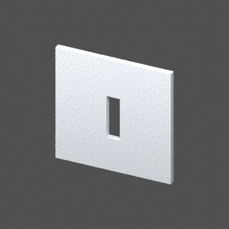
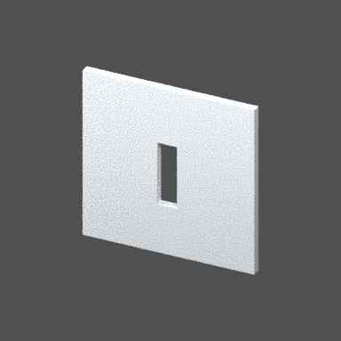

# Blender projection source-change evidence

Executed 2026-09-18 against the implementation based on MonkeyHub
`1036802633ed1dd69a09384b800b381b03fce89b`, using Blender 4.3.0,
cadquery-ocp 7.9.3.1.1 and Pillow 12.3.0 on Windows.
[Reproduction and boundary](../../docs/BLENDER_PROJECTION.md).

The `demo` P036 project contains two runs, `before` and `after`. MonkeyHub's wall
producer moves the door from 6.0 to 6.1 m along the wall, then OCCT and Blender
rebuild the output. The screenshots below are copies of the verified PNG artifacts,
with all PNG text metadata removed before publication to avoid disclosing local
filesystem paths. Decoded pixels are unchanged. The wall is one seat; four columns are a separate
seat. Camera `overview`, render preset `preview-v1`, azimuth -65 degrees,
elevation 30 degrees, CPU Cycles, seed 0, 384 × 384, 8 samples, two-area lights.

| Binding / output | Before | After |
| --- | --- | --- |
| Design-state digest | `0827924112b6ded77f79e0478a05d87ac09d2855f93edb86127c5e3ca786df15` | `d96031e639ec0b82151be533b7897a79563ca1b12ab0bd0707a16c802b46cefb` |
| Exact wall STEP SHA256 | `829b8201e7fabacdff8326c6a1b4f0e7fa74f35b2da888abb55014b352966850` | `0bf80eae2cb113a58fd3ddae7c5bbb85ac89180fcb212150c6ab2dfce5ef16c6` |
| Saved scene SHA256 | `de0c34a6d9477a311099e5af2c482907e306655b1e64efaa52bfd01610ef0c11` | `a6aa1f1098efe4c33f6e11182a8ee1cc8bcf644b4dc66aef79ed9cc66c892958` |
| PNG SHA256 | `9ad5e50ff3ff9d62abf5edec463cee64869aed724a4c04a12a8328836a95138d` | `50bcee24ba461312444107cf204eb3c977ea06900b7e917c0dffee5a0d820e13` |
| Public screenshot SHA256 (text metadata removed) | `6ae5602acbcc7350b5fd4de67dff8940b574868ea0781a5d3a951c743d902126` | `1014532dd8298961d800bfead419c305bf030f0f155ee033e6900a594eba0a6f` |

Both saved scenes retain `obj-wall-south-cut` and
`obj-wall-south-aperture-door`. Their source geometry changes; the unrelated
column objects retain their vertices/faces/bounds/materials and IDs. Source
digests correctly differ across runs. Canonical HEAD remains unchanged because
these are retained candidates and projections, not formal project issuance.

Validation: 94 tests ran successfully (91 passed, 3 optional Rhino host tests skipped) in the
projection/CAD contract/runner suite; architecture check passed (363 files).
The subsequent 5 focused tests also passed, including real Blender-side geometry
mutation/reopen rejection and explicit semantic material assertions.

These screenshots prove output availability, not user validation of architectural
quality. The demo is an automated architectural fixture. Full P036 records,
source STEP files, blend scenes and logs are retained in the local acceptance
project; the command above regenerates its own complete project without those
machine-local files. Byte hashes here identify this run, not universal goldens.
