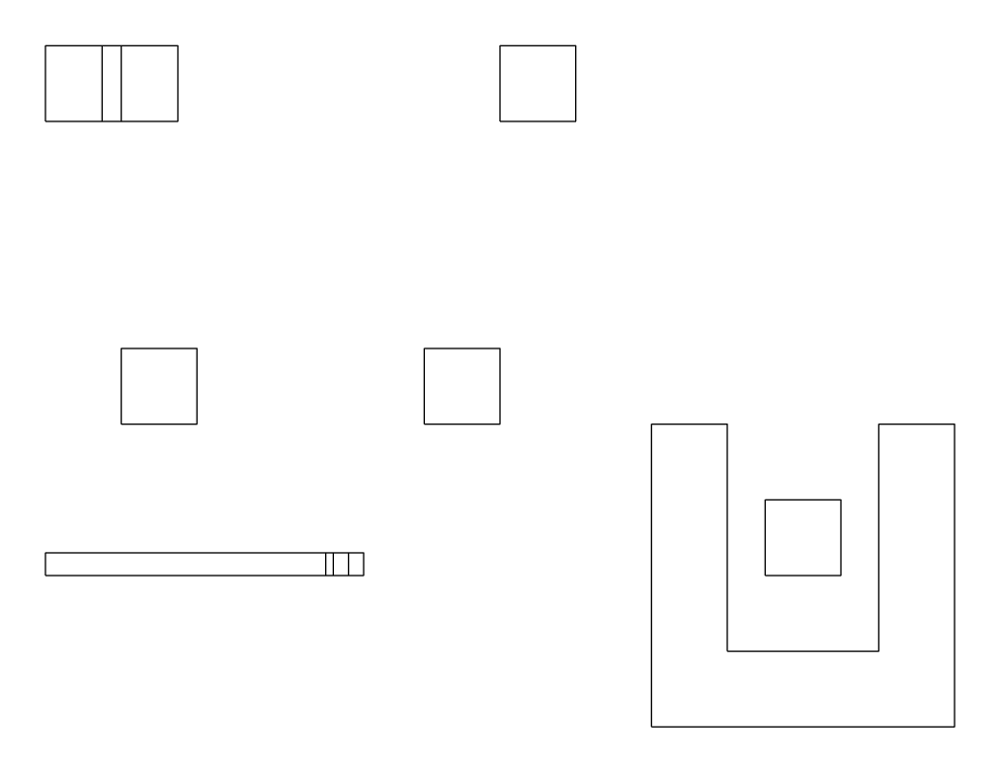

# 精确空间观察与事实选择：公开合成 pilot 结果

2026-09-20，基于 MonkeyHub `3a92b41460b52c04963278a3300a29c34744c43e`。
本页分别回答 [#195](https://github.com/cogco1/MonkeyHub/issues/195) 的观察表示问题与
[#170](https://github.com/cogco1/MonkeyHub/issues/170) 的事实选择问题。
[实现及生产事实表](../../labs/spatial_observation/README.md)、
[原论文与实际系统调查](../../labs/spatial_observation/research.md)、
[预定实验规则](../../labs/spatial_observation/protocol.md)。

## 可以据此作出的判断

对本次已定义的对象身份、尺寸、实体距离/交叠、声明依赖和版本问题，完整结构化输入已经足够；
在相同线稿上增加精确查询可以恢复信息，但没有胜过结构化输入的正确性和成本。
查询接口存在并不保证 Agent 会正确调用或使用它：保留的一次 D0 遮挡错误发生在来源格式被拒绝之后。
这个结果支持先复用已知状态与按需事实查询，没有提供为这类题先训练空间 token 的理由。

对事实选择，MiniLM+图扩展在五条 held-out 查询中保留全部相关实体，随后真实语言模型也提取成功；
但同一算法在 development 的五节点影响链上漏掉末端 `drain`。
声明影响必须由完整依赖遍历保底，不能被相似度排名或上下文预算截掉。
另一方面，纯图规则漏掉没有声明边的壳体/插入块组合，文本检索找到了它，精确几何又反驳了碰撞怀疑。
所以图、检索和精确查询各有具体作用，实验没有选出通用优胜方法。

这是一栋建筑之前的小型机制实验：12 个合成实体和一个基准面，三次重复，单一可查询世界。
任务相关性由代码定义并独立核查，未作外部建筑师任务审定；不声称验证了建筑质量、完整设计意图、
一般空间推理能力或统计显著性。未知视觉语义、构图、材料和空间感仍不在这些精确问题的充分定义内。

## 来源、调用和可回答性

几何只由合成 StateRecord 经现有 producer/compiler 生成，P036 保留 STEP 与冷读回执。
CAD 为 Z-up、米；Hub Y-up 通过 `(x,z,y)` 转换。每次精确查询重新核验保留 STEP、对象名与来源绑定。
三个变体为 base、预定 heldout 参数变化和整体二倍尺度。所有试验 HEAD 保持原状；没有接受候选。
夹具与手算真值见[fixture protocol](../../labs/spatial_observation/fixture_protocol.md)。

真实 consumer 为 Claude Code **2.1.272**，请求 `claude-opus-5[1m]`，实际回答模型
`claude-opus-5`，effort low。CLI 没有 seed 或不可变权重版本入口，不能声称 seeded replay。
每组最多三次模型调用、每次 4,096 输出 token/180 秒/USD 2 CLI 估算上限；D0 最多 12 次精确查询。
各组都有相同的三轮自查，没有 gold 反馈。使用原生 PNG image block，未把文本伪装成张量。
没有调用模型的文件、桌面、浏览器或其他 MCP 工具，也未发送私人建筑、账户信息或本机路径。

第一版完整 39-trial 运行漏给 A 前后相机轴定义。全部旧结果和 USD 9.969462 估算成本保留，
不用于主结论。向**所有组**补充相同的生产相机约定后，完整重跑同一 39-trial 设计；
没有改几何、题目、gold、模型或预算，也没有挑成功样本重跑。
主试验为三变体×三表示×三重复＝27 组，加 base 前向/顶向初始图像×B0/D0×三重复＝12 组。
每组 11 题。117 次 CLI 调用均有成功结果事件，没有超时或无效 JSON；查询拒绝另行计数。

| 题目所需信息 | A：结构化 | B0：现有线 PNG | D0：同 PNG + 查询 |
|---|---|---|---|
| 稳定对象身份、米制尺寸、点坐标、声明影响 | 明确提供 | 无标签、尺度和依赖；多数题应弃答 | 可查询，但必须正确调用和消费 |
| 指定实体的正/背面线可见性 | 参数和明确相机约定可推导 | 有轮廓，缺实体对应关系 | 可查询全场景 HLR 身份/显隐 |
| U 壳与内部块是否相交 | 轮廓参数足够 | 顶视可作分离轮廓判断，但名称对应尚未核实 | 可查实体交叠，或由完整参数推导 |
| `mystery` 未声明角色 | 读取 null | 只能表达缺少角色信息，不能证明记录中为 null | 可读取 null |
| 全零旧 digest 能否用于当前来源 | 公共绑定可拒绝 | 公共绑定可拒绝 | 公共绑定及查询检查可拒绝 |

B0 的合理弃答不计为空间推理失败。顶视下正确的 U 壳/内部块分离推断单列；
它没有验证名字到持久 ID 的对应，也不应一概叫作随机猜测。
这里主要测试系统给出了什么事实，不能用机械 gold 命中率直接排名模型空间能力。

## #195：观察结果与成本

每格为三次重复中 11 题的机械 gold 命中数；其中包含未知角色与陈旧来源两道拒绝题。

| 相同来源与初始图像 | A | B0 | D0 |
|---|---|---|---|
| base，五向 | 11 / 11 / 11 | 3 / 2 / 4 | 10 / 11 / 11 |
| heldout，五向 | 11 / 11 / 11 | 2 / 2 / 2 | 11 / 11 / 11 |
| 二倍尺度，五向 | 11 / 11 / 11 | 2 / 2 / 2 | 11 / 11 / 11 |
| base，仅 front | 不适用 | 2 / 2 / 2 | 11 / 11 / 11 |
| base，仅 top | 不适用 | 2 / 2 / 2 | 11 / 11 / 11 |

在匹配的五向 9 组中，A 的九类精确事实为 **81/81**；D0 为 **80/81**。
B0 在 81 次这类问题中合理弃答 76 次，作出两次正确的条件性轮廓分离推断，
一次没有身份支持但碰巧正确的背面判断，以及两次错误断言：把一对轮廓误认为 twin，给出零距离并误判前向可见。
因此 B0 对严格 ID 绑定事实的可回答准确率记 **N/A**，不把全部弃答纳入“推理错误率”。
每种表示另外各有 9 次角色弃答和 9 次正确版本拒绝。

A、D0 在主五向组中回答的 36 个距离/体积值均在预定容差内（绝对误差 0，单位为米或立方米）。
B0 只有三次数值断言：两次交叠体积为零正确，一次 twin 距离误差 **3 米**；未回答值没有被填零。
身份错误、遮挡错误、缺失对象和每条回答均可在 [summary.json](summary.json) 与原始行中复算。

D0 全部 15 组共尝试 **165 次查询，90 次因来源格式/绑定不匹配被拒绝**；75 次实际返回事实。
这 90 次主要来自模型把完整 source 对象写成 revision 字符串，而非几何内核失败。
固定轮次内的后续查询保留在同一试验；没有外部挑选重试。
base 五向 r0 在后续轮中获得 state 和距离事实，却未再取得 HLR，最后仍错误声称 twin-a 在 front 可见。
这也是查询策略与实验传输协议的限制，不能冒称生产通用工具的失败率。
本实验没有为拉高成绩再调 source 提示或更换协议。

初轮 D0 通常为未知，随后查询填回事实；报告把**解答初始弃答**与**纠正错误断言**分开。
不能把九个 unknown→known 都称作纠正九个推理错误。固定的 bbox 错误先验题在 A/D0 主组均被反驳。
来源拒绝题的模型结果首先是文字协议判断；真正的陈旧/混装/篡改拒绝由适配器实测，
role-drift 的旧来源查询也实际被拒绝。

| 五向主组，9 trials/27 CLI calls 每表示 | A | B0 | D0 |
|---|---:|---:|---:|
| 单次原始表示大小，三变体范围 | 6,209–6,235 B JSON | 8,969–9,032 B PNG | 相同 PNG，另计查询 JSON |
| CLI API 等价估算合计 USD | 2.154881 | 2.038369 | 3.314498 |
| 达到整组 11 题正确的试验数 | 9/9 | 0/9 | 8/9 |
| 首次整组正确的响应边界时间 | 13.56–18.78 s | 未达到 | 29.20–64.84 s，仅成功的8组 |
| 首次整组正确前 CLI 估算/试验 | 约 0.075–0.080 | 未达到 | 约 0.253–0.309，仅成功的8组 |

时间从第一次 consumer 调用开始，包含后续查询和完整响应等待，不是首 token 时间；
失败的 D0 组仍保留在总成本和分母中。表中的首次正确成本不包含其后的预定自查轮，完整成本在上一行。
PNG 每来源生成一次并在各组复用，五向渲染实测 0.269–3.201 秒；不是每次复用都重新渲染。
预处理、冷读、查询、base64 和序列化在 manifest/逐行结果中分别记录；
传输、GPU copy、纯推理与首 token 遥测为 unknown。CLI `duration_api_ms` 没有改名为纯推理。

front/top 附加组研究的是**初始图像**敏感性；D0 仍可查询任意已定义方向，因此它们不能证明
只凭单向观测理解了完整空间。二倍尺度改变了真实尺寸与体积，不只是缩放图像；像素自动适配无法提供米制尺度。
这些小样本的离散结果不支持普遍的视角/尺度不变性结论。

## #170：固定表示后的选择与真实消费

同一结构化 snapshot、相同 query/target/operation、相同算法规则。
主预算为六实体；full 保留全部 13 实体作成本/覆盖参照，不假装和 top-k 有相同字节预算。
三条 development + 五条 held-out 查询，共 32 行；预算 4 与 12 各另有 32 行，算法没有后调。

| 五条 held-out 查询，budget 6 | 实体 precision / recall，宏平均 | 完整检索 | 平均 context bytes | 查询 ms，单次均值 |
|---|---:|---:|---:|---:|
| full | .169 / 1.000 | 5/5 | 7,375 | .324 |
| graph/rule | .567 / .633 | 2/5 | 1,466 | .136 |
| lexical | .333 / .950 | 4/5 | 2,689 | .476 |
| embedding+graph | .367 / 1.000 | 5/5 | 3,003 | 7.910 |

负例没有丢弃：budget 6 的 development screen 影响链中，lexical 漏掉 seal/fixing，hybrid 漏 drain；
graph 完整保留五节点链。held-out 的 shell/insert 未声明关系，graph 没找到 insert；文本方法找到了二者。
在这个已编辑版本上，实际 OCCT 结果是 **separated、0.25 m、0 m³**，反驳“可能碰撞”的检索怀疑。
九次查询是各预算/方法重复检查**同一构件对**，不是九个独立几何案例。
budget 4 放不下五节点完整链是容量约束；budget 12 时文本方法完整召回，graph 仍有文本发现缺口。

真正的嵌入是固定 ONNX MiniLM，384 维，Apache-2.0，FastEmbed 0.7.3 / ONNX Runtime 1.30.0，CPU。
它是**文本**编码器，不是 CAD/3D token 编码器。固定权重 90,387,630 B，13 向量 19,968 B；
实际 tokenizer 上限是 **128 tokens**，13/13 文档均截断，未根据结果重写输入。
一次加载 1.359 s，首索引 519.0 ms，整次更新 478.2 ms；简单方法首建/更新约 1.1–1.8 ms。
下载阶段 tool wall 8.20 s 包含启动和元数据访问，非纯网络耗时；依赖安装耗时未知。
电力、硬件成本未测，不把本地零 API 费用写成总成本为零。

下游另作 **60 次真实 Claude 调用＝五题×四方法×三重复**；每方法 15 次，并非15个不同问题。
只传相同 policy、query 和选中 context，不传 gold、方法名、排名或遗漏列表；没有图像或新增工具。

| 选中 context 的消费结果 | 有来源支持的完整实体答案 | 实体答案 recall | 有 gold 边的6次回答之边 recall | 15次 CLI 估算 USD |
|---|---:|---:|---:|---:|
| full | 15/15 | 1.000 | 1.000 | .807023 |
| graph/rule | 6/15 | .633 | .500 | .341548 |
| lexical | 12/15 | .850 | .500 | .452070 |
| embedding+graph | 15/15 | 1.000 | 1.000 | .475121 |

60 次均有有效结果，未出现超出所给 context 的虚构实体/边引用。
“完整且有支持”要求答案正确**并且引用确实在输入中**；猜中被遗漏 ID 不会算 grounded success。
无 gold 边的题不加入边 recall 分母，额外但确实存在的无关边与虚构边分别处理。
lexical 有时选中了链尾，却漏中间节点/边，下游无法恢复完整影响链；实体 recall 不能代替关系完整性。
hybrid 在这五题达到与 full 相同的实体答案覆盖、估算消费更低，但首建/更新更贵，且仍有另题漏关键依赖，
不能据此采用为生产默认或声称跨建筑泛化。

陈旧结果与索引在四方法均拒绝，更新后读到改变的内容；交换输入顺序不改变结果。
独立 [ontology-drift stress](ontology_drift.json) 保持几何不变，只把 mystery 的 role 从 null 改为
`role.structural_support`，保留旧标签 `unclassified object`。四方法重建后均保留新声明，旧来源拒绝，
没有从标签把 role 改回 null；排名/选择集合没有变化，分数变化不计为改进。
它验证显式目标下的来源保真，不是自主语义分类能力。

## 外部机制与下一步边界

[七类调查](../../labs/spatial_observation/research.md)逐项记录原始论文、固定源码版本、许可、
训练与真实输入：3D-LLM/PaLM-E、ConceptFusion/DreamerV3、ConceptGraphs、nvdiffrast、Habitat/Isaac、DLPack。
例如 3D-LLM 需要图像提升的点特征和训练过的对齐层；ConceptGraphs 的推断边不等于已声明因果依赖；
Isaac 的 Torch→Warp alias 后仍执行 tile→batch 重排。CPU [DLPack smoke](interop-smoke.json)
只验证 NumPy 本地共享，不证明 GPU/远程模型零拷贝。

本轮 C/E **unavailable**：当前生产消费边界为 text/base64 PNG，没有接通原始 depth/normal/ID tensor
或 learned tokens 的模型入口。将深度画成 PNG 是另一视觉化条件，不能冒充数值/tensor 消费。
3D-LLM 可构成另一个具有权重/编码/对齐前提的系统实验，但同时改变底模，不能作为本次单因素 E。
不为凑条件训练模型、重建模拟器/状态库或添加生产入口。

生产 owner 可据此考虑的最小需求是：从既有绑定源读取指定实体的身份、全场景线显隐和精确实体测量，
让应用层维护来源绑定、让工具返回可验证的事实。必须另外验证真实建模任务中的使用方式；
不能把本实验易错的自由 JSON source 复述协议直接当成最终工具交互。
学习表示值得继续的任务是未知外部视觉语义到已有对象的关联，或文本检索确有缺口时的可验证选择；
本次没有检验或宣布这些未来路线的效果。

## 保留数据、总账与复核

- [主观察原始行](observation-explicit-camera-v2.jsonl)、[配置/时间/来源](manifest-explicit-camera-v2.json)、[Monitor 元数据](monitor-explicit-camera-v2.jsonl)。
- [完整旧版原始行](observation-orientation-unspecified-v1.jsonl)与[旧版配置](manifest-orientation-unspecified-v1.json)，明确不参与主比较。
- [smoke 原始行](observation-smoke.jsonl)与[smoke 配置](manifest-smoke.json)。
- [选择/预算敏感性/精确查询](selection.json)、[下游全部原始回答](downstream.jsonl)、[下游 Monitor](monitor-downstream.jsonl)、[可复算汇总](summary.json)。
- [base 顶视 PNG](images/base-s1/top.png)、[base snapshot](images/base-s1/snapshot.json)，同目录保留三变体全部五向图；B0/D0共享原始字节。

主观察 117 CLI calls 的估算为 **USD 9.783289**；完整旧版 117 calls 为 **9.969462**；
smoke 9 calls 为 **.859466**；选择下游 60 calls 为 **2.075762**。
上述 303 次保留调用合计 **22.687979**。另有开始时连接检查一次 **.003663**，只留在本任务运行时工具输出，
未纳入此证据包；加计后为 **304 次、22.691642**，其中可由本包逐行复算的是前述 303 次。
均为 CLI 的 API 等价估算，**不是订阅账单或实际扣费**。原始 usage 包含辅助 Haiku 模型，未只计主回答模型。
主观察的主模型普通输入 234、cache creation 690,220、cache read 0、输出 98,517（其中 thinking 17,298）；
辅助模型输入 408,589、输出 1,681，分账保留，不重复计算 inclusive/cache 子集。
统计以各调用保留的 `provider_result.modelUsage` 为准。Monitor 是可跳过争用写入的诊断日志：
主观察应有 234 条分模型事件，实际保留 232 条并有 `missing_observations` 提示，不能独立作为完整总账。
smoke、旧版和下游分别保留 18/18、234/234、119/119 条；下游有一次调用仅报告一个模型。
实际订阅配额、扣费、纯推理时间未知。并发三路、固定顺序及同机负载会影响延迟与缓存，不能当稳定性能结论。

完整 P036 项目与 STEP 留在显式外部实验根，公开 probe 晋升的是可重建的合成输入、图像及诊断结果。
manifest 保存开跑时源代码哈希和基线；其后仅增加独立 role-drift 变体、健壮性检查和离线统计，
没有修改已采样的 base/heldout 几何或方法。原始旧评分保留，当前统计额外区分答案支持与可回答性。
复算入口为 `labs.spatial_observation.analyze`，运行方式见[lab README](../../labs/spatial_observation/README.md)。

验证：29 项聚焦检查通过（含真实 OCCT、生产 PNG 字节一致、真实固定 MiniLM、来源拒绝和评分边界）；
架构检查通过。研究代码不被生产导入，未改变接受状态或普通生产写入链。

